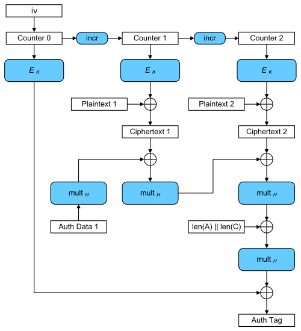

# AEAD

## AEAD 简介
Authenticated Encryption with Associated Data (AEAD) 是一种同时具备保密性，完整性和可认证性的加密形式。认证加密是一种将对称密码和消息认证相结合的技术，同时满足加密性，完整性和认证性三大功能。

AEAD 产生的原因很简单，单纯的对称加密算法，其解密步骤是无法确认密钥是否正确的。也就是说，加密后的数据可以用任何密钥执行解密运算，得到一组疑似原始数据，而不知道密钥是否是正确的，也不知道解密出来的原始数据是否正确。

因此，需要在单纯的加密算法之上，加上一层验证手段，来确认解密步骤是否正确。

## AEAD 原理介绍

认证加密有几种，这里举例：例如 Encrypt-then-MAC，先用对称密码将明文加密，然后计算密文的 MAC 值。Encrypt-and-MAC，将明文用对称密码加密，并对明文计算 MAC 值。MAC-then-Encrypt，先计算明文的 MAC 值，然后将明文和 MAC 值同时用对称密码加密。在 HTTPS 中，一般使用 MAC-then-Encrypt 这种模式进行处理。

简单地把加密算法和认证算法组合，可以实现上述目的，并由此产生了几个方案：

* EtM (Encryption then MAC)

    

    先加密，然后对密文进行 MAC 运算（一般用各种 HMAC），把二者拼接起来，发给接收方。

    接收方先验证 MAC，如果验证通过，则证明密钥是正确的，然后执行解密运算。

* MtE (MAC then Encryption)

    

    与 EtM 相反，先对原始数据执行 MAC 运算，与原始数据拼接后，执行加密算法，将密文发送给接收方。

    接受方先进行解密，然后执行 MAC 运算，验证解密结果是否正确。

* E&M (Encryption and MAC)
    
    

    同时对原始数据执行加密和 MAC 运算，把二者拼接起来，发给接收方。

    接收方先进行解密，然后对解密结果执行 MAC 运算，比对发来的 MAC，验证正确性。

然而，业内逐渐意识到以上通过组合加密和认证算法来实现 AEAD 的方案都是有安全问题的。

在一个算法内同时实现加密和认证，相对于上面的组合算法这种方式的安全性更好。

基于这个思想，一些新的算法被提出，这些算法被称为真正的 AEAD 算法。

常见的 AEAD 算法如下：
* AES-128-GCM
* AES-192-GCM
* AES-256-GCM
* ChaCha20-IETF-Poly1305
* XChaCha20-IETF-Poly1305

在具备 AES 加速的 CPU 上，建议使用 AES-XXX-GCM 系列，移动设备建议使用 ChaCha20-IETF-Poly1305 系列。

在设计加密系统的时候，请务必选用真正AEAD 算法，抛弃旧的 MtE，EtM，E&M 方案。

## AEAD常用算法介绍

### AES-GCM算法原理

AES的GCM(Galois/Counter Mode)模式本质上是AES的CTR模式(计数器模式)加上GMAC(Galois Message Authentication Code, 伽罗华消息认证码)进行哈希计算的一种组合模式。GCM可以提供对消息的加密和完整性校验，另外，它还可以提供附加消息的完整性校验。

与ECB，CBC和CTR类似，GCM和CCM其实也是一种加密模式。它全称为Galois/Counter mode，即是一种集合了GMAC和CTR两种算法的模式。其流程示意图如下：

 

就像CTR模式下一样，先对块进行顺序编号，然后将该块编号与初始向量(IV)组合，并使用密钥k，对输入做AES加密，然后，将加密的结果与明文进行XOR运算来生成密文。像CTR模式下一样，应该对每次加密使用不同的IV。对于附加消息，会使用密钥H(由密钥K得出)，运行GMAC，将结果与密文进行XOR运算，从而生成可用于验证数据完整性的身份验证标签。最后，密文接收者会收到一条完整的消息，包含密文、IV(计数器CTR的初始值)、身份验证标签(MAC值)。

## 参考
[大话密码技术（四）消息摘要算法原理](https://zhuanlan.zhihu.com/p/524010767)
[GCM](https://zh.m.wikipedia.org/zh-hans/%E4%BC%BD%E7%BD%97%E7%93%A6/%E8%AE%A1%E6%95%B0%E5%99%A8%E6%A8%A1%E5%BC%8F)
[AES-GCM 加密简介](https://juejin.cn/post/6844904122676690951)
[AES算法（五）GCM工作模式](https://zhuanlan.zhihu.com/p/376692295)
