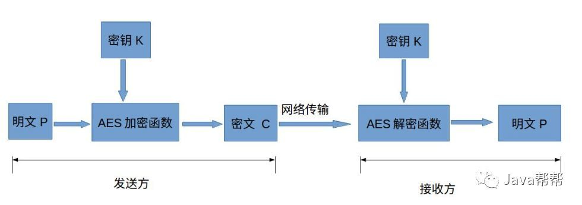
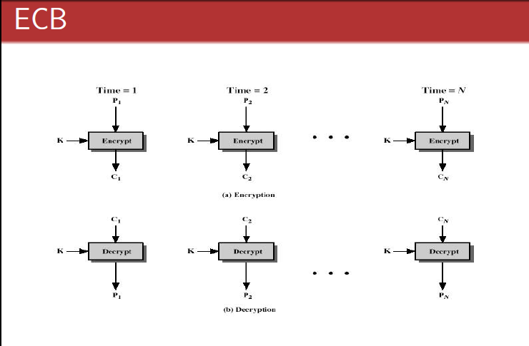

# AES加密算法

## 简介

AES的全称是Advanced Encryption Standard，意思是高级加密标准。

AES为最常见的对称加密算法(微信小程序加密传输就是用这个加密算法的)。对称加密算法也就是加密和解密用相同的密钥，具体的加密流程如下图：



它的出现主要是为了取代DES加密算法的，因为我们都知道DES算法的密钥长度是56Bit，因此算法的理论安全强度是2的56次方。但二十世纪中后期正是计算机飞速发展的阶段，元器件制造工艺的进步使得计算机的处理能力越来越强，虽然出现了3DES的加密方法，但由于它的加密时间是DES算法的3倍多，64Bit的分组大小相对较小，所以还是不能满足人们对安全性的要求。于是1997年1月2号，美国国家标准技术研究所宣布希望征集高级加密标准，用以取代DES。AES也得到了全世界很多密码工作者的响应，先后有很多人提交了自己设计的算法。最终有5个候选算法进入最后一轮：Rijndael，Serpent，Twofish，RC6和MARS。最终经过安全性分析、软硬件性能评估等严格的步骤，Rijndael算法获胜。

AES密码与分组密码Rijndael基本上完全一致，Rijndael分组大小和密钥大小都可以为128位、192位和256位。然而AES只要求分组大小为128位，因此只有分组长度为128Bit的Rijndael才称为AES算法。密钥长度为192位和256位的处理方式和128位的处理方式类似，只不过密钥长度每增加64位，算法的循环次数就增加2轮，128位循环10轮、192位循环12轮、256位循环14轮。


## AES加密模式

* ECB (Electronic Codebook Book)电码本模式
* CBC (Cipher Block Chaining)密码分组链接模式
* CTR (Counter)计算器模式
* CFB (Cipher FeedBack) 密码反馈模式
* OCF (Output FeedBack (OFB))输出反馈模式

### ECB

电码本模式, 这种模式是将整个明文分成若干段相同的小段，然后对每一小段进行加密。



ECB是最简单的块密码加密模式，加密前根据加密块大小（如AES为128位）分成若干块，之后将每块使用相同的密钥单独加密，解密同理。

```c

```

### CBC

CBC模式对于每个待加密的密码块在加密前会先与前一个密码块的密文异或然后再用加密器加密。第一个明文块与一个叫初始化向量的数据块异或。


## 参考（copy)

[密码学基础：AES加密算法](https://zhuanlan.zhihu.com/p/78913397)
[AES加密算法的详细介绍](https://cloud.tencent.com/developer/article/1350186)
[AES对称加密算法原理](https://www.cnblogs.com/txw1958/p/aes.html)
[AES五种加密模式（CBC、ECB、CTR、OCF、CFB）](https://www.cnblogs.com/starwolf/p/3365834.html)