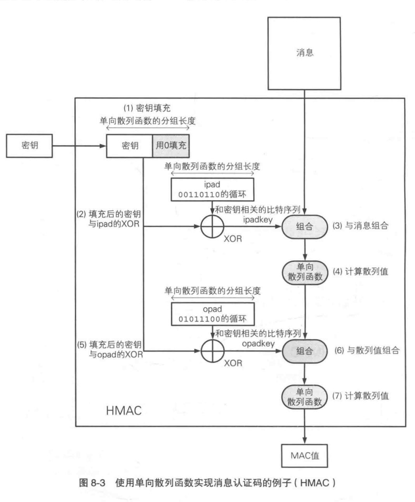

#消息认证码(Message Authentication Code)

消息认证码(Message Authentication Code) 是一种确认完整性并进行认证的技术，简称 MAC。

使用消息认证码可以确认自己收到的消息是否就是发送者的本意，也就是说可以判断消息是否被篡改，是否有人伪装成发送者发送了这条消息。

消息认证码的输入包括任意长度的消息和一个发送者与接收者之间的共享密钥。输出固定长度的数据，输出的数据就是 MAC 值。

消息认证码和单向散列函数的区别就在有没有这个共享密钥上了。所以消息认证码就是利用共享密钥进行认证的。消息认证码和单向散列函数的散列值一样，如果消息发生了 1 比特的变化，MAC 值也会发生变化。所以消息认证码正是用这个性质来进行完整性的。

所以消息认证码可以理解为消息认证码是一种与密钥相关联的单向散列函数。

这里需要说明的是经过mac算法得到的摘要值也可以使用十六进制编码表示，其摘要值得长度与实现算法的摘要值长度相同。例如 HmacSHA算法得到的摘要长度就是SHA1算法得到的摘要长度，都是160位二进制数，换算成十六进制的编码为40位。

```
消息认证码也是密码学家工具箱中的 6 大工具之一：对称密码、公钥密码、单向散列函数、消息认证码、数字签名和伪随机数生成器。
```

### 消息认证码的实现方式
   * 使用 SHA-2 之类的单向散列函数可以实现消息认证码，例如 HMAC。
   * 使用 AES 之类的分组密码可以实现消息认证码。分组密码的密钥作为共享密钥，利用 CBC 模式将消息全部加密。由于消息认证码中不需要解密，所以可以只留下最后一个分组，其他分组全部丢弃。CBC 模式的最后一个分组会受到整个消息以及密钥的双重影响，所以它可以作为 MAC 值。AES-CMAC (RFC4493) 就是一种基于 AES 来实现的消息认证码。
   * 流密码
   * 公钥密码

## HMAC
HMAC算法是一种基于密钥的报文完整性的验证方法 ，其安全性是建立在Hash加密算法基础上的。它要求通信双方共享密钥、约定算法、对报文进行Hash运算，形成固定长度的认证码。通信双方通过认证码的校验来确定报文的合法性。 HMAC算法可以用来作加密、数字签名、报文验证等 。

HMAC算法是一种执行“校验和”的算法，它通过对数据进行“校验”来检查数据是否被更改了。在发送数据以前，HMAC算法对数据块和双方约定的公钥进行“散列操作”，以生成称为“摘要”的东西，附加在待发送的数据块中。当数据和摘要到达其目的地时，就使用HMAC算法来生成另一个校验和，如果两个数字相匹配，那么数据未被做任何篡改。否则，就意味着数据在传输或存储过程中被某些居心叵测的人作了手脚。

HMAC的特点，任意的消息大小；固定的输出长度；

  |算法|	摘要长度|
  |-|-|-|
  |HmacMD5|	128|
  |HmacSHA1|	160|
  |HmacSHA256|	256|
  |HmacSHA384|	384|
  |HmacSHA512|	512|
  |HmacMD2|	128|
  |HmacMD4|	128|
  |HmacSHA224|	224|


一句话总结：HMAC是密钥相关的哈希运算消息认证码（Hash-based Message Authentication Code），HMAC运算利用哈希算法，以一个密钥和一个消息为输入，生成一个消息摘要作为输出。

HMAC算法的定义用公式表示如下：
```
  HMAC（K，M）=H（（K’⊕opad）∣H（（K’⊕ipad）∣M））
```

### HMAC算法的加密步骤

  1. 在密钥K后面添加0 或者 对密钥K用H进行处理 来创建一个字长为B的字符串。(例如，如果K的字长是20字节，B＝64字节，则K后会加入44个零字节0x00；如果K的字长是120字节，B＝64字节，则会用H作用于K后产生64字节的字符串)

  2. 将上一步生成的B字长的字符串与ipad做异或运算。

  3. 将数据流text填充至第二步的结果字符串中。

  4. 用H作用于第三步生成的数据流。

  5. 将第一步生成的B字长字符串与opad做异或运算。

  6. 再将第四步的结果填充进第五步的结果中。

  7. 用H作用于第六步生成的数据流，输出最终结果 。

  用图表示就是：




### HMAC算法的典型应用
HMAC算法的一个典型应用是用在“挑战/响应”（Challenge/Response）身份认证中，认证流程如下：

  1. 先由客户端向服务器发出一个验证请求。

  2. 服务器接到此请求后生成一个随机数并通过网络传输给客户端（此为挑战）。

  3. 客户端将收到的随机数与自己的密钥进行HMAC-SHA1运算并得到一个结果作为认证证据传给服务器（此为响应）。

  4. 与此同时，服务器也使用该随机数与存储在服务器数据库中的该客户密钥进行HMAC-SHA1运算，如果服务器的运算结果与客户端传回的响应结果相同，则认为客户端是一个合法用户 。

### HMAC算法的安全性
HMAC算法引入了密钥，其安全性已经不完全依赖于所使用的HASH算法，安全性主要有以下几点保证：

  1. 使用的密钥是双方事先约定的，第三方不可能知道。由上面介绍应用流程可以看出，作为非法截获信息的第三方，能够得到的信息只有作为“挑战”的随机数和作为“响应”的HMAC结果，无法根据这两个数据推算出密钥。由于不知道密钥，所以无法仿造出一致的响应。

  2. 在HMAC算法的应用中，第三方不可能事先知道输出（如果知道，不用构造输入，直接将输出送给服务器即可）。

  3. HMAC算法与一般的加密重要的区别在于它具有“瞬时”性，即认证只在当时有效，而加密算法被破解后，以前的加密结果就可能被解密。


### HMAC C实现

```c
/*
** Function: hmac_md5
*/

void
hmac_md5(
  unsigned char*  text;                /* pointer to data stream */
  int             text_len;            /* length of data stream */
  unsigned char*  key;                 /* pointer to authentication key */
  int             key_len;             /* length of authentication key */
  caddr_t         digest;              /* caller digest to be filled in */
）
{
        MD5_CTX context;
        unsigned char k_ipad[65];    /* inner padding -
                                      * key XORd with ipad
                                      */
        unsigned char k_opad[65];    /* outer padding -
                                      * key XORd with opad
                                      */
        unsigned char tk[16];
        int i;
        /* if key is longer than 64 bytes reset it to key=MD5(key) */
        if (key_len > 64) {

                MD5_CTX      tctx;

                MD5Init(&tctx);
                MD5Update(&tctx, key, key_len);
                MD5Final(tk, &tctx);

                key = tk;
                key_len = 16;
        }

        /*
         * the HMAC_MD5 transform looks like:
         *
         * MD5(K XOR opad, MD5(K XOR ipad, text))
         *
         * where K is an n byte key
         * ipad is the byte 0x36 repeated 64 times
         * opad is the byte 0x5c repeated 64 times
         * and text is the data being protected
         */

        /* start out by storing key in pads */
        bzero( k_ipad, sizeof k_ipad);
        bzero( k_opad, sizeof k_opad);
        bcopy( key, k_ipad, key_len);
        bcopy( key, k_opad, key_len);

        /* XOR key with ipad and opad values */
        for (i=0; i<64; i++) {
                k_ipad[i] ^= 0x36;
                k_opad[i] ^= 0x5c;
        }
        /*
         * perform inner MD5
         */
        MD5Init(&context);                   /* init context for 1st
                                              * pass */
        MD5Update(&context, k_ipad, 64)      /* start with inner pad */
        MD5Update(&context, text, text_len); /* then text of datagram */
        MD5Final(digest, &context);          /* finish up 1st pass */
        /*
         * perform outer MD5
         */
        MD5Init(&context);                   /* init context for 2nd
                                              * pass */
        MD5Update(&context, k_opad, 64);     /* start with outer pad */
        MD5Update(&context, digest, 16);     /* then results of 1st
                                              * hash */
        MD5Final(digest, &context);          /* finish up 2nd pass */
}

```

## 参考

[消息认证码是怎么一回事？](https://halfrost.com/message_authentication_code/)
[RFC 2104](http://www.ietf.org/rfc/rfc2104.txt)
