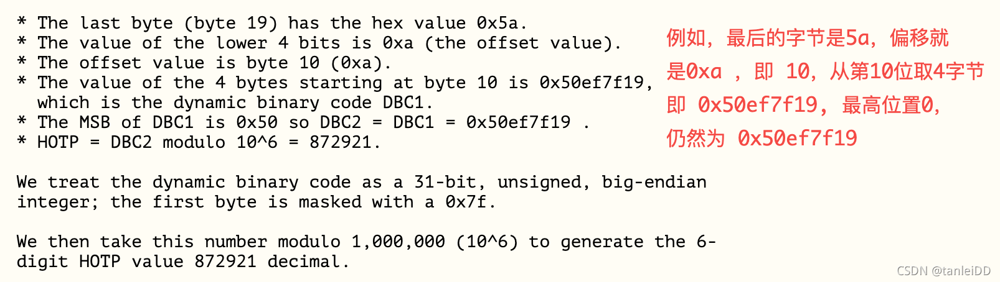

# OTP、HOTP与OTP

## 名词解释

* OTP（One-Time Password）表示一次性密码
* HOTP（HMAC-based One-Time Password）表示基于HMAC算法加密的一次性密码
* TOTP（Time-based One-Time Password）表示基于时间戳算法的一次性密码


## OTP

计算OTP串的公式
```
OTP(K,C) = Truncate(HMAC-SHA-1(K,C))
```

* K表示秘钥串
* C是一个数字，表示随机数；

HMAC-SHA-1表示使用SHA-1做HMAC；

Truncate是一个函数，就是怎么截取加密后的串，并取加密后串的哪些字段组成一个数字。

对HMAC-SHA-1方式加密来说，Truncate实现如下。

* HMAC-SHA-1加密后的长度得到一个20字节的密串；
* 取这个20字节的密串的最后一个字节，取这字节的低4 位，作为截取加密串的下标偏移量；
* 按照下标偏移量开始，获取4个字节，按照大端方式组成一个整数；
* 截取这个整数的后6位或者8位转成字符串返回。

## HTOP

基于HMAC的一次性密码算法【An HMAC-Based One-Time Password Algorithm】

一次性密码意味着通过该算法生成的密码只能使用一次，使用一次后就会失效，下一次又会是另一个密码。

HTOP计算公式
* 通过 HMAC 的 SHA-1 算法，生成一个 20 字节的字符串，称为 HS ，即 HS = HMAC-SHA-1(K, C)
* 通过动态截断 DT 将 20 字节的 HS 转换为 4 字节的字符串，称为 Sbits，即 Sbits = DT(HS)
* 将 Sbits 转换成数字，再模以 10 ^ Digit，得到 HOTP 值，即 HOTP = (StToNum(Sbits)) % 10 ^ Digit

其中：
* K 指 Secret，是一个只有服务端跟客户端知道的密钥，一般跟设备绑定，从而只有固定设备才能生成有效的 HOTP 值

* C 指 Counter 是一个计数器，只在每次验证成功后加一，因此在一次性密码被使用后 C 就会变化，从而下一个 HOTP 的值也会发生改变

* DT 的定义如下：
```c
    int offset = hmac_result[19] & 0x0F;
    int dt_code =  (hmac_result[offset] & 0x7F) << 24 |
                    (hmac_result[offset + 1] & 0xFF << 16) |
                    (hmac_result[offset + 2] & 0xFF << 8) |
                    (hmac_result[offset + 3] & 0xFF);

```

其规则图如下：




## TOPT


TOPT与 HOTP 不同的是，HOTP 中的 C 是基于事件的，而 TOTP 中的 C 是基于时间的，即在一定时间范围内 客户端设备计算出来的 TOTP 值跟服务端计算出来的 TOTP 值相同，则验证通过

## 参考
[OTP,HOTP,TOTP基本原理](https://blog.csdn.net/weixin_37569048/article/details/80257368)
[HOTP: An HMAC-Based One-Time Password Algorithm](https://datatracker.ietf.org/doc/html/rfc4226)
[TOPT: Time-Based One-Time Password Algorithm](https://datatracker.ietf.org/doc/html/rfc6238)
[配置 HOTP 一次性密码机制](https://www.ibm.com/docs/zh/sva/9.0.5?topic=authentication-configuring-hotp-one-time-password-mechanism)