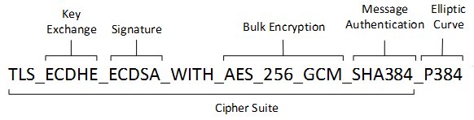

# TLS


```plantuml
A->B
B->C
```

# TLS 1.2 
```plantuml

participant server as s
participant client as c

c->s: client hello
s->c: server hello
s->c: 

```

* client hello
    TLS version
    client Random
    cipher suites

* server hello
    TLS version
    server random
    cipher suite


## CIPHER SUITES

### TLS_ECDH_ECDSA_WITH_AES_256_GCM_SHA384_P384


* TLS：Transport Layer Security (TLS)，表明了密钥套件的协议
* ECDHE: Elliptic Curve Diffie-Hellman Ephemeral (ECDHE)，表明了密钥交换的算法
* ECDSA: 表明了签名加密算法、握手期间的身份认证机制

* AES_128_GCM，用于加密消息流。ciphersuite.info原话直译是：在 Galois/Counter 模式下具有 128 位密钥的高级加密标准 (AES 128 GCM)。其中，
AES：Advanced Encryption Standard，AES，会话加密算法。用于加密消息流
128：会话加密密钥的大小（128位）
GCM：GCM ( Galois/Counter Mode) 指的是该对称加密采用Counter模式，并带有GMAC消息认证码。二者分别保证了加密算法的保密性、完整性。


### TLS_AES_128_GCM_SHA256


# TLS 1.3


## 参考

https://www.rfc-editor.org/rfc/rfc5116
[RFC8446](https://tools.ietf.org/html/rfc8446)

[TLS 详解](https://blog.csdn.net/summer_fish/article/details/125279853)
[TLS详解](https://blog.csdn.net/qinwuxian19891211/article/details/123929731)

[理解 TLS_ECDHE_RSA_WITH_AES_128_GCM_SHA256](https://blog.csdn.net/H_O_W_E/article/details/125247938)