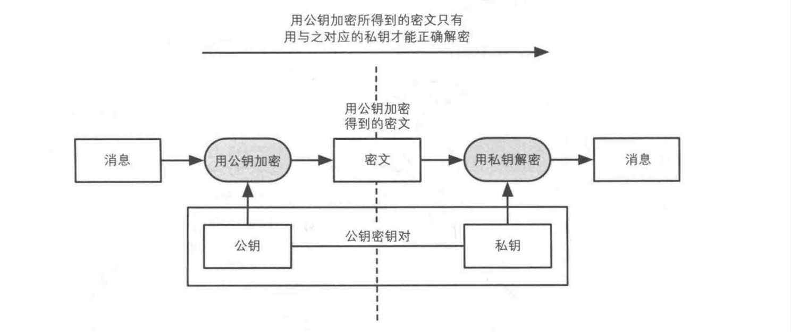
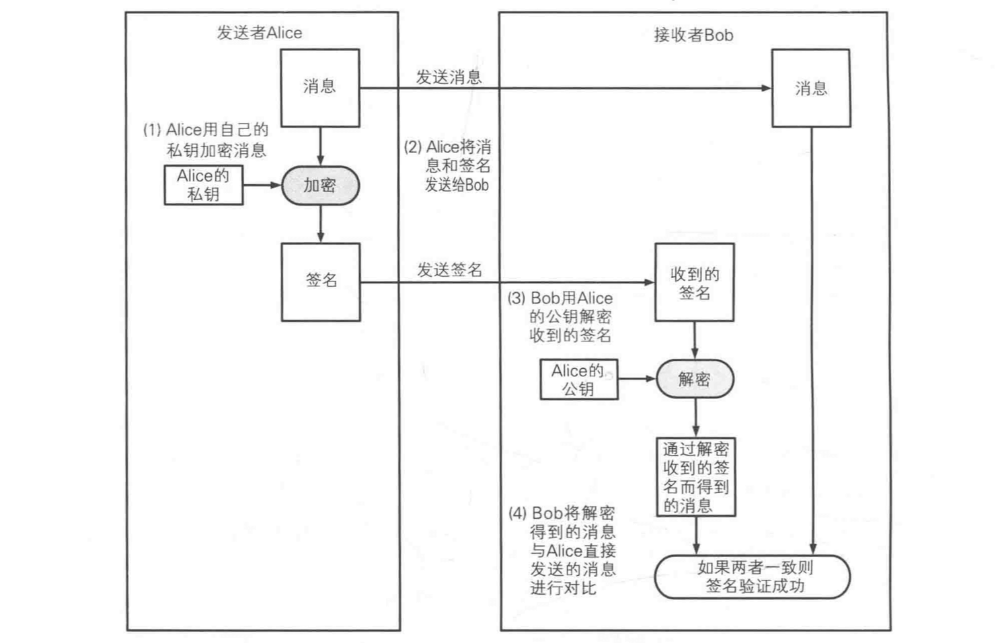
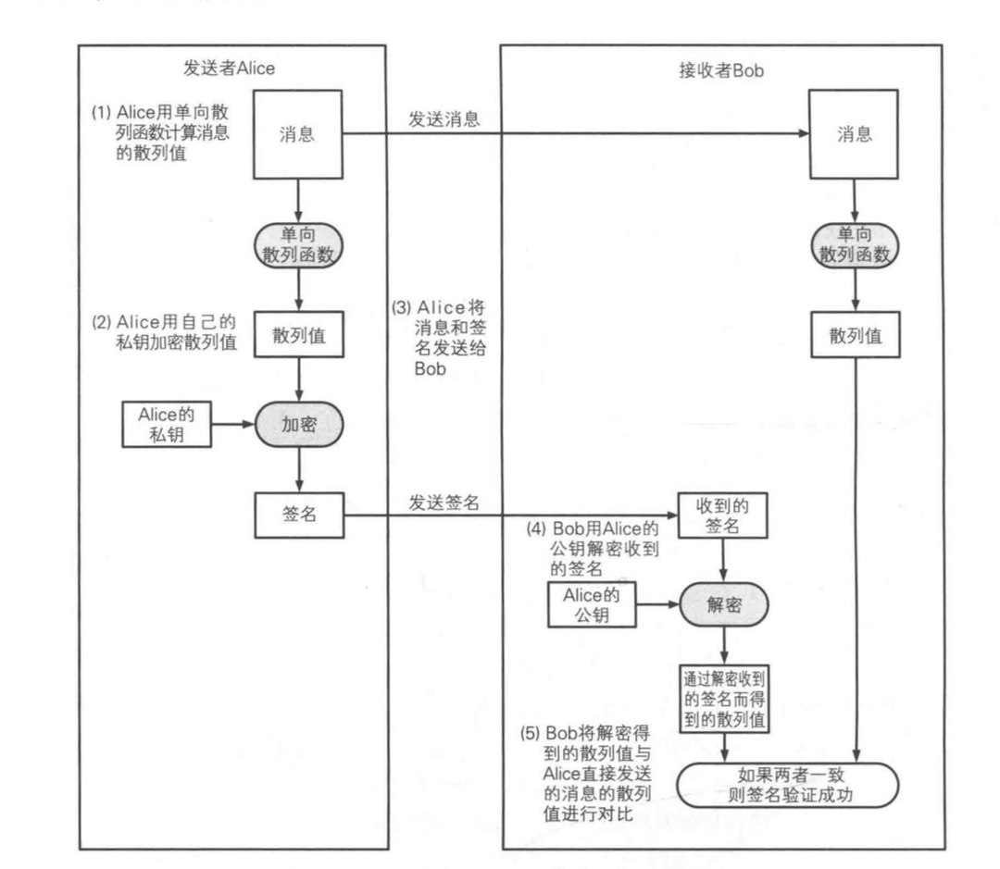
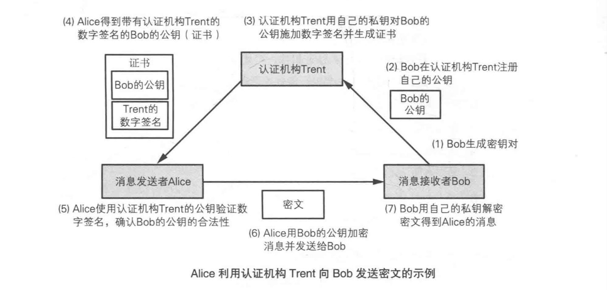
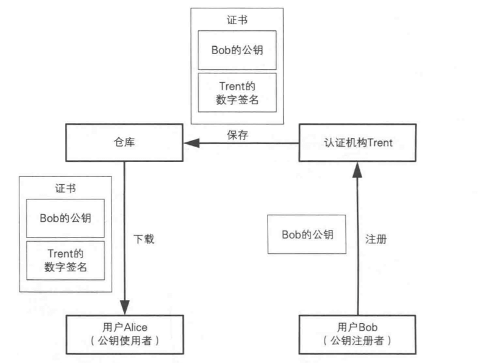

# 数字签名和证书

## 数字签名

数字签名就是附加在数据单元上的一些数据,或是对数据单元所作的密码变换。这种数据或变换允许数据单元的接收者用以确认数据单元的来源和数据单元的完整性并保护数据,防止被人(例如接收者)进行伪造。它是对电子形式的消息进行签名的一种方法,一个签名消息能在一个通信网络中传输。基于公钥密码体制和私钥密码体制都可以获得数字签名,主要是基于公钥密码体制的数字签名。

数字签名是个加密的过程，数字签名验证是个解密的过程。

简单来说，数字签名（digital signature）是公钥密码的逆应用：用私钥加密消息，用公钥解密消息。

用私钥加密的消息称为签名，只有拥有私钥的用户可以生成签名。
用公钥解密签名这一步称为验证签名，所有用户都可以验证签名(因为公钥是公开的)

一旦签名验证成功，根据公私钥数学上的对应关系，就可以知道该消息是唯一拥有私钥的用户发送的，而不是随便一个用户发送的。

由于私钥是唯一的，因此数字签名可以保证发送者事后不能抵赖对报文的签名。由此，消息的接收者可以通过数字签名，使第三方确信签名人的身份及发出消息的事实。当双方就消息发出与否及其内容出现争论时，数字签名就可成为一个有力的证据。

如公钥密码应用时是用公钥加密，私钥解密，如下图:


而数据签名则刚好相反，使用私钥加密，公钥来解密，如下图：


### 生成和验证数字签名的方法
有两种生成和验证数字签名的方法：
  * 直接对消息签名的方法，直接对整个消息进行加密
  * 对消息的散列值签名的方法，先将消息进行单向散列哈希，再对哈希值进行加密

一般都会使用对消息的散列值签名种方法。原因是因为直接对消息签名的方法要对整个消息进行加密，而且是公钥密钥算法，非常耗时。利用简短的单向散列函数来替代消息本身。再进行加密(对消息进行签名)，会快很多。

#### 直接对消息进行签名


方法要对整个消息进行加密，而且是公钥密钥算法，非常耗时

#### 对消息的散列值签名的方法


#### 数字签名特征
 * 数字签名是利用了 “没有私钥的人就无法生成使用该私钥所生成的密文” 这一性质来实现的。生成的密文并非是用于保证机密性，而是用于代表一种只有持有该密钥的人才能生成的信息。所以私钥产生的密文是一种认证符号(authenticator)。

 * 数字签名不保证消息的机密性。如果需要保证机密性，可以考虑加密和数字签名结合起来使用。

  * 数字签名代表的意义是特定的签名者与特定的消息绑定在一起，数字签名虽然可以任意复制，但是它的代表的意义始终不变。

  * 数字签名会识别修改，验证者验证的时候会发现消息和签名的散列值不同，验证失败从而丢弃这条消息。

  * 数字签名中的消息若有变动，其签名信息必然会发生变化。

  * 数字签名就是用来防止抵赖的，一旦签署以后，无法抵赖，不能撕毁合同。只能再创建一个声明消息，声明该公钥已经作废的消息并另外加上数字签名。

### 对数字签名的攻击方式

#### 中间人攻击公钥
这里的攻击主要是攻击公钥。即如何确保你所得到的公钥是对方真正的公钥。
如何进行公钥之间的认证，还是需要使用公钥证书。

#### 对单向散列函数的攻击
对单向散列函数进行碰撞攻击，生成另外一条不同的消息，使其与签名所绑定的消息具有相同的散列值。所以在使用数字签名时，需要选择现阶段安全可靠的单向散列哈希函数。

#### 利用数字签名攻击公钥密码

由于 RSA 和数字签名互为逆向操作。于是可以利用这一性质，对 RSA 进行攻击。让发送者对 RSA 密文进行签名(用私钥加密)，就相当于是 RSA 中的解密操作。

防止这种攻击有几种方法：

* 不要直接对任何消息进行签名，对散列值进行签名比较安全
* 公钥密码和数字签名使用不同的密钥对
* 绝对不要对意思不清楚的消息进行签名，就像在看不懂的合同上任意盖章

#### 潜在伪造

即使签名的对象是无任何意义的消息，例如随机比特序列，如果攻击者能够生成合法的数字签名(即攻击者生成的签名能够正常通过校验)，这也算是对这种签名算法的一种潜在威胁。在用 RSA 来解密消息的数字签名算法中，潜在伪造是可能的。只要将随机比特序列 S 用 RSA 的公钥加密生成密文 M，那么，S 就是 M 的合法数字签名，由于攻击者是可以获取公钥的，因此对数字签名的潜在伪造就实现了。

为了防止这种情况，人们改良了 RSA ，开发出了新的签名算法，RSA-PSS(Probabilistic Signature Scheme)。RSA-PSS 并不是对消息本身进行签名，而是对其散列值进行签名，为了提高安全性，在计算散列值的时候还对消息加盐(salt)。

#### 其他攻击

对公钥密码的攻击都可以用于对数字签名的攻击，例如暴力破解私钥，尝试对 RSA 的 N 进行质因数分解等等

### 数字证书无法解决的问题

数字签名所用到的公钥密码中的公钥需要另外认证，防止中间人攻击。认证用于验证签名的公钥必须属于真正的发送者。

似乎陷入了一个死循环。数字签名用来识别消息篡改，伪装以及防止抵赖。但是我们又必须从没有被伪装的发送者得到没有被篡改的公钥才行。

为了验证得到的公钥是否合法，必须使用证书。证书是将公钥当做一条消息，由一个可信的第三方对其签名后所得到的公钥。

## 数字证书
数字证书也称公开密钥证书，是指用于电子信息活动中电子文件行为主体的验证和证明，并可实现电子文件保密性和完整性的电子数据。数字证书是一个经证书认证中心（Certification Authority,简称CA）发行的文件。

我们需要从一个没有被伪装的发送者那里得到没有被篡改的公钥才行，为了验证得到的公钥是否合法，必须使用公钥证书。证书是将公钥当做一条消息，由一个可信的第三方对其签名后所得到的公钥。

证书实际上就是对公钥进行数字签名，它是对公钥合法性提供证明的技术。证书一般包含：公钥（记住证书中是带有公钥的），公钥的数字签名，公钥拥有者的信息若证书验证成功，这表示该公钥是合法，可信的。

证书认证机构(Certification Authority， CA)。CA就是能够认定”公钥确实属于此人”，并能生成公钥的数字签名的组织或机构。CA有国际性组织和政府设立的组织，也有通过提供认证服务来盈利的组织。

目前使用最广泛的是 ITU(International Telecommunication Union，国际电信联盟) 和 ISO(International Organization for Standardization，国际标准化组织) 制定的 X.509 规范(RFC3280)。基本上大多程序都是遵循这种证书生成和交换的标准规范。

### 证书生成与验证



如图例所示：

 * 第一步中，Bob 的密钥可以是自己生成的，也可以由认证机构代为生成。
 * 第三步中，认证机构在拿到 Bob 的公钥以后会开始认证这个公钥是否是 Bob 的。有三种验证等级，Class 1 通过邮箱中的邮件进行确认本人身份；Class 2 通过第三方数据库来确认本人身份；Class 3 通过当面认证和身份来确认本人身份。等级越高，身份认证越严格。
 * 第五步中，Alice 使用认证机构 Trent 的公钥对证书中的数字签名进行验证，如果验证成功，就确认了证书中所包含的公钥是 Bob 的。
 * 第六步中，图上虽然标识的是“公钥加密”的方式，但实际上这一步用混合加密的方式也是可以的。


### PKI （公钥基础设施(Public-Key Infrastructure)）

公钥基础设施(Public-Key Infrastructure)是为了能够更有效的运用公钥而制定的一系列规范和规格的总称。英文缩写 PKI。

PKI 是一个总称，并非指某一个单独的规范或规格。RSA 公司制定的 PKCS(Public-Key Cryptography Standards，公钥密码标准)系列规范也是 PKI 的一种，互联网规格 RFC(Request for Comments)也是 PKI 的一种，X.509 也是 PKI 的一种。每个公司编写的 API(Application Programming Interface，应用程序编程接口)和规格设计书也可以算是 PKI 的相关规格。

```
公钥基础设施 PKI 不能误解为“面向公众的权威认证机构只有一个”，“全世界的公钥都是由一个根 CA 来认证”。这些都是不正确理解。认证机构只要对公钥进行数字签名就可以了，所以任何人都可以成为认证机构。
```

#### PKI 组成

 * 用户——使用 PKI 的人
 * 认证机构——颁发证书的人
 * 仓库——保存证书的数据库



##### 用户
用户和认证机构都可以是人或者计算机，统称为实体(entitiy)。
实体是进行证书和密钥相关处理的行为主体。

用户包括 2 种，一种是希望使用 PKI 的人，另外一种是希望使用已注册的公钥的人。

类似 Bob 注册公钥的用户：
 * 生成密钥对(可以自己生成也可以由认证机构生成)
 * 在认证机构注册公钥
 * 向认证机构申请证书
 * 申请作废已注册的证书
 * 解密收到的密文
 * 对消息进行数字签名

类似 Alice 使用公钥的用户:
 * 将消息加密后发送给接收者
 * 验证数字签名

##### 认证机构 CA

认证机构(Certification Authority，CA)是对证书进行管理的人。主要负责以下操作：

 * 生成密钥对(也可以由用户生成)
 * 对注册公钥的人进行身份认证
 * 生成并颁发证书
 * 作废证书
 * 认证机构中还可以细分一个注册机构(Registration Authority，RA)，注册机构专门处理注册相关的业务，认证机构专门颁发证书和作废证书。

##### 仓库
仓库(repository)是一个保存证书的数据库。仓库也叫证书目录。作废的证书也需要制作一张证书作废清单(Certificate Revocation List，CRL)。

#### 证书链

证书链，是一连串的数字证书，由根证书为起点，透过层层信任，使终端实体证书的持有者可以获得转授的信任，以证明身份。

基于信息安全的考虑，在进行电子商务或使用政府服务时，交易的另一方用户，以根证书为基础，凭借对签发机构的信任，相信当时持有信任链终端的证书持有者确为其人，并透过公开密钥加密确保通信保密、透过数字签名确保内容无误、以及保证对方无法抵赖。

公开密钥基础建设已经在X.509及RFC 5280指定了使用信任链的认证路径验证算法。其中，会透过证书吊销列表及OCSP检查手上得到的证书是否已被证书机构在到期前撤消。另一方面，证书机构签发新的证书时，也可能透过证书透明度公布签发证书的记录，让公众查核，避免有其他机构在未得到当事人同意下滥发欺诈证书伪冒身份。CA/浏览器论坛通过了DNS证书颁发机构授权协议，参与的证书机构会在签发证书前透过域名系统检查是否已获授权。


#### 证书作废

当用户私钥丢失、被盗时，认证机构需要对证书进行作废(revoke)。要作废证书，认证机构需要制作一张证书作废清单(Certificate Revocation List)，简称CRL

假设我们有Bob的证书，该证书有合法的认证机构签名，而且在有效期内，但仅凭这些还不能说明该证书一定有效，还需要查询认证机构最新的CRL，并确认该证书是否有效。


##### 证书链的验证

所谓证书链的验证，是想通过证书链追溯到可信赖的CA的根（ROOT）。换句话说，要验证签发用户实体证书的CA是否是权威可信的CA，如CFCA。

证书链验证的要求是，路径中每个证书从最终实体到根证书都是有效的，并且每个证书都要正确地对应发行该证书的权威可信任性CA。

### 对数字证书的攻击

由于证书实际上使用的就是数字签名技术，所以对数字签名的所有攻击方法都对证书有效。

#### 在公钥注册之前进行攻击

中间人可以在对用户向认证机构提交公钥认证的时候，替换成中间人自己的公钥。预防这种中间人攻击有 2 种方法：
 * 用户在向 CA 发送公钥的时候，使用认证机构 CA 的公钥进行加密。
 * 认证机构在确认完用户身份以后，将公钥指纹作为回执发给用户进行确认。

 ```
 有一个机构叫 PKG (Private Key Generator，私钥生成机构)，这个机构和认证机构 CA 地位并列。
 它利用一些公开的信息，邮箱，通信地址，姓名，这些基于 ID 的密码来生成私钥。
 它所依赖的是对 ID 的信任。私钥生成机构负责根据 ID 生成私钥，并将私钥安全的发送给合法的接收者。由于私钥生成机构拥有对所有密文的解密权限，所以自身的安全性需要更加注意。

PKG 相对于 PKI 的优点在于，发送者无需在加密前获得接收者的公钥，接收者在真正解密操作前也无需管理自己的私钥。
 ```

#### 注册相似人名进行攻击
注册相似的人名来骗取对方的信任。

#### 窃取认证机构的私钥进行攻击
这种方式就是攻击 CA。如果 CA 发现私钥真的被窃取了，需要及时通知所有用户，并及时作废相关证书，更新 CRL。

#### 攻击者伪装成认证机构
认证机构不需要登记，谁都可以充当认证机构，只是别的 CA 认不认可的问题。攻击者可以通过伪造自己是 CA，给用户颁发证书，这样证书验证肯定都没问题。但是通信之间的内容没有秘密可言了。例如攻击者可以 DNS 污染一片区域或者攻击一个 Wifi 信号，让这片区域的用户都误认为攻击者是信任的 CA，接下来就可以实施攻击了。

如果认证机构不可信，即便证书合法，它对应的公钥也不能使用。

#### CRL 的“漏洞”
攻击者可以利用 CRL 发布的时间差来进行攻击。A 向 B 发邮件说要 100 W，当 B 给 A 转了 100W 以后，A 就抵赖说自己并没有发那封邮件。签名并非是 A 自己，因为证书已经被作废了。B 没有及时更新 CRL，所以导致对方可以抵赖。

应对这种攻击：

 * 当公钥失效的时候尽快通知认证机构(A 用户)
 * 尽快发布 CRL(CA)
 * 及时更新 CRL(B 用户)

### 公钥证书的无法解决的问题
公钥证书目前也没有任何无法解决的问题。

它可以识别篡改或者发送者身份是否被伪装，也就是验证消息的完整性，还可以对消息进行认证。还可以防止抵赖。

公钥证书和数字签名的区别就在于认证机构上。

如果能取得可信的公钥，就不需要认证机构。这种情况只能本人面对面才行，否则都不可信。

当持有可信的认证机构的公钥，并相信认证机构所进行的身份确认的情况下，可以信任该认证机构颁发的证书以及通过该途径取得的公钥。

认证机构是在完全不可信的状态下创造出信任关系。

## 参考

[数字证书的基础知识](http://www.enkichen.com/2016/02/26/digital-certificate-based/)
[什么是数字签名和证书？](https://www.jianshu.com/p/9db57e761255)
[【区别】摘要、数字签名、数字证书](https://zhuanlan.zhihu.com/p/32754315)
[无处不在的数字签名](https://halfrost.com/digital_signature/)
[数字签名原理及作用](https://zhuanlan.zhihu.com/p/25162134)
[数字签名是什么](http://www.ruanyifeng.com/blog/2011/08/what_is_a_digital_signature.html)
[What is a Digital Signature?](http://www.youdzone.com/signature.html)
[数字证书](https://wiki.mbalib.com/wiki/%E6%95%B0%E5%AD%97%E8%AF%81%E4%B9%A6)
[什么是数字证书](https://www.jianshu.com/p/42bf7c4d6ab8)
[信任链](https://zh.wikipedia.org/wiki/%E4%BF%A1%E4%BB%BB%E9%8F%88)
[关于信任模型与交叉认证](https://www.cfca.com.cn/20150810/101229926.html)
