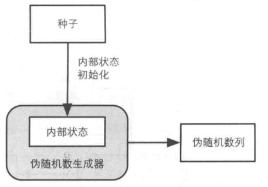
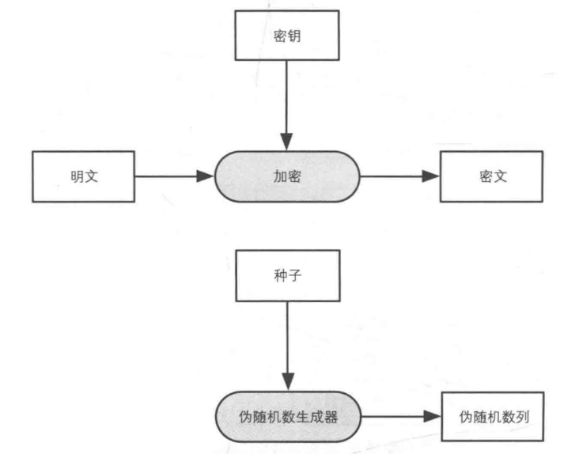
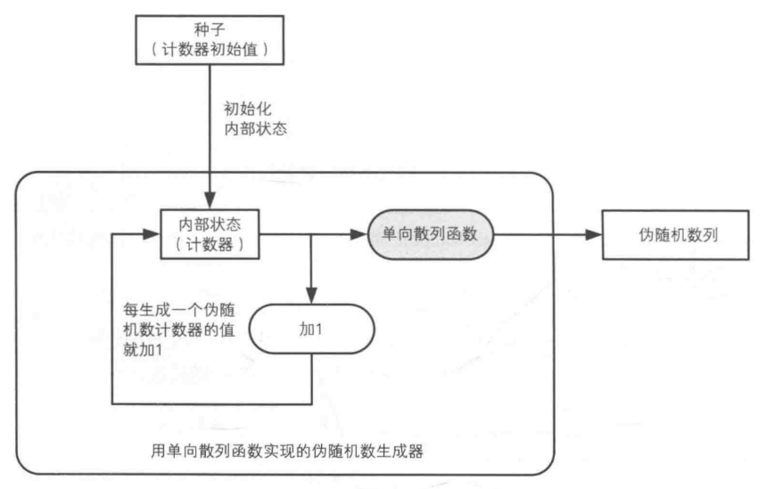
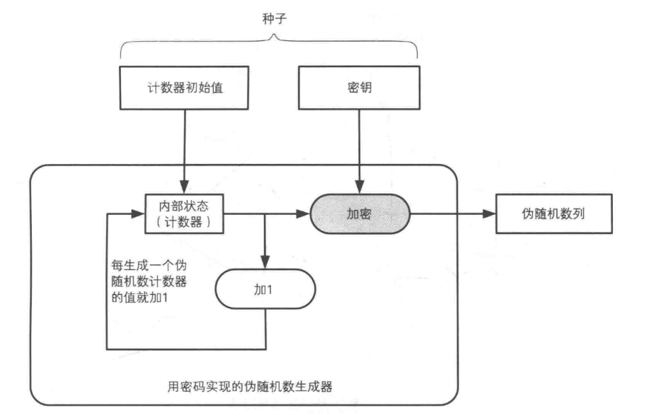
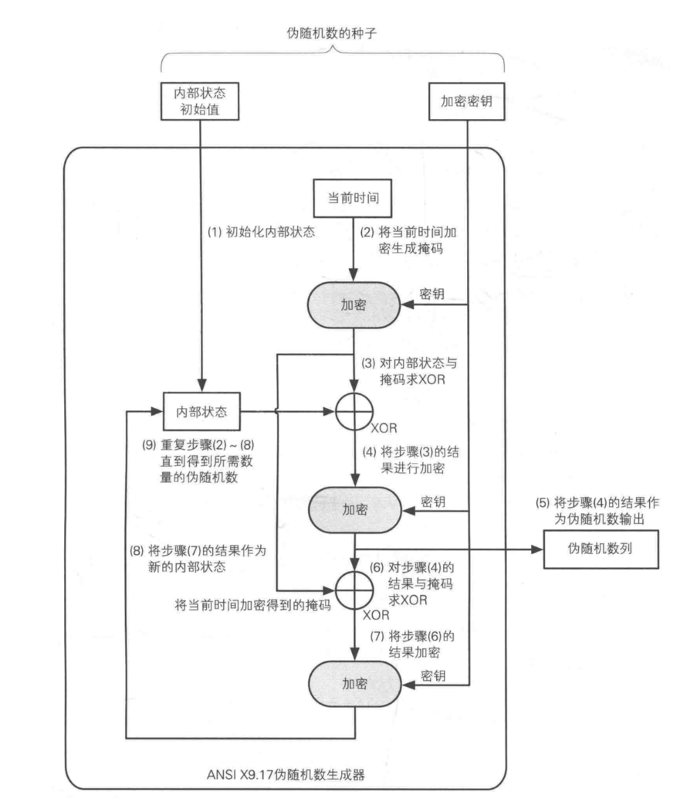

# 随机数

随机数这一概念在不同领域有着不同的含义。

根据密码学原理，随机数的随机性检验可以分为三个标准：

 * 统计学伪随机性。统计学伪随机性指的是在给定的随机比特流样本中，1的数量大致等于0的数量，同理，“10”“01”“00”“11”四者数量大致相等。类似的标准被称为统计学随机性。满足这类要求的数字在人类“一眼看上去”是随机的。
 * 密码学安全伪随机性。其定义为，给定随机样本的一部分和随机算法，不能有效的演算出随机样本的剩余部分。
 * 真随机性。其定义为随机样本不可重现。实际上衹要给定边界条件，真随机数并不存在，可是如果产生一个真随机数样本的边界条件十分复杂且难以捕捉（比如当地的背景辐射波动值），可以认为用这个方法演算出来了真随机数。但实际上，这也只是非常接近真随机数的伪随机数，一般认为，无论是背景辐射、物理噪音、抛硬币等等都是可被观察了解的，任何基于经典力学产生的随机数，都只是伪随机数。

随机数从性质来说需要满足如下特性：
  * 随机性 —— 不存在统计学偏差，是完全杂乱的数列
  * 不可预测性 —— 不能从过去的数列推测出下一个出现的数
  * 不可重现性 —— 除非将数列本身保存下来，否则不能重现相同的数列

相应的，随机数也分为三类：
 * 伪随机数：满足第一个条件的随机数。
 * 密码学安全的伪随机数（强伪随机数)：同时满足前两个条件的随机数。可以通过密码学安全伪随机数生成器计算得出。
 * 真随机数：同时满足三个条件的随机数。

|分类|随机性|不可预测性|不可重现性|特性|备注|生成器|
|-|-|-|-|-|-|-|
|弱伪随机数|✅|❌|❌|只具备随机性|不可用于密码技术❌ |伪随机数生成器 PRNG (Preudo Random Number Generator)|
|强伪随机数|✅|✅|❌|具备不可预测性|可用于密码技术✅|密码学伪随机数生成器 CPRNG (Cryptography secure Preudo Random Number Generator)|
真随机数|✅|✅|✅|具备不可重现性|可用于密码技术✅|真随机数生成器 TRNG (True Random Number Generator)|

```
密码技术上使用到的随机数至少要达到不可预测性这一等级，即至少是强伪随机数，最好是真随机数。
```
随机数在密码学中非常重要，保密通信中大量运用的会话密钥的生成即需要真随机数的参与。
如果一个随机数生成算法是有缺陷的，那么会话密钥可以直接被推算出来。若果真发生这种事故，那么任何加密算法都失去了意义。

用随机数的目的是为了提高密文的不可预测性，让攻击者无法一眼看穿。

随机数经常用于协助生成密钥、或者签名填充、对称加密IV值等等。其作用一般如下：

 * 生成密钥，用于对称密码和消息认证码
 * 生成公钥密码，用于生成公钥密码和数字签名
 * 生成初始化向量 IV，用于分组密码中的 CBC、CFB、OFB 模式
 * 生成 nonce，用于防御重放攻击和分组密码中的 CTR 模式
 * 生成盐（salt），用于基于口令密码的 PBE 等

## 真随机与伪随机

随机数分为真随机数和伪随机数，我们程序使用的基本都是伪随机数，其中伪随机又分为强伪随机数和弱伪随机数。

真正的随机数是使用物理现象产生的：比如掷钱币、骰子、转轮、使用电子元件的噪音、核裂变等等，这样的随机数发生器叫做物理性随机数发生器，它们的缺点是技术要求比较高。
真正意义上的随机数（或者随机事件）在某次产生过程中是按照实验过程中表现的分布概率随机产生的，其结果是不可预测的，是不可见的。

现有的真随机数生成器，比如PuTTYgen的随机数是让用户移动鼠标达到一定的长度，之后把鼠标的运动轨迹转化为种子；Intel通过电阻和振荡器来生成热噪声作为信息熵资源；Unix/Linux的dev/random和/dev/urandom采用硬件噪音生成随机数。

而计算机中的随机函数是按照一定算法模拟产生的，其结果是确定的，是可见的。
我们可以这样认为这个可预见的结果其出现的概率是100%。所以用计算机随机函数所产生的“随机数”并不随机，是伪随机数。

伪随机性（英语：Pseudorandomness）是一个过程似乎是随机的，但实际上并不是。
例如伪随机数是使用一个确定性的算法计算出来的似乎是随机的数序，因此伪随机数实际上并不随机。
在计算伪随机数时假如使用的开始值不变的话，那么伪随机数的数序也不变。
伪随机数的随机性可以用它的统计特性来衡量，其主要特征是每个数出现的可能性和它出现时与数序中其它数的关系。
伪随机数的优点是它的计算比较简单，而且只使用少数数值很难推算出计算它的算法。一般人们使用一个假的随机数，比如电脑上的时间作为计算伪随机数的开始值。
随机性虽然看似杂乱无章，但是却会被攻击者看穿。所以被称为弱伪随机数。用线性同余生成的伪随机数列，看起来杂乱无章，但是实际上是能被预测的。

## 伪随机数生成器

伪随机数生成器是由外部输入的种子和内部状态两者生成的伪随机数列。

由于内部状态决定了下一个生成的伪随机数，所以内部状态不能被攻击者知道。外部输入的种子是对伪随机数生成器的内部状态进行初始化的。所以种子也不能被攻击者知道，因此种子也不能使用容易被预测的值。如我们常用时间作为随机种子，这种使用方法是不对的。

密码的密钥与随机数种子之间的对比如下：


生成伪随机数有以下几种算法：

 * 杂乱的方法，不推荐
 * 线性同余法
 * 单向散列函数法
 * 密码法
 * ANSI X9.17

有一个伪随机数生成算法叫梅森旋转算法(Mersenne twister)，它并不能用于安全相关的用途，因为它和线性同余算法一样，观察周期，即可对之后生成的随时数列进行预测。

### 线性同余法

线性同余法就是将当前的伪随机数值乘以 A 再加上 C，然后将除以 M 得到的余数作为下一个伪随机数。如下。
```
R0 = (A * 种子 + C) mod M
R1 = (A * R0 + C) mod M
R2 = (A * R1 + C) mod M
R3 = (A * R2 + C) mod M
R4 = (A * R3 + C) mod M

Rn = (A * R(n-1) + C) mod M
```


线性同余具有周期性，根据周期即可预测未来的状态。所以它不具备不可预测性，即不能将它用于密码技术。

很多伪随机数生成器的库函数(library function)都是采用线性同余法编写。例如 C 语言的库函数 rand，以及 Java 的 java.util.Random 类等，都采用了线性同余法。因此这些函数都不能用于密码技术。

### 单向散列函数法
单向散列函数也可以生成不可预测的伪随机数，且为强伪随机数(因为它的单向性，具备不可预测性)。
1. 用伪随机数的种子初始化内部状态，即计数器的值
2. 用单向散列函数计算计数器的散列值
3. 将散列值作为伪随机数输出
4. 计数器的值加1
5. 根据需要的伪随机数数量，重复 第 2 步 ~ 第 4 步

单向散列函数的单向性是支撑伪随机数生成器不可预测性的基础。

### 密码法
使用密码法也能生成强伪随机数，既可以使用 AES 对称加密，也可以使用 RSA 公钥加密。
1. 初始化内部状态(计数器)
2. 用密钥加密计数器的值
3. 将密文作为伪随机数输出
4. 计数器的值加1
5. 根据需要的伪随机数数量，重复 第 2 步 ~ 第 4 步


### ANSI X9.17
用 ANSI X9.17 方法也可以生成强伪随机数。
1. 初始化内部状态
2. 将当前时间加密生成密钥
3. 对内部状态与掩码求 XOR
4. 将步骤 3 的结果进行加密
5. 将步骤 4 的结果作为伪随机数输出
6. 将步骤 4 的结果与掩码求 XOR
7. 将步骤 6 的结果加密
8. 将步骤 7 的结果作为新的内部状态
9. 根据需要的伪随机数数量，重复 第 2 步 ~ 第 8 步


## 对随机数攻击

* 对种子进行攻击
伪随机数的种子和密码的密钥同等重要，要避免种子被攻击者知道，需要使用具备不可重现性的真随机数作为种子。

* 对随机数池进行攻击
一般不会在使用的时候才生成真随机数，会事先在随机数池的文件中累计随机比特序列。当需要用的时候，直接从池子中取出所需长度的随机比特序列使用即可。(随机数池本身并不存储任何意义的信息，但是我们却需要保护没有任何意义的比特序列。虽然有点矛盾，但是又是必须的)

## 参考
[随机数](https://zh.wikipedia.org/wiki/%E9%9A%8F%E6%9C%BA%E6%95%B0)
[无法预测的根源——随机数](https://halfrost.com/random_number/)
[真/伪随机、以及随机算法](https://www.jianshu.com/p/489ce4cb7628)
