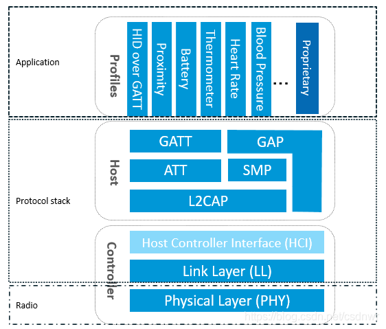

# 蓝牙协议和解析

## 经典蓝牙（BT）: BR技术 、EDR技术 、AMP技术

蓝牙的理论传输速率分别为721.2Kbps，2.1Mbps,54Mbps

上面所讲的是经典蓝牙的技术进化路线，就是传输速率的加快、加快、再加快。但能量是守恒的，你想传的更快，代价就是消耗更多的能量。

## 低功耗蓝牙（BLE）：LE技术

而有很多的应用场景，并不关心传输速率，反而非常关心功耗。这就是低功耗蓝牙（简称 BLE）产生的背景。

## Bluetooth的系统构成

控制器部分包括： 物理层（Physical Layer）， 链路层（Link Layer）， 主机控制接口层（Host Controller Interface）

主机部分包括：L2CAP逻辑链路控制和自适应协议层（Logical Link Control and Adaptation Protocol），安全管理层（Security Manager），ATT属性协议层（Attribute Protocol），GAP通用访问配置文件层（Generic Access Profile），总协定通用属性配置文件层（Generic Attribute Profile）

这里主要考虑APP层，理解蓝牙协议中的应用层，基于L2CAP提供的channel，实现各种各样的应用功能。Profile是蓝牙协议的特有概念，为了实现不同平台下的不同设备的互联互通，蓝牙协议不止规定了核心规范（称作Bluetooth core），也为各种不同的应用场景，定义了各种Application规范，这些应用层规范称作蓝牙profile。

## 广播数据格式

广播数据/扫描应答数据一个个的AD Structure组成，未满31bytes的数据由0填充；每个ADStructure有1byte的长度信息（Data的长度），和剩余的Data组成。

Data由AD Type和AD Data组成。其中AD Type可以指定Service UUID，设备支持哪些profile；Local Name，设备的名称； Flags，设备的GAP发现连接能力等。结合上面的例子，再分析下：

02 01 06，是一个AD Structure：Data的长度是02；Data是01 06；AD Type是01（Flags）；AD Data是06，表明支持General Discoverable Mode可被发现、不支持BR。

03 03 aa fe，是一个AD Structure：Data的长度是03；Data是03 aa fe；AD Type是03（16 bits的Service UUID）；AD Data是aa fe，是Eddystone profile的Service UUID。

17 16 aa fe 00 -10 00 01 02 03 04 05 06 07 08 09 0a 0b 0e 0f 00 00 00 00，是一个AD Structure：Data的长度是17（23bytes）；Data是16 aa fe 00 -10 00 01 02 03 04 05 06 07 08 09 0a 0b 0e 0f 00 00 00 00；AD Type是16（Service Data）；AD Data是aa fe 00 -10 00 01 02 03 04 05 06 07 08 09 0a 0b 0e 0f 00 00 00 00，是Eddystone profile具体的Service Data。

## 数据解析

# 参考(copy)
[蓝牙协议和解析](https://blog.csdn.net/csdnwr/article/details/118554051)
[蓝牙核心技术概述（一）:蓝牙概述](https://blog.csdn.net/xubin341719/article/details/38145507?spm=1001.2101.3001.6650.4&utm_medium=distribute.pc_relevant.none-task-blog-2%7Edefault%7ECTRLIST%7Edefault-4-38145507-blog-118554051.nonecase&depth_1-utm_source=distribute.pc_relevant.none-task-blog-2%7Edefault%7ECTRLIST%7Edefault-4-38145507-blog-118554051.nonecase&utm_relevant_index=7)
