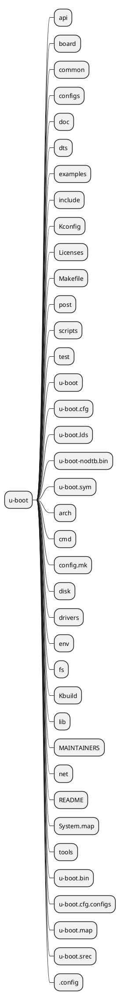

# uboot 分析

## 源码结构

```plantuml
@startmindmap
+ u-boot
++ api
++ board
++ common
++ configs
++ doc
++ dts
++ examples
++ include
++ Kconfig
++ Licenses
++ Makefile
++ post
++ scripts
++ test
++ u-boot
++ u-boot.cfg
++ u-boot.lds
++ u-boot-nodtb.bin
++ u-boot.sym
++ arch
++ cmd
++ config.mk
++ disk
++ drivers
++ env
++ fs
++ Kbuild
++ lib
++ MAINTAINERS
++ net
++ README
++ System.map
++ tools
++ u-boot.bin
++ u-boot.cfg.configs
++ u-boot.map
++ u-boot.srec
++ .config
@endmindmap
```

## 参考

