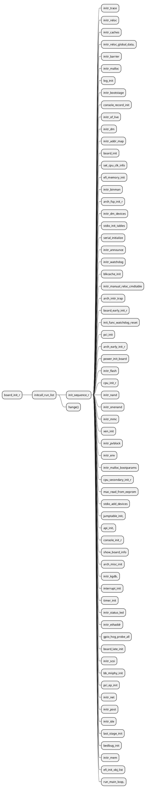

# uboot 启动分析

uboot的启动过程分为BL1和BL2两个阶段。

BL1阶段通常是开发板的配置等设备初始化代码，需要依赖依赖于SoC体系结构，通常用汇编语言来实现。

BL2阶段主要是对外部设备如网卡、Flash等的初始化以及uboot命令集等的自身实现，通常用C语言来实现。

## BL1

uboot的BL1阶段代码通常放在start.s文件中，用汇编语言实现，其主要代码功能如下：

1. 指定uboot的入口。在链接脚本uboot.lds中指定uboot的入口为start.S中的_start。

2. 设置异常向量(exception vector)

3. 关闭IRQ、FIQ，设置SVC模式

4. 关闭L1 cache、设置L2 cache、关闭MMU

5. 根据OM引脚确定启动方式

6. 在SoC内部SRAM中设置栈

7. lowlevel_init（主要初始化系统时钟、SDRAM初始化、串口初始化等）

8. 设置开发板供电锁存

9. 设置SDRAM中的栈

10. 将uboot从SD卡拷贝到SDRAM中

11. 设置并开启MMU

12. 通过对SDRAM整体使用规划，在SDRAM中合适的地方设置栈

13. 清除bss段，远跳转到start_armboot执行，BL1阶段执行完

14. 执行boot

## BL2

