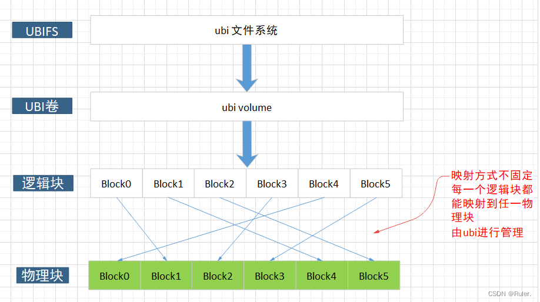

# UBI 文件系统

## UBI简介
UBI全称Unsorted Block Images,是一种原始flash设备的卷管理系统。这个系统能在一个物理的flash设备上管理多个卷并且能在整个flash芯片上实现损耗均衡。

UBI映射逻辑擦除块到物理擦除块。但是除了映射，UBI还实现了全局的损耗均衡和透明的I/O错误处理。

一个UBI卷就是一串连续的逻辑擦除块(LEBs)。每一个逻辑擦除块可以被映射到任何一个物理擦除块(PEB)上面。这个映射是由UBI管理，这种映射对用户是透明的，同时这种映射也是UBI实现全局的损耗均衡的基础。通过每一个物理擦除块记录的擦除计数，可以将数据从损耗严重的物理块转移到损耗较少的擦除块。

## UBIFS文件系统
UBIFS是UBI file system的简称，用于裸的flash设备，作为jffs2的后继文件系统之一。
UBIFS通过UBI子系统处理与MTD设备之间动作。UBIFS文件系统更适合MLCNAND FLASH。
UBIFS工作在UBI卷之上，不能在MTD设备之上运行，也不能在block设备上运行，因为ubifs的设计就是raw flash设备之上的文件系统。
需要注意的是UBIFS并不是为SSD，MMC，SD，Compact Flash等之类的基于flash的存储设备，其是针对于裸flash设备。

裸flash有以下特点：
* 其包含的块被称为可擦除块，而对于SSD这类的设备，并无可擦除块的概念，取而代之的是扇区的概念。
* 包括读、写、擦除可擦除块三种操作。
* 硬件并不管理坏的可擦除块，而SSD之类的设备则具有专门的控制器处理坏块。
* 可擦除块的读写寿命从几千到几十万之间不等。

UBI和UBIFS关系如下：

## UBI 主要功能
UBI的主要功能如下：
* UBI 提供可以动态创建、删除或调整大小的卷；
* UBI 在整个闪存设备上实现磨损均衡(您可能认为您在不断地写入/擦除UBI卷的同一个逻辑擦除块，但实际上UBI 会将其均衡分配到闪存芯片的所有物理擦除块)；
* UBI 透明地处理坏物理擦除块；
    * UBI会处理坏的擦除块，无需上层软件参与。 UBI 有一个保留的物理擦除块池，当一个物理擦除块变坏时，它会透明地用一个好的物理擦除块替换它。 UBI 将数据从新发现的坏物理擦除块移动到好的物理擦除块。 结果是 UBI 卷的用户不会注意到 I/O 错误，因为 UBI 会透明地处理它们。
* UBI 通过清理将丢失数据的机会降至最低。

    * NAND 闪存容易受到读写操作中发生的位翻转错误的影响。位翻转由ECC校验和纠正，但它们可能会随着时间的推移累积并导致数据丢失。UBI通过将数据从具有位翻转的物理擦除块移动到其他物理擦除块来处理这个问题。这个过程称为scrub。 scrub工作在后台透明地完成，并且对上层隐藏。

### UBI卷

一个UBI卷就是一串连续的逻辑擦除块(LEBs)。

UBI卷大小在创建卷时指定，但以后可能会更改（卷可动态调整大小）。UBI提供用户空间工具用于操作UBI卷。

UBI卷有两种类型：

静态卷。 静态卷是只读的，其内容受CRC-32校验和保护。
动态卷。动态卷是可读写的，上层(文件系统)负责确保数据完整性。
静态卷通常用于内核、initramfs 和 dtb。 较大的静态卷在打开时可能会损失部分性能，因为需要计算 CRC-32。

动态卷可以动态创建、删除、调整大小。内核、initramfs或dtb之外的其他镜像最好使用动态卷。

MTD分区和UBI卷的相同点：

两者都由擦除块组成——在UBI卷的情况下是逻辑擦除块，在MTD分区的情况下是物理擦除块；
两者都支持三种基本操作：读、写和擦除。
但与 MTD分区相比，UBI卷具有以下优点：

UBI实现了wear-leveling，用户完全不用关心这个，也就是说上层软件会更简单；
UBI处理坏的擦除块，这也使上层软件更简单；
UBI 卷可以是动态的，它们可以动态创建、删除或调整大小，而MTD分区总是静态的；
UBI 处理位翻转，这再次使上层软件更简单；
UBI提供了卷更新操作，该操作使检测中断的软件更新和恢复变得更容易；
UBI 提供原子逻辑擦除块更改操作，如果在操作期间发生不干净的重启，它允许更改逻辑擦除块的内容而不会丢失数据；这可能对上层软件非常有用（例如，对于文件系统）；
UBI有一个un-map 操作，它只是从物理擦除块中取消映射一个逻辑擦除块，调度物理擦除块进行擦除，然后返回；这非常快，并且使上层软件免于实现自己的机制来延迟擦除（例如，JFFS2必须实现这样的机制）。
除此之外，UBI还提供了一个块设备，允许将常规的、面向块的文件系统挂载在UBI卷的顶部。这是可能的，因为UBI透明地处理坏块。

## 参考（copy from)

[【NAND文件系统】UBI介绍](https://blog.csdn.net/qq_24835087/article/details/125336305)
[UBI文件系统分析](https://blog.csdn.net/gy794627991/article/details/120056000)