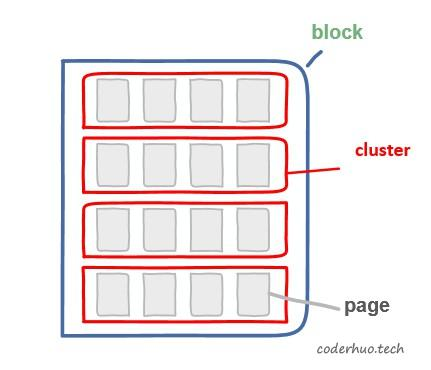
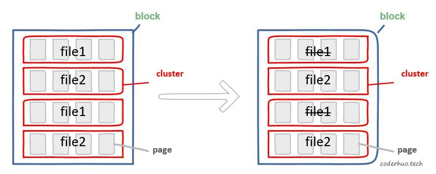
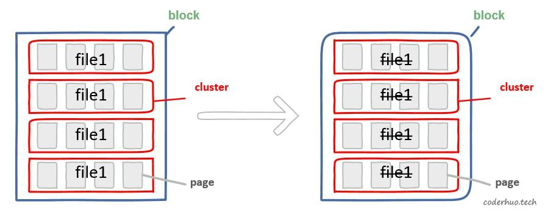
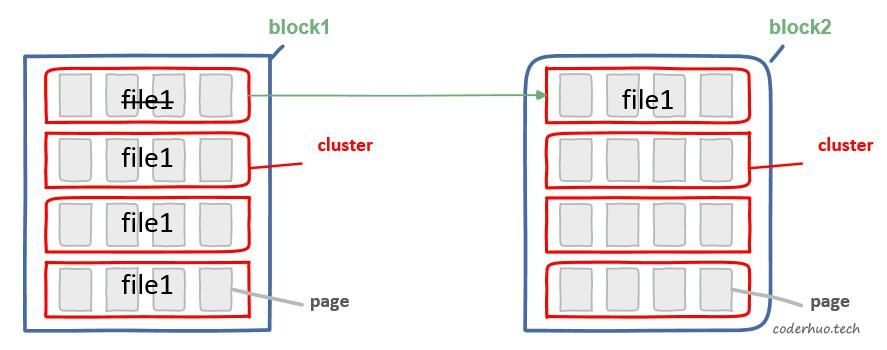

# 文件碎片对Flash性能的影响

copy from 《[文件碎片对Flash性能的影响](http://blog.coderhuo.tech/2020/07/20/file_fragment/)》

本文主要介绍文件碎片对Flash性能的影响。

阅读本文前，建议先阅读下这两篇文章：《NAND Flash基础知识简介》、《Flash写入性能下降问题》。

## 簇（cluster）
前面的文章介绍了flash里面的两个概念：block（flash的最小擦除单元）和page（flash读写的最小单元）。

文件系统层面有个簇（cluster, 有些地方也称为allocation unit）的概念，它是文件系统为文件分配存储空间的最小单元。簇在存储介质格式化的时候指定，必须是page的整数倍，如果要更改簇大小，必须重新格式化存储介质。

一个文件由若干个簇组成，如下图所示。文件实际占用空间大小是簇的整数倍，这在一定程度上会造成存储空间浪费（假设簇大小是1KB，文件实际大小是512B，那么它实际占用空间是1KB，浪费512B）。

cluster、page、block的关系可以用下图来表示（这里假设cluster小于block，实际上不排除一个cluser包含多个block的情况）。下面的例子中一个block包含16个page，一个cluster包含4个page。

## 文件碎片
如果无并发写文件的情况，那么每个文件的簇应该是连续的；否则，多个文件交叉申请存储空间，必然会造成簇的交叉分布，如下面左图所示，file1和file2的簇是交叉排列的（交叉程度和业务层的写卡策略有关）。这种簇不连续的现象就是文件碎片。

假设在某个时刻file1被删除了（上面右图所示），这会导致file1所占用的page处于stale状态，在整个block被擦除前，无法再次使用。如果后来由于磨损均衡策略或者垃圾回收策略需要回收该block，必须先将file2所占用page中的数据拷贝到其他block，才能回收该block。这必然会造成TF卡性能的下降。

如果一个block被同一个文件占用，如下图所示，file1删除的时候，整个block可以直接被擦除回收，这可以避免不必要的数据搬运，有利于TF卡性能提升。

如果簇大小是block的整数倍，就可以保证一个block中不会存在多个文件的情况了。当然，这带来的后果就是潜在的空间浪费。

不过，即使一个block中只有一个文件，修改文件也会造成文件碎片。如下图所示，file1的一部分被修改，由于flash不支持原址更新，所以必须重新为它分配空间。这个没好办法，只能尽量避免修改文件，如果无法避免，尽量以簇为单位去修改。

另外，不同于传统的机械硬盘，文件碎片对Flash的读操作影响很小，因为Flash不需要像机械硬盘那样转动磁盘去寻址。

三、参考资料
https://bbs.huaweicloud.com/blogs/136714
https://www.man7.org/linux/man-pages/man2/fallocate.2.html
https://superuser.com/questions/974824/what-is-the-difference-between-sector-and-cluster