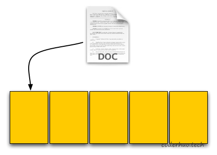
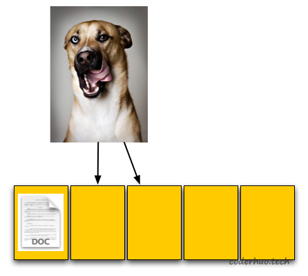
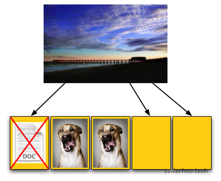
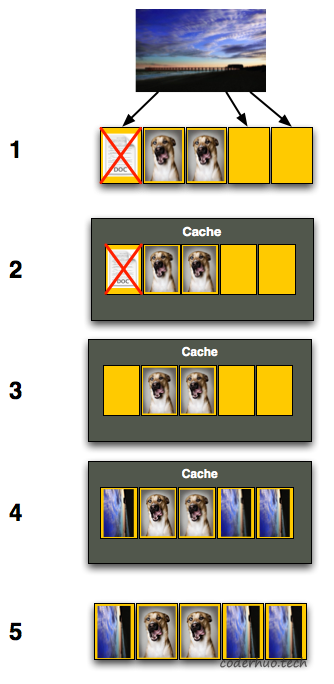
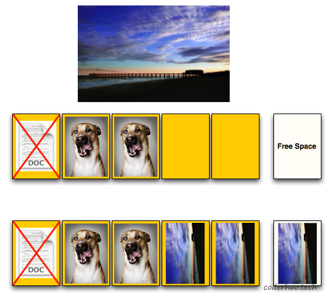
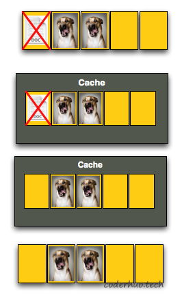

# Flash写入性能下降问题

copy from [Flash写入性能下降问题s](http://blog.coderhuo.tech/2020/07/19/flash_write_performance/)

在《NAND Flash基础知识简介》中，我们介绍了NAND Flash的一些特征。本文主要从文件操作的角度看下写入性能问题。

说明：本文是基于参考文档1、2、3、4做的意译，中间加入了自己的理解。如有需要，可以参阅原文。

现代操作系统是通过FBL（Flash Translation Layer)和存储介质交互的，它使用的地址是LBA（Logic Block Addressing）。操作系统知道哪些逻辑地址是空闲的，哪些已经被占用。写文件时，它发送写入某个逻辑地址的指令给FTL；删除文件时，原来被该文件占用的逻辑地址被释放（实际上可能并未被删除，可以通过恢复工具恢复，除非已经被覆盖写过）。

## 写性能下降
假设一个TF卡的信息如下：
```
Page Size: 4KB
Block Size: 5Pages(20KB)
总存储空间：1Blocks（20KB)
读取速度：2KB/s
写入速度：1KB/s
```
用户首先保存一个4KB大小的文本文件到TF卡。TF卡控制器接收到命令后，发现所有的page都是空的（黄色代表空），就把该文档保存在了第一个page上。



用户继续保存一个8KB的图片到TF卡。TF卡控制器收到命令后，把它存在了紧挨着的两个page。这时候系统显示TF卡60%的空间已使用。



用户这时候删除了原来的文本文件。TF卡控制器此时可能根本感知不到这个操作（FTL层就搞定了），在它看来，现在5个page中，3个被占用，2个空闲。

如果这时候用户想存储12KB的图片到TF卡（需要占用3个page），操作系统知道第一个page可以被覆盖（上一步删除了），再加上最后两个空闲的page，可以放下这张图片。所以它告诉TF卡控制器，图片的前4KB覆盖第一个page，后8KB写入最后的两个page。控制器收到这个指令就傻眼了，因为在它看来只有最后的两个page可以被写入，另外一个page需要先擦除再写入。



我们知道，擦除不能以page为单位，必须以block为单位。为了回收第一个page，我们必须把整个block中的数据读取到内存中（下图步骤1、2所示），这个内存可以是TF卡内的内存（有些卡不一定有），也可以是TF卡插入的主机的内存。然后在内存中修改对应的数据，把新数据写入（步骤3、4所示）。最后把整个block擦除，再把修改完成的数据写回到TF卡（步骤5所示）。



在最后一次存储操作中，写入的有效数据是12KB，但是我们先读取了12KB，然后写入了20KB的数据（上一篇文章讲到的写放大的概念）。

考虑到该卡的写入速率是1KB/s，读取速度是2KB/s，本次写入我们预期的耗时应该是12s，但是实际上花费了26s。在用户看来，我们的写入速率从1KB/s下降到了0.46KB/s，因为写入12KB花费了26s。

这就是为啥TF卡越用越慢的原因（这里说的慢指的是写入速率，读取速率基本不受影响）。

## 预留空间
由于NAND Flash本身特征的限制，我们无法以page为单位擦除，所以导致了上面的问题。

常规的优化方法是预留一些存储空间，比如我们的TF卡对外展示的容量是20KB，但实际上我们有24KB的存储空间，多出来的这4KB只能被TF卡控制器使用，用户无法使用。

回到上面写入12KB图片的例子，由于我们有了额外的4KB空间，再加上之前剩余的8KB，可以直接把这12KB写入了，如下图所示：



如果我们继续删除8KB，然后再写入8KB，又会遇到同样的问题。也就是说，预留空间只是延迟了这个问题。当然，预留空间越大（成本也越高），该问题出现的就越晚，但迟早会出现。（所以，需要垃圾回收策略。）

预留空间可以从下面三个层面实现，第一点用户不可控，后两点用户可控：

1. 厂商自己就做了预留（一般会有7%左右的冗余，看厂商）
2. 用户在建立分区的时候，保留一部分空间（比如8G卡，分成两个分区，一个7G用作数据存储，一个1G做预留空间）
3. 保持卡的剩余容量在5%以上

## TRIM命令
通过上面的例子我们知道，文件删除是很快的，因为page回收是延迟进行的。

这样做的代价是后续某个时刻的写操作会触发page回收，导致写入性能下降。这是否合理？有没有办法把性能平均下来，避免出现较大的性能瓶颈。TRIM命令可以帮助我们（需要操作系统和存储器支持）。

删除文件的时候，操作系统发送TRIM命令给TF卡控制器，告诉它哪些page是被删除的。控制器收到命令后，把整个block复制到自己的cache中，清空已删除的page，擦除整个block，然后把修改后的block写回。

如下图所示，当用户删除最左边page中的文档时，TF卡控制器收到TRIM命令，知道第一个page被删除，就把整个block读取到自己的cache中，然后清空第一个page，擦除整个block后再写回到TF卡。



这样做的后果是：删除操作耗时会增加，但是不会再影响后续的写入操作。

比如当用户再写入12KB的数据时，这时候有3个空闲的page，可以直接写入，效率比之前有提升。

TRIM的效果

不过，TRIM只能减轻该问题，并不能彻底消除该问题。比如，当你修改一个已存在文件的时候就不能使用TRIM命令。这种场景下，仍然会遇到写性能下降的问题。

四、参考资料
https://www.anandtech.com/show/2738/8
https://www.anandtech.com/show/2738/9
https://www.anandtech.com/show/2738/10
https://www.anandtech.com/show/2738/11
https://pdfs.semanticscholar.org/faf8/22b0712731a32a10988e4ee3b3602bec5dd9.pdf
https://flashdba.com/storage-for-dbas/
