# NAND Flash基础知识简介 
copy from [NAND Flash基础知识简介](http://blog.coderhuo.tech/2020/07/18/flash_basics/)

NAND Flash是一种非易失存储介质（掉电后数据不会丢失），常见的U盘、TF卡/SD卡，以及大部分SSD（固态硬盘）都是由它组成的。 本文主要介绍其组成及工作原理。

为了表述方便，后面所说的Flash仅指NAND Flash。

## Flash基本组成单元：SLC/MLC/TLC

Flash的基本组成单元是浮栅晶体管，其状态可以用来指示二进制的0或1。写操作就是往晶体管中注入电子，使之充电；擦除操作则是把晶体管中的电子排出，使之放电。由于这是个模拟系统，晶体管并不存在绝对的空和满状态，其中的电子数目可以处于空和满之间的任一个状态。

由此可见，可以根据晶体管中电子的数目来指示二进制的0和1。比如在SLC（Single Level Cell）中，晶体管中电子数目小于50%的时候代表1，大于50%的时候代表0。

SLC是对电子数目做的一阶量化，所以一个晶体管可以代表两个状态：0和1。如果我们对晶体管中的电子数目做二阶量化，一个晶体管就可以代表四个状态：少于25%代表00，25% ~ 50%代表01，50% ~ 75%代表10、大于75%代表11。这就是MCL(Multi Level Cell)的做法。

当然我们还可以对晶体管中的电子数目做三阶量化，一个晶体管就可以代表八个状态：000、001、010、011、100、101、110、111。这是TLC(Three Level Cell)的做法。

也就是说，量化等级越高，一个晶体管可以表示的状态越多，存储密度就越大，同等数量的存储单元组成的存储介质，存储容量也越大。

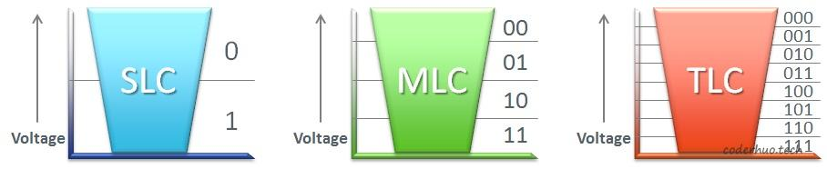

如上图所示，可以把晶体管比作水桶，晶体管内的电子比作水：

* 由于SLC只有两个状态，只需要保证电子数目多于一半或少于一半即可，所以注入/排放电子的过程比较简单，执行起来很快；对于MLC，有四个状态，对注入/排放电子的精度要求就比较高，执行起来就没那么快了；对于TLC，有八个状态，对注入/排放电子的精度要求更高，执行的就更慢了。另外，写入的数据也会影响效率，比如对于MLC，写入代表满状态的00和代表空状态的11，效率要高于01和10（清空一杯水和倒满一杯水肯定比倒1/4,、1/2杯水简单，当然这个影响在业务层看来可能比较小）。
* 另一方面，如果水桶发生损坏，比如在上半部分产生了一个缺口（擦除操作会导致介质磨损，最终导致电子泄露），对于SLC可能没影响，可以正常使用，对于MLC和TLC可能由于无法区分多个状态，就无法使用了。NAND Flash的寿命在很大程度上受所用存储单元类型影响，单个晶体管中存放的状态越多，容错性越差，寿命越短。

不同组成单元对Flash性能和寿命的影响

从上面的原理可以看出，SLC、MLC、TLC的性能和寿命是递减的，存储密度是递增的。 下面是一组具体的数据：

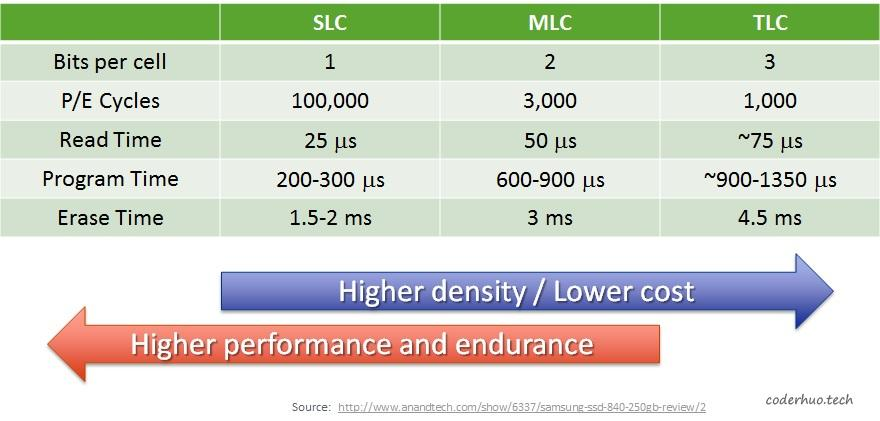

从上图可以看出：

* 随着每个单元代表的比特数增加，读、写、擦除耗时也在增加
无论是SLC还是MCL、TLC，擦除耗时（ms数量级）都远高于读写耗时(us数量级)
* SLC的擦写次数远大于MLC、TLC，也就是说寿命长。
* SLC每个晶体管只能代表一个比特，从存储密度看，是最低的，TLC存储密度最高，MLC次之。
* 总的来看，SLC的性能、寿命、稳定性是优于MLC的，当然价格也更贵，MCL次之，TLC最次。

## Flash的结构及特点
### Flash的结构
Flash中存在下面几个基本概念：package、die、plane、block、page(page对应于普通硬盘HDD中的sector，即常说的扇区)。 下面是一个示意图，我们由大到小拆解下：

* package是存储芯片，即拆解固态硬盘或者SD卡后看到的NAND Flash颗粒。
* 每个package包含一个或多个die。die是可以独立执行命令并上报状态的最小单元。
* 每个die包含一个或多个plane(通常是1个或2个)。不同的plane间可以并发操作，不过有一些限制。
* 每个plane包含多block*，block是最小擦除单元。
* 每个block包含多个page， page是最小的读写单元。
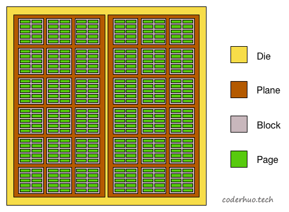

这里我们需要重点关注的是：

* 读写的操作对象是page，通常是512字节或者2KB
* 擦除的对象是block，通常包含32或64个page（16KB或64KB）
* 每个block在写入前需要先擦除
* block擦除前，需要保证本block上所有page中都不包含有效数据（如果有些page包含有效数据，需要先搬移到其他地方）

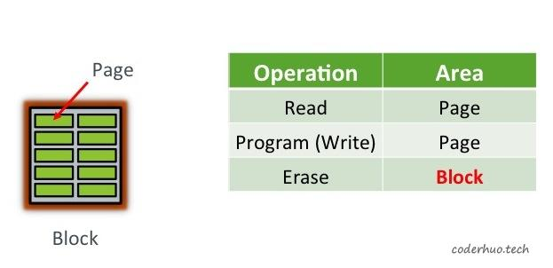

### Program/Erase Cycles
Flash还有一个重要特性：Flash不支持更新操作，严格说应该是不支持原址更新。 如果我们已经往某个page中写入了数据，想修改这个page中的内容，只能通过下面的方法：

1. 先把本page所属block的数据全部读出来，比如先读到内存DRAM
2. 然后修改对应page的内容
3. 接下来擦除整个block
4. 最后把修改后的block数据回写到Flash

Flash芯片上block的擦写次数是有限的，最大擦写次数称为PE Cycles(Program erase cycles, 往Flash写入的过程又称为编程过程，即program)。如果采用上面的方法进行原址更新，Flash很容易就会被用坏的。一个折中的方法是：将新数据写到一个新的page中，并将原来的page标记为无效，如下图所示：

*说明：新的page和老的page可以位于同一个block，也可以位于不同的block，甚至位于不同的die。*

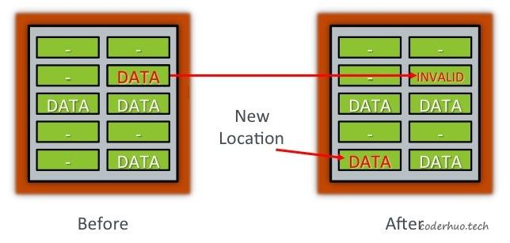

这样做会带来另外的问题：

1. 数据所在page变了，后续如何访问新的数据（谁来维护这个映射关系）
2. 无效的page什么时候回收（上面的做法只是延迟了擦除block的时间，但是空闲page迟早有用完的时候）
3. 如何选择新的page，保证整个flash的擦写均衡（避免有的block擦除次数多，有的block擦除次数少）
4. 接下来登场的FTL会解决上面的问题。需要注意的是，擦除的耗时远大于读写耗时，相关逻辑处理不好的话会影响性能。所以目前有很多FTL的优化算法。

关于Flash的原址更新补充如下说明：假设一个空白page是全1，比如1111 1111，对它的写操作只能把其中的某些位由1变为0（第一次写可以把1111 1111改成1111 0000，第二次可以继续把1111 0000改成0011 0000，从这个角度看，page可以执行多次写操作），而无法再把0变为1（如果某个写操作涉及把0变为1，那就无能为力了，只有整个block擦除后再写入了）。

## The Flash Translation Layer

### 逻辑地址映射
在NAND Flash出现前，逻辑地址映射(Logical Block Mapping， 简称LBA)就存在了，它是为了对上层的文件系统屏蔽Physical Block Address(PBA)的细节，让寻址更简单、灵活。

下面是逻辑地址和物理地址映射示意图：
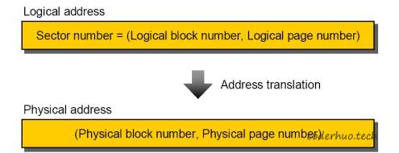

上图所示属于page-to-page的映射，这种映射的缺点是FTL中维护大量的映射关系，好处是管理方便（某个page更新时，不用关心新数据是否和原数据位于同一个block，如下图所示）。
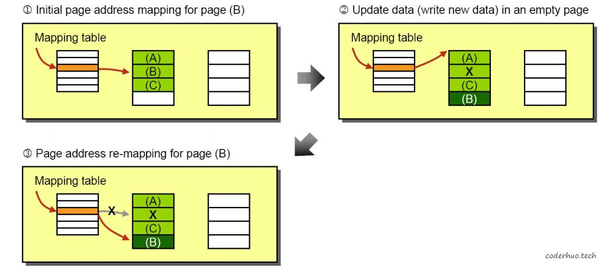

实际一般使用block-to-block的映射（这种情况下，逻辑page和物理page的映射是固定的，比如逻辑的page1对应物理的page1，逻辑的page2对应物理的page2），如下图所示：
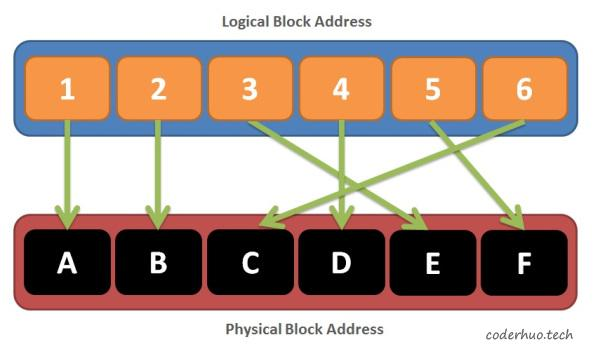

block-to-block的映射，好处是维护的映射关系较少，节省了存储空间，缺点是在数据更新的时候比较麻烦，如下图所示：

1. 步骤1展示的是初始状态，FTL的映射指向Original block
2. 步骤2想要更新前两个page的数据：先将新数据写入新的的block（注意：page在block中的相对位置保持不变），原来block中对应的page被标记为无效
3. 步骤3把原来block中下面的两个page搬移到新的block中（注意：page在block中的相对位置保持不变）
4. 步骤4更新FTL映射关系，指向新的block，然后擦除原来的block（具体什么时候擦除，由Flash内部的垃圾回收机制决定）

block-to-block方式的映射，在数据更新的时候产生了额外的数据拷贝，需要付出的代价较高。为了解决这个问题，FAST、BAST等算法应运而生。

可以看到，无论是page-to-page的映射还是block-to-block的映射，虽然Flash内部的映射关系发生了变化，但是该变化对文件系统是透明的，因为FTL的映射表对外并未发生变化。

### 磨损均衡
每个block的最大擦写次数(P/E Cycles)基本上是一样的，磨损均衡（Wear Levelling）的作用是保证所有block被擦写的次数基本相同。这就要求磨损均衡算法要把擦写操作均摊在所有的block上。

如果所有block上的数据都经常更新，磨损均衡算法执行起来问题不大。如果有些block上存在冷数据（写入之后就很少更改的数据），我们必须根据一定的策略强制搬移这些数据并擦写对应的block，否则这些block就永远不会被擦除。当然这种操作会增加系统负载，同时也加大了整个系统的磨损（产生了不必要的擦写）。

实际上，磨损均衡算法越激进，系统的磨损越严重；但是如果磨损均衡算法太消极，会导致两极分化，部分block被擦除次数较多，部分block被擦除次数较少。

### 垃圾回收
接下来我们需要处理page的回收问题（Garbage Collection）。Flash的擦除单元是block，这决定了垃圾回收的最小单元也是block。block回收过程中，需要确保待擦除block上无有效数据；如果有的话，需要搬移到其他的block（和磨损均衡一样，这也会增加额外的负担，实际应用中需要找到一个平衡点）。

**为什么需要垃圾回收**

我们假设一个简单的存储介质只包含5个block，每个block包含10个page。在初始化状态，所有的page都是空的，存储介质的可用空间是100%。
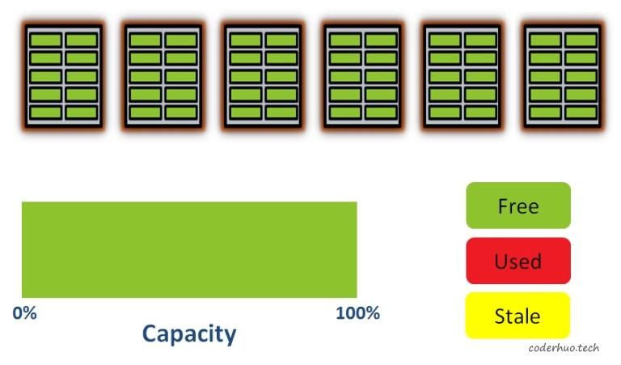

接下来写入一些数据（注意：写入的最小单元是page）。从下图可以看出，有些page已经被占用了，并且由于磨损均衡算法的作用，他们被分散在不同的block上:
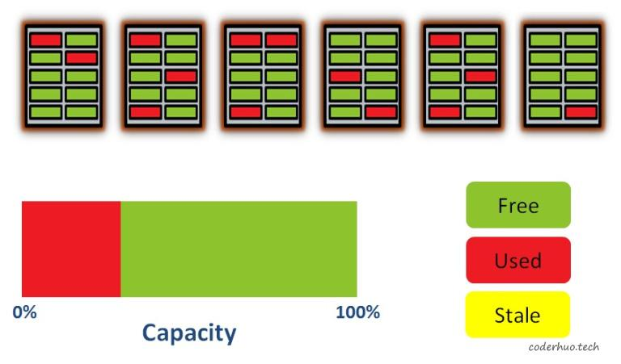

我们再继续写入一些数据，现在50%的空间被占用了，并且数据分散在各个block上（尽管在物理层面数据是分散在各个block的，FTL对外展现的可能是连续的）：

如果这时更新数据，FTL会选择一个空的page写入新数据，然后把老的page标记为stale状态（黄色标记块），如下图所示:
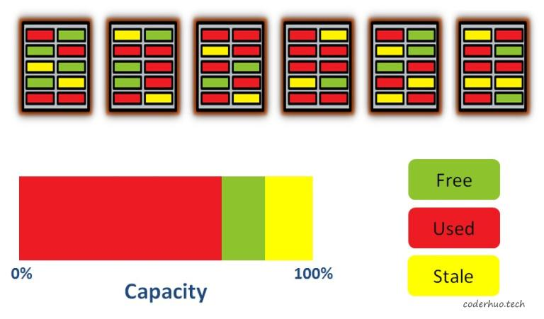

这时最左边的block包含2个stale状态的page和4个used状态的page，为了回收stale状态的page，必须先把4个used状态的page拷贝到其他的block，然后再把最左边的block整个擦除掉。如果此时不执行该操作，继续写入新数据（或者更新现有数据），会耗尽所有free状态的page，尽管此时还存在stale状态的page，但是已经无法回收了（有效数据没法腾挪了），这时候整个存储介质会进入只读状态。

所以，Flash的FTL层需要执行垃圾回收策略，释放stale状态的page。

### 写放大因子
从上面的介绍我们了解到，磨损均衡和垃圾回收在一定程度上都会触发后台数据搬运。这些操作是在Flash内部进行的，外部通过任何方法都监控不到，外部唯一能感受到的就是性能受到影响，比如某次写很耗时。

这种现象叫做写放大（Write Amplification），可以通过下面的公式衡量。该值越大说明效率越低，会对存储介质的性能和寿命造成不良影响：

公式的分子是实际写入到Flash的数据量，分母是有效数据量。比如一次写入5KB数据，但是由于磨损均衡或者垃圾回收导致后台产生了数据搬运，实际写入数据量是10KB，那么，写放大因子就是2。

### 预留空间
一般情况下，存储介质的实际存储空间都大于标称空间(一般多7%左右，具体依赖生产商)，多出来的存储空间被称为预留空间（Over-Provisioning），这部分空间用户是无法使用的。它可以被用来进行数据腾挪，保证垃圾回收、擦写均衡的正常进行，如果有坏块产生，还可以作为替补block顶上去（在一定程度上，让用户感知不到坏块的存在）。

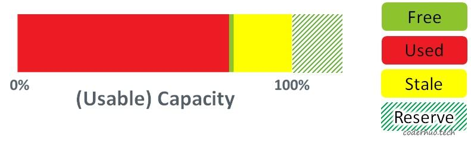

## 参考资料

https://pdfs.semanticscholar.org/faf8/22b0712731a32a10988e4ee3b3602bec5dd9.pdf
https://flashdba.com/storage-for-dbas/

