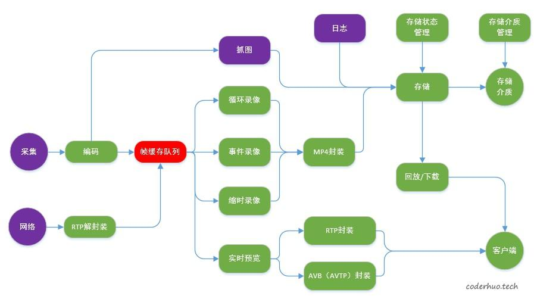
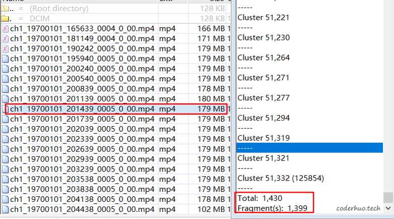

# TF卡存储性能调优案例分析

copy from 《[TF卡存储性能调优案例分析](http://blog.coderhuo.tech/2020/07/21/tf_write_problem/)》

本文根据一个实际案例介绍TF卡存储性能调优思路。

阅读本文前，建议先阅读下这三篇文章：
1. 《NAND Flash基础知识简介》
2. 《Flash写入性能下降问题》
3. 《文件碎片对Flash性能的影响》

这是个系统性问题，并非单一原因导致的，排查过程涉及测试/验证较多，很多实验是多个优化点的组合。由于单次实验很耗时，很多是同步进行的，本文就不再以时间线的形式逐步递进，而是逐一列出所有的问题点及对应排查方法、优化方法。

## 背景
在一个视频存储项目中遇到由于TF卡写入性能下降导致的视频丢帧问题。 项目业务框图如下所示，在下面的业务场景下出现丢帧：

 * 两路视频存储，码流速率分别是12Mbps、8Mbps，视频一直在循环覆盖写，卡满后就删除最老的视频文件
 * 一个文件日志，记录设备运行信息，理论速率不超过11.5Kbps，文件大小不超过2MB，达到上限后文件内部自循环覆盖最早的日志

存储介质是TF卡（MLC类型的NAND Flash， Class 10），大概在TF卡被循环覆盖写一遍后就会出现问题，规律还算比较明显。

##排查点及优化方法
首先确认是CPU瓶颈还是IO瓶颈导致的问题。

通过iostat命令发现iowait和idle都较高（60% ~80%)，基本上可以确认这是IO瓶颈导致的问题。如果是IO瓶颈，可能是由于以下几种原因导致的：

 * 芯片TF卡控制器的问题
 * TF卡本身的问题，也就是常说的”挑卡”，有些卡有问题，有些卡没问题
 * 业务层写卡逻辑不合理导致的问题
### TF卡控制器有没有问题

可以用同一张卡在不同的平台上使用dd命令进行测试，验证写入速率。注意dd测试的时候要排除cache的影响，可以设置oflag选项为direct绕开cache，如果不支持的话也可以设置CONV选项为fsync，二者的区别是：前者每次写都直接写入到存储介质中，后者还是会进入cache，但是命令结束前会把所有的数据刷到存储介质中。

另外，由于写入性能和TF卡状态等因素有关，最好是用多卡多次验证。

通过该实验，我们发现自己的芯片和另一款对标芯片的写入性能差了大概20%，说明芯片TF卡控制器性能还是有差异的。这个问题直接抛给供应商，他们可以通过SD卡协议分析仪抓SD卡command分析，这里不再细述。

### TF卡有没有问题

这里要验证是否存在“挑卡”的问题：部分品牌/型号的卡有问题，其他的则没问题。

这个问题有两个解法：

* 一是把其他品牌/型号的卡直接放在设备上验证，看是否还出现问题。如果问题不存在了，可以侧面证明原来的卡有问题；如果问题还存在，则说明不了什么问题，还要结合其他实验进一步分析。
* 另一个就是直接分析卡的性能。判断一个TF卡有没有问题，不仅需要关注它的顺序写速率，更要关注它的随机写速率，以及卡满覆盖后的顺序写速率、随机写速率，还有卡的寿命（覆盖写几次后性能急剧下降或者直接无法使用）。可以借助fio工具做这些验证。

这次我们摸排了市场上主流品牌/型号的TF卡，发现不同卡的性能差别还是蛮大的，特别是随机写性能，同样是Class 10的卡，有些卡随机写性能小于1MB/s，有些卡的随机写速率不亚于顺序写速率，可以稳定在10MB/s以上。这和TF卡内部的磨损均衡算法（Wear Levelling)、垃圾回收算法（Garbage Collection），以及预留分区（Over-Provisioning)有很大的关系。

评估下来我们所用的出货卡属于中等偏下水平，极端情况下的随机写速率1MB/s左右（这种缺陷只好通过业务写入方式去规避，尽量避免进入这种状态）。

### 业务层写卡逻辑有没有问题

通过dd命令测试出现问题的TF卡，发现写卡速率也较低，在2MB/s附近波动，无法满足业务需求（12Mbps + 8Mbps = 2.5MB/s)。 格式化之后，发现速率可以达到5MB/s左右，这间接证明了我们对卡的写入方式不合理，导致卡进入低性能状态。

我们还通过下面的方式进行了直接证明：用一张可以读取统计信息的卡（需要TF卡厂商的配合才能做到），复现问题，发现写放大因子为5.6，也就是说向卡内写入1MB的有效数据会导致TF卡实际写入5.6MB数据。（具体原理可以参考《NAND Flash基础知识简介》中关于写放大因子的介绍）。这说明TF卡内部发生了较多的数据搬运，从《文件碎片对Flash性能的影响》中我们知道多个文件并发写和修改文件会导致该问题。

用winhex分析出问题的文件，发现文件碎片化确实比较厉害。如下图所示，一个视频文件179MB，共占用1430个簇（簇大小是128KB），但是有1399个碎片，该文件碎片化十分厉害，基本上没有连续的簇了。其他文件基本上也是如此。

梳理文件操作逻辑，发现存在以下问题点：

* 多文件同时写操作：正常场景下两路视频文件外加一个日志文件，有些场景还会叠加抓图、紧急录像等业务，并且这些文件的删除时机是不同的。

* 存在修改文件的场景：
    * mp4文件使用的是前置索引，每隔3s更新一次。（如下图所示，索引位于文件的头部，数据位于尾部，更新索引的时候需要跳回文件头部） 
    
    * 日志文件每16KB写一次卡，并且是文件内部循环写的。文件大小固定2MB，文件内部自循环。

* 写文件时的数据对齐问题：虽然mp4模块有个256KB的输出缓存（每256KB写一次卡），但是更新索引的时候，会把缓存中的数据强制清空，这导致写入数据的对齐问题（一般要求至少是flash的page的倍数，即512字节的整数倍）。

* cache设置不合理，占比较高，最后文件关闭的时候，大量数据需要从cache刷到存储介质，耗时较久。

##### 优化思路：

* 簇大小设置为4MB，尽量避免一个block中存在多个文件的情况（不同卡的block大小是有差异的，不排除有些卡的block大于4MB）。这样做的后果是，在一定程度上造成了空间的浪费，比如图片文件实际大小1MB左右，现在也要占用4MB的空间。
*注：如果文件系统是FAT32，可以设置的最大簇是64KB，这时候可以用函数fallocate动态的执行预分配，以达到为同一个文件分配连续簇的效果（使用的时候记得设置参数FALLOC_FL_KEEP_SIZE，否则文件大小会被改变，并且有些平台会直接写卡的，很慢）。*

* 调整相关代码逻辑，保证每次写卡大小都是256KB的整数倍，解决数据对齐的问题

* 禁用pdflush刷写cache的机制，业务层在每个文件句柄累积了2MB数据后，主动往介质中刷数据（模拟Direct IO），这样可以让IO压力均匀分散在写文件的整个过程中，避免在文件关闭的时候出现热点。

* 加大码流缓冲区（具体参阅上面的业务流程图），用缓冲来对抗偶尔出现的IO热点。

* 降低修改文件的频率：对于mp4文件，降低索引刷新频率，拔卡会导致录像文件最后几秒的数据无法播放（不过可以通过修复算法找回）。

### 存储性能的其他优化思路
还有一些优化方法，出于项目风险考虑并未落地，可供参考：

1. 提高TF卡总线速率，比如时钟频率从50MHz提高到100MHz，对应理论速率上限就从25MB/s提高到50MB/s
2. 增加对TRIM命令的支持，目前很多嵌入式设备是不支持的，原理参考 《Flash写入性能下降问题》
3. 增加OP分区，原理参考 《Flash写入性能下降问题》
4. 如果你的业务层面没有缓冲区，可以使用setvbuff设置一个缓存，这样可以将一些零碎的写操作归集成大块的写操作，减少IO次数，另外还可以优化数据对齐问题（注意：fseek操作会导致该vbuff里面的数据刷下去）
5. Direct IO，屏蔽掉底层cache，直接由业务层控制什么时候写卡
6. 调整cache比率优化IO，比如调整dirty_ratio等参数
7. 文件系统的性能差异，比如exFAT文件系统，存在fuse和nofuse两个版本，前者在用户态实现，后者在内核态实现，业内一般认为后者效率要高于前者。
8. 注意一些IO操作函数的细节，比如fflush只能把数据从用户态刷到内核态，fsync可以保证数据刷到存储介质，不过它还会更新元数据（文件大小、文件修改时间等信息），而fdatasync则是fsync的优化版，它只在文件大小发生变化的时候更新元数据；fclose/close均不能保证文件关闭后数据一定能刷到存储介质中，必须用fsync/fdatasync/sync来保证。

## 参考资料
https://www.ufsexplorer.com/articles/file-systems-basics.php
https://bbs.huaweicloud.com/blogs/136714
http://linuxperf.com/?p=33
https://pdfs.semanticscholar.org/faf8/22b0712731a32a10988e4ee3b3602bec5dd9.pdf
https://flashdba.com/storage-for-dbas/
https://smallbusiness.chron.com/block-size-affect-fragmentation-68368.html
https://www.cnblogs.com/suzhou/p/5381738.html
https://techterms.com/definition/cluster
https://www.anandtech.com/show/2738/7
