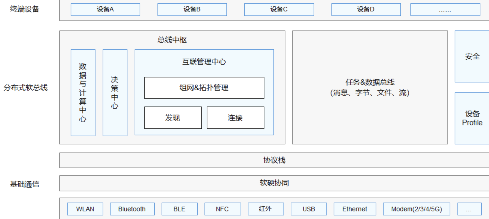
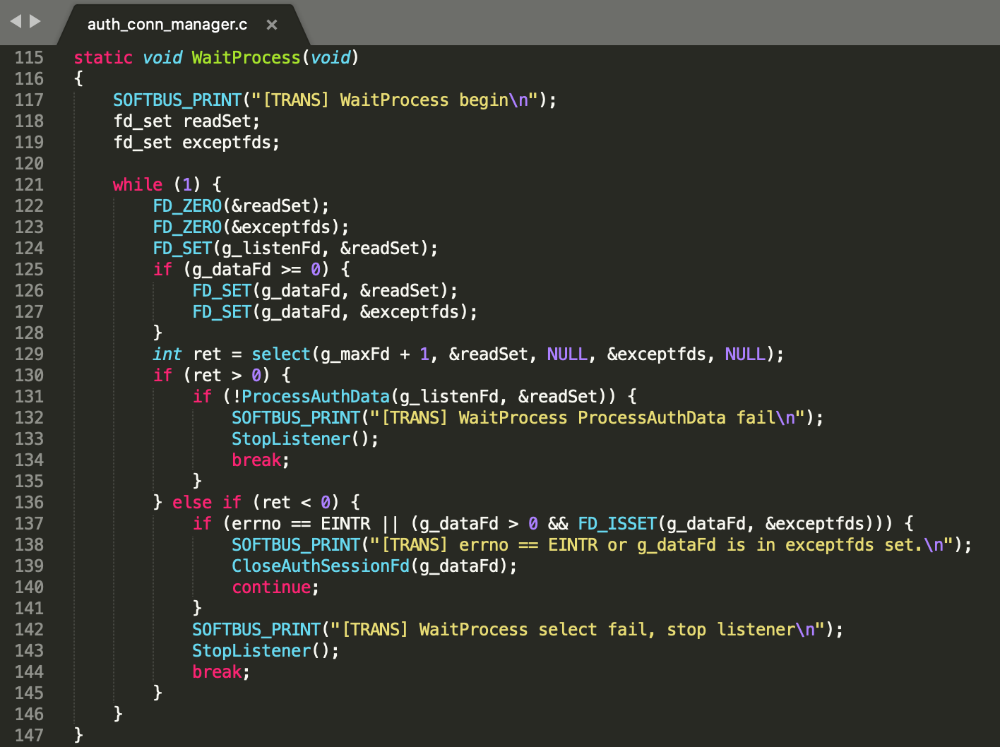
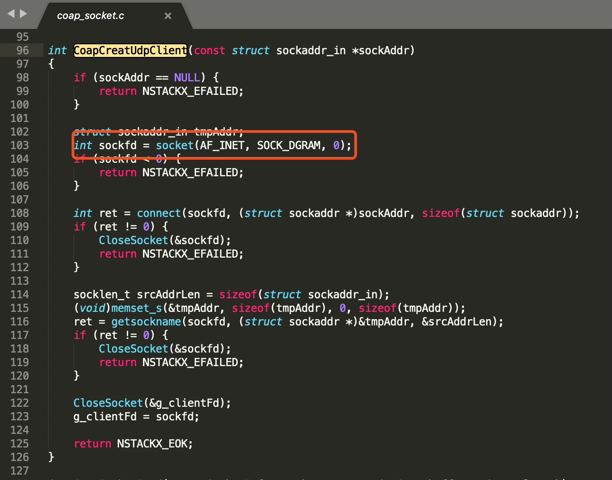
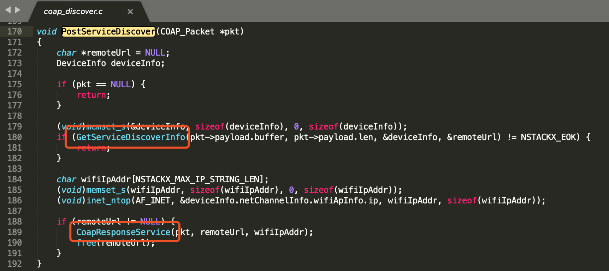

# 鸿蒙分布式软总线技术研究
[鸿蒙分布式软总线技术研究](https://www.cnblogs.com/ikariShinji/p/14348415.html)

## 一、HarmonyOS概述
### 1.1系统定义
#### 1.1.1 系统定位
HarmonyOS是一款“面向未来”、面向全场景（移动办公、运动健康、社交通信、媒体娱乐等）的分布式操作系统。在传统的单设备系统能力的基础上，HarmonyOS提出了基于同一套系统能力、适配多种终端形态的分布式理念，能够支持手机、平板、智能穿戴、智慧屏、车机等多种终端设备。

* 对消费者而言，HarmonyOS能够将生活场景中的各类终端进行能力整合，可以实现不同的终端设备之间的快速连接、能力互助、资源共享，匹配合适的设备、提供流畅的全场景体验。
* 对应用开发者而言，HarmonyOS采用了多种分布式技术，使得应用程序的开发实现与不同终端设备的形态差异无关。这能够让开发者聚焦上层业务逻辑，更加便捷、高效地开发应用。
* 对设备开发者而言，HarmonyOS采用了组件化的设计方案，可以根据设备的资源能力和业务特征进行灵活裁剪，满足不同形态的终端设备对于操作系统的要求。

HarmonyOS提供了支持多种开发语言的API，供开发者进行应用开发。支持的开发语言包括Java、XML（Extensible Markup Language）、C/C++ 、 JS（JavaScript）、CSS（Cascading Style Sheets）和HML（HarmonyOS Markup Language）。

#### 1.1.2 技术架构
HarmonyOS整体遵从分层设计，从下向上依次为：内核层、系统服务层、框架层和应用层。系统功能按照“系统 > 子系统 > 功能/模块”逐级展开，在多设备部署场景下，支持根据实际需求裁剪某些非必要的子系统或功能/模块。HarmonyOS技术架构如下所示。


##### 内核层
* 内核子系统：HarmonyOS采用多内核设计，支持针对不同资源受限设备选用适合的OS内核。内核抽象层（KAL，Kernel Abstract Layer）通过屏蔽多内核差异，对上层提供基础的内核能力，包括进程/线程管理、内存管理、文件系统、网络管理和外设管理等。
* 驱动子系统：硬件驱动框架（HDF）是HarmonyOS硬件生态开放的基础，提供统一外设访问能力和驱动开发、管理框架。
##### 系统服务层
系统服务层是HarmonyOS的核心能力集合，通过框架层对应用程序提供服务。该层包含以下几个部分：

* 系统基本能力子系统集：为分布式应用在HarmonyOS多设备上的运行、调度、迁移等操作提供了基础能力，由分布式软总线、分布式数据管理、分布式任务调度、方舟多语言运行时、公共基础库、多模输入、图形、安全、AI等子系统组成。其中，方舟运行时提供了C/C++/JS多语言运行时和基础的系统类库，也为使用方舟编译器静态化的Java程序（即应用程序或框架层中使用Java语言开发的部分）提供运行时。
* 基础软件服务子系统集：为HarmonyOS提供公共的、通用的软件服务，由事件通知、电话、多媒体、DFX（Design For X） 、MSDP&DV等子系统组成。
* 增强软件服务子系统集：为HarmonyOS提供针对不同设备的、差异化的能力增强型软件服务，由智慧屏专有业务、穿戴专有业务、IoT专有业务等子系统组成。
* 硬件服务子系统集：为HarmonyOS提供硬件服务，由位置服务、生物特征识别、穿戴专有硬件服务、IoT专有硬件服务等子系统组成。

根据不同设备形态的部署环境，基础软件服务子系统集、增强软件服务子系统集、硬件服务子系统集内部可以按子系统粒度裁剪，每个子系统内部又可以按功能粒度裁剪。

##### 框架层
框架层为HarmonyOS应用开发提供了Java/C/C++/JS等多语言的用户程序框架和Ability框架，两种UI框架（包括适用于Java语言的Java UI框架、适用于JS语言的JS UI框架），以及各种软硬件服务对外开放的多语言框架API。根据系统的组件化裁剪程度，HarmonyOS设备支持的API也会有所不同。

##### 应用层
应用层包括系统应用和第三方非系统应用。HarmonyOS的应用由一个或多个FA（Feature Ability）或PA（Particle Ability）组成。其中，FA有UI界面，提供与用户交互的能力；而PA无UI界面，提供后台运行任务的能力以及统一的数据访问抽象。FA在进行用户交互时所需的后台数据访问也需要由对应的PA提供支撑。基于FA/PA开发的应用，能够实现特定的业务功能，支持跨设备调度与分发，为用户提供一致、高效的应用体验。

#### 1.2 技术特性
Harmony的技术特性主要是多种设备之间能够实现硬件互助，资源共享。 依赖的技术主要包括分布式软总线、分布式设备虚拟化、分布式数据管理、分布式任务调度等。本报告将主要调研分布式软总线技术。

#### 1.2.1 分布式软总线
分布式软总线是手机、平板、智能穿戴、智慧屏、车机等分布式设备的通信基座，为设备之间的互联互通提供了统一的分布式通信能力，为设备之间的无感发现和零等待传输创造了条件。开发者只需聚焦于业务逻辑的实现，无需关注组网方式与底层协议。分布式软总线示意图如下： 



典型应用场景举例：

* 智能家居场景：在制作粉蒸肉时，手机可以通过碰一碰和烤箱连接，并将自动设置粉蒸肉的制作参数，控制烤箱来制作菜肴。与此类似，料理机、油烟机、空气净化器、空调、灯、窗帘等都可以在手机端显示并通过手机控制。设备之间即连即用，无需繁琐的配置。
* 多屏联动课堂：老师通过智慧屏授课，与学生开展互动，营造课堂氛围；学生通过手机完成课程学习和随堂问答。统一、全连接的逻辑网络确保了传输通道的高带宽、低时延、高可靠。

#### 1.2.2 分布式设备虚拟化
分布式设备虚拟化平台可以实现不同设备的资源融合、设备管理、数据处理，多种设备共同形成一个超级虚拟终端。针对不同类型的任务，为用户匹配并选择能力合适的执行硬件，让业务连续地在不同设备间流转，充分发挥不同设备的能力优势，如显示能力、摄像能力、音频能力、交互能力以及传感器能力等。分布式设备虚拟化示意图如下：


#### 1.2.3 分布式数据管理
分布式数据管理基于分布式软总线的能力，实现应用程序数据和用户数据的分布式管理。用户数据不再与单一物理设备绑定，业务逻辑与数据存储分离，跨设备的数据处理如同本地数据处理一样方便快捷，让开发者能够轻松实现全场景、多设备下的数据存储、共享和访问，为打造一致、流畅的用户体验创造了基础条件。分布式数据管理示意图如下：


#### 1.2.4 分布式任务调度
分布式任务调度基于分布式软总线、分布式数据管理、分布式Profile等技术特性，构建统一的分布式服务管理（发现、同步、注册、调用）机制，支持对跨设备的应用进行远程启动、远程调用、远程连接以及迁移等操作，能够根据不同设备的能力、位置、业务运行状态、资源使用情况，以及用户的习惯和意图，选择合适的设备运行分布式任务。

下图以应用迁移为例，简要地展示了分布式任务调度能力。


除了硬件互助，资源共享外，HarmonyOS还支持一次开发、多端部署，统一OS、弹性部署，HarmonyOS提供了用户程序框架、Ability框架以及UI框架，支持应用开发过程中多终端的业务逻辑和界面逻辑进行复用，能够实现应用的一次开发、多端部署，提升了跨设备应用的开发效率。一次开发、多端部署示意图如下：


HarmonyOS通过组件化和小型化等设计方法，支持多种终端设备按需弹性部署，能够适配不同类别的硬件资源和功能需求。支撑通过编译链关系去自动生成组件化的依赖关系，形成组件树依赖图，支撑产品系统的便捷开发，降低硬件设备的开发门槛。

* 支持各组件的选择（组件可有可无）：根据硬件的形态和需求，可以选择所需的组件。
* 支持组件内功能集的配置（组件可大可小）：根据硬件的资源情况和功能需求，可以选择配置组件中的功能集。例如，选择配置图形框架组件中的部分控件。
* 支持组件间依赖的关联（平台可大可小）：根据编译链关系，可以自动生成组件化的依赖关系。例如，选择图形框架组件，将会自动选择依赖的图形引擎组件等。 


## 二、分布式软总线介绍
### 2.1 总线 
总线（Bus）是一个非常广泛的概念，在传统计算机硬件体系中应用的非常广泛。它是一种内部结构，是cpu、内存、输入、输出设备传递信息的公用通道，主机的各个部件通过总线相连接，外部设备通过相应的接口电路再与总线相连接，从而形成了计算机硬件系统。在计算机系统中，各个部件之间传送信息的公共通路叫总线，微型计算机是以总线结构来连接各个功能部件的。按照计算机所传输的信息种类，计算机的总线可以划分为数据总线、地址总线和控制总线，分别用来传输数据、数据地址和控制信号。


### 2.2 分布式软总线定义
分布式软总线技术是基于华为多年的通信技术积累，参考计算机硬件总线，在1+8+N（1-手机、8-车机/音箱/耳机/手表/）设备间搭建一条“无形”的总线，具备自发现、自组网、高带宽低时延的特点。


全场景设备间可以基于软总线完成设备虚拟化、跨设备服务调用、多屏协同、文件分享等分布式业务。

分布式软总线的典型特征：
* 自动发现/即连即用
* 高带宽
* 低时延
* 高可靠
* 开放/标准

## 2.3 分布式软总线的功能和原理
### 2.3.1 分布式软总线的架构


通过协议货架和软硬协同层屏蔽各种设备的协议差别，总线中枢模块负责解析命令完成设备间发现和连接，通过任务和数据两条总线实现设备间文件传输、消息传输等功能。

分布式总线的总体目标是实现设备间无感发现，零等待传输。实现这个目标需要解决三个问题：

1. 设备间的发现和连接：从手动发现，进化成自发现
  比如手机上有很多照片需要传到个人PC上，我们可以采用蓝牙传输，首先要打开手机和PC的蓝牙发现功能，手机或者PC点击搜索设备，然后互相配对授权即可连接上，成功连上后就可以发送照片了。
  在分享照片这个场景中有很多人为的动作：开启蓝牙发现功能、搜索设备、配对授权，这确实有点麻烦，耗费了很多时间，可能会降低分享的意愿。  
  软总线提出了自动发现的概念，实现用户零等待的自发现体验，附近同账号的设备自动发现无需等待。
  

2. 多设备互联后的组网技术：软总线组网-异构网络组网
  上面的例子中手机传照片是通过蓝牙，假如PC没有蓝牙功能只有WIFI，在传统的场景中这种可能就不能实现分享传输了。因为不同的组网方式之间是隔离的，所以我们要解决很多异构网络之间的组网问题
  
  软总线提出的异构网络组网可以很好解决设备间不同协议的交互问题，就解决了手机通过蓝牙传输，而PC通过WIFI接收照片。解决方案如下图所示。
  
  设备上线后会向网络层注册，同时网络层会与设备建立通道连接，实时检测设备的变换。网络层负责管理设备的上线下线变换，设备间可以监听自己感兴趣的设备，设备上线后可以立即与其建立连接，实现零等待体验。软总线可以自动构建一个逻辑全连接网络，用户或者业务开发者无需关心组网方式与物理协议。对于软件开发者来说软总线异构组网可以大大降低其开发成本。
  传统开发模式：在传统开发模式中开发者需要适配不同网络协议和标准规范。
  分布式开发模式：在HarmonyOS分布式开发模式中开发不再需要关心网络协议差异，业务开发与设备组网解耦，业务仅需监听设备上下线，开发成本大大降低。

3. 多设备多协议间的传输技术
  传统协议的传输速率差异非常大，时延也难以得到保证。所以软总线传输要实现的目标有：高带宽（High Speed）、低时延（Low Latency）、高可靠（High Reliability）
  软总线要实现的这三大目标的尖刀武器是：极简协议。
  
  极简协议将中间的四层协议栈精简为一层提升有效载荷，有效传输带宽提升20%，并且在传统网络协议的基础上进行增强：
  * 流式传输：基于UDP实现数据的保序和可靠传输；
  * 双轮驱动：颠覆传统TCP每包确认机制；
  * 不惧网损：摒弃传统滑动窗口机制，丢包快速恢复，避免阻塞；
  * 不惧抖动：智能感知网络变化，自适应流量控制和拥塞控制；

## 三、Harmony内核编译
### 3.1系统环境
```
Ubuntu 20.0.4.1 LTS
gcc 9.3.0
gdb 9.1
```

### 3.2编译
#### 3.2.1 鸿蒙os开源代码下载
鸿蒙OS代码已开源，可以方便的从代码仓库下载源代码；分布式软中线代码仓库地址如下：

* communication_interfaces_kits_softbuskit_lite
https://gitee.com/openharmony/communication_interfaces_kits_softbuskit_lite
* communication_services_softbus_lite
https://gitee.com/openharmony/communication_services_softbus_lite

也可以通过OpenHarmony官方开发者文档获取，地址：[OpenHarmony开发者文档](https://gitee.com/openharmony/docs)，通过镜像站点获取OpenHarmony全量代码进行实验。


下载完毕后，拷贝到ubuntu中，并解压。


解压完成后，可以找到软总线的源代码。`softbus_lite`。


#### 3.2.2 系统环境准备

* 安装python
```shell
python3 --version
```
* 设置python3软链接
```shell
ln -s /usr/bin/python3 /usr/bin/python
```
* 安装包管理工具pip
```shell
sudo apt install python3-pip
```
* 安装python模块setuptools
```shell
pip3 install setuptools
```
* 安装GUI menuconfig工具（Kconfiglib）
```shell
pip3 install kconfiglib
```
*安装升级文件签名依赖的Python组件包，包括：pycrytodome、six、esdsa。安装ecdsa依赖six，所以先安装six再安装ecdsa。
```shell
pip3 install pycrytodome six esdsa
``` 
* 安装Scons
```shell
sudo apt install scons
``` 
* 安装gn
```shell
wget https://repo.huaweicloud.com/harmonyos/compiler/gn/1523/linux/gn.1523.tar
tar -xf gn.1523.tar
export PATH=${PATH}:${PWD}/gn
``` 
* 安装ninja
```shell
wget https://repo.huaweicloud.com/harmonyos/compiler/ninja/1.9.0/linux/ninja.1.9.0.tar
tar -xf ninja.1.9.0.tar
export PATH=${PATH}:${PWD}/ninja
```
* 将linux shell改为bash
```shell
sudo dpkg-reconfig dash
sudo rm -rf /bin/sh
sudo ln -s /bin/bash /bin/sh
```

#### 内核编译
首先配置MakeFile，主要代码如下所示：


将MakeFile放在OpenHarmony文件夹，在终端中执行make。


第一次编译时遇到了错误，没有找到unit16_t的数据类型，根据阮旭东同学的调研报告找到解决方法，在出现错误的tcp_socket.c文件中加入一行数据类型的声明。修改后成功完成编译。


至此，鸿蒙软总线编译完成。

## 四、示例程序运行
### 4.1 用于测试的demo
```c
#include<discovery_service.h>
#include<session.h>
#include<coap_discover.h>
#include<tcp_session_manager.h>
#include<nstackx.h>

#include<stdio.h>
#include<string.h>

// 定义业务⾃身的业务名称，会话名称及相关回调
const char *g_pkgName = "BUSINESS_NAME";
const char *g_sessionName = "SESSION_NAME";
struct ISessionListener * g_sessionCallback= NULL;

#define NAME_LENGTH 64
#define TRANS_FAILED -1

// 回调实现：接收对方通过SendBytes发送的数据，此示例实现是接收到对端发送的数据后回复固定消息
void OnBytesReceivedTest(int sessionId, const void* data, unsigned int dataLen)
{
    printf("OnBytesReceivedTest\n");
    printf("Recv Data: %s\n", (char *)data);
    printf("Recv Data dataLen: %d\n", dataLen);
    char *testSendData = "Hello World, Hello!";
    SendBytes(sessionId, testSendData, strlen(testSendData));
    return;
}

// 回调实现：用于处理会话关闭后的相关业务操作，如释放当前会话相关的业务资源，会话无需业务主动释放
void OnSessionClosedEventTest(int sessionId)
{
    printf("Close session successfully, sessionId=%d\n", sessionId);
}

// 回调实现：用于处理会话打开后的相关业务操作。返回值为0，表示接收；反之，非0表示拒绝。此示例表示只接受其他设备的同名会话连接
int OnSessionOpenedEventTest(int sessionId)
{
    char sessionNameBuffer[NAME_LENGTH+1];
    if(GetPeerSessionName(sessionId,sessionNameBuffer,NAME_LENGTH) == TRANS_FAILED) {
        printf("GetPeerSessionName faild, which sessionId = %d\n",sessionId);
        return -1;
    }
    if (strcmp(sessionNameBuffer, g_sessionName) != 0) {
        printf("Reject the session which name is different from mine, sessionId=%d\n", sessionId);
        return -1;
    }
    printf("Open session successfully, sessionId=%d\n", sessionId);
    return 0;
}

// 向SoftBus注册业务会话服务及其回调
int StartSessionServer()
{
    if (g_sessionCallback == NULL) {
        g_sessionCallback = (struct ISessionListener*)malloc(sizeof(struct ISessionListener));
    }
    if (g_sessionCallback == NULL) {
        printf("Failed to malloc g_sessionCallback!\n");
        return -1;
    }
    g_sessionCallback->onBytesReceived = OnBytesReceivedTest;
    g_sessionCallback->onSessionOpened = OnSessionOpenedEventTest;
    g_sessionCallback->onSessionClosed = OnSessionClosedEventTest;
    int ret = CreateSessionServer(g_pkgName, g_sessionName, g_sessionCallback);
    if (ret < 0) {
        printf("Failed to create session server!\n");
        free(g_sessionCallback);
        g_sessionCallback = NULL;
    }
    return ret;
}

// 从SoftBus中删除业务会话服务及其回调
void StopSessionServer()
{
    int ret = RemoveSessionServer(g_pkgName, g_sessionName);
    if (ret < 0) {
        printf("Failed to remove session server!\n");
        return;
    }
    if (g_sessionCallback != NULL) {
        free(g_sessionCallback);
        g_sessionCallback = NULL;
    }
}

// 回调函数声明：
void onSuccess(int publishId)
{
    printf("publish succeeded, publishId = %d\r\n", publishId);
    char ipbuff[NSTACKX_MAX_IP_STRING_LEN] = {"0.0.0.0"};
    CoapGetIp(ipbuff,NSTACKX_MAX_IP_STRING_LEN,0);
    printf("CoapGetIp = %s\n",ipbuff);
    if(StartSessionServer()!=-1)
        printf("StartSessionServer successed!\n");
}
void onFail(int publishId, PublishFailReason reason)
{
    printf("publish failed, publishId = %d, reason = %d\r\n", publishId, reason);
}

int main(){
    // 服务发布接口使用
    PublishInfo info = {0};
    IPublishCallback cb = {0};
    cb.onPublishSuccess = onSuccess;
    cb.onPublishFail = onFail;
    char a[] = "456";
    info.capabilityData = a;
    info.capability = "ddmpCapability";
    info.dataLen = strlen(a);
    info.medium = 2;
    info.publishId = 1;
    PublishService("cxx", &info, &cb);
}
```
### 4.2 编译运行
将libsoft_bus_lite.so放入根目录的/lib，然后执行
```shell
gcc -o publshiServer harmonyTest.c -lsoftbus_lite -lrt -lpthread -I /usr/local/softbus/include
```
得到可执行文件publshiServer，用sudo权限执行


### 4.3 分析
1. 发现端设备，发起discover请求后，使用coap协议在局域网内发送广播。报文如下：


2. 被发现端设备使用PublishService接口发布服务，接收端收到广播后，发送coap协议单播给发现端。报文格式如下：


3. 发现端设备收到报文会更新设备信息。

## 五、源码分析
### 5.1 软总线代码结构


在源代码目录，我们可以通过ls看到主要分为四个目录，分别是authmanager、discovery、trans_service、 和为兼容系统差别而生的os_adapter。


* discover:提供基于 COAP 协议的设备发现机制;
* authmanager:提供设备认证机制和知识库管理功能;
* trans_service:提供身份验证和数据传输通道;
* os_adapter:检测运行设备性能，决定部分功能是否执行。

#### authmanager
authmanager提供设备认证机制和设备知识库管理，当发现有请求时，调用ProcessDataEvent函数，收包，检验包头，根据数据包的类型确定不同的处理方式。类型主要包括以下三种：

* MODULE_AUTH_SDK     加密数据类型
* MODULE_TRUST_ENGINE 可信类型，直接进行数据传输
* MODULE_CONNECTION  进行ip及设备认证

authmanager源码结构及功能概述如下：

* auth_conn.c 
提供发送、接收、认证、获取秘钥功能

* auth_interface.c 
管理各个会话节点、各个链接节点、各个秘钥节点，提供包括增删改查等功能；

* msg_get_deviceid.c
提供以cJSON格式获取各个设备的信息，包括设备id、链接信息、设备名、设备类型等；

* bus_manager.c
主要通过deviceIp创建两个不同的listen，主要用来监听系统上有哪些device及新的device节点的创建;其中有两个回调函数OnConnectEvent和OnDataEvent,分别是用来处理设备节点的基本操作及节点数据的处理；

* wifi_auth_manager.c
主要实现了连接管理和数据接收功能。连接管理包括连接的建立、断开及连接的查找。数据接收包括数据获取、包头及包长等的校验，并且为了简化包头数据读取，单独实现了对一个int型和一个long型数据的接收函数；

#### discover
discover是一种基于coap协议的设备发现机制，选择coap协议是因为物联网设备的ram，rom都通常非常小，运行TCP和HTTP是不可以接受的。而coap（Constrained Application Protocol、受限应用协议）是一种在物联网世界的类web协议，顾名思义，可以使用在资源受限的物联网设备上。它支持可靠传输的轻量化协议。discover的设备发现功能就是用的这个特性。

 

discovery 代码包含coap和discovery_service两部分，coap部分是coap协议封装实现，discovery_service 是基于coap协议设备的发现流程实现。


#### trans_service 
trans_service目录中的代码提供身份验证和传输通道。它主要封装了socket、cJSON、线程锁接口，实现了用户的创建、监听、会话管理，以及设备、指令、数据等信息的获取，最终提供加密和解密传输两种传输通道。 trans_service模块依赖于系统OS提供的网络socket服务，向认证模块提供认证通道管理和认证数据的收发；向业务模块提供session管理和基于session的数据收发功能，并且通过GCM模块的加密功能提供收发报文的加解密保护。

trans_service源码结构及功能概述如下：

* auth_conn_manager.c
  用户创建，监听，连接等服务管理；

* tcp_session_manager.c
  会话管理；

* trans_lock.c
  互斥锁初始化以及互斥锁资源获取与释放；

* aes_gcm.c
  提供加密传输和解密传输接口；

* messages.c
  用于获取以cJSON格式管理的设备（包括设备名、设备类型、设备ID等)、指令、数据、会话（包括用户端口、会话端口等)等信息；

* tcp_socket.c
  端口号管理以及数据传输管理。


### 5.2 trans_service详解
#### 5.2.1 初始化
在分布式软总线的设计中，trans_service模块是在authmanager模块中被初始化的，而authmanager模块又被discovery模块初始化，因此设备在向外发布本设备信息的过程中，即完成了这三个相互关联模块的初始化动作。

authmanager模块中存在StartBus()函数，其中，StartListener()函数负责为认证模块提供通道完成初始化，StartSession()函数负责初始化业务的session管理：

 
认证通信与业务session的实现原理类似，本文中我们以简单一些的认证通信代码为例子，说明典型的处理流程。

初始化的入口在StartListener，StartListener()函数的底层存在对应不同版本平台的适配函数，这印证了鸿蒙OS各部分解耦的模块化设计思想，针对不同的硬件设备，组合成最适合该设备的OS。比如创建线程时采用了统一的static void WaitProcess(void)函数，而其内部封装了不同底层API的适配代码。


StartListener()调用InitListenFd()函数完成监听TCP socket的创建和监听，其中IP地址和端口号由上层调用者指定。

 
如上文所述，AuthCreate()在不同平台上会有不同的实现，在LITEOS_A和Linux平台上， AuthCreate()会调用兼容POSIX的pthread_create()完成线程的创建，线程的入口函数为static void WaitProcess(void)。


#### 5.2.2 监听新连接和数据

WaitProcess()使用忙等方式，调用select()来监听listenFd和数据g_dataFd的信息，如果监听到有数据可读，则进入ProcessAuthData来处理。如果发现g_dataFd有异常信息，则将其关闭。其中g_dataFd是由listenFd监听到连接时创建的socket。

#### 5.2.3 处理新连接和数据


无论是新连接请求，还是已有连接中有数据到来，均会进入本函数。

函数通过FD_ISSET()判断是否是listenFd上存在消息，如果是，则说明当前存在新的连接，这时调用accept()完成链接创建，新创建的socket的fd被存储在g_dataFd中，同时调用g_callback->onConnectEvent通知认证模块有新的连接事件发生，并将新创建的fd和client的IP地址告知认证模块。

与此同时，创建g_dataFd时候需要刷新g_maxFd，以保证在WaitProcess()中的下一次select()操作时中，会监听到g_dataFd上的事件。

如果FD_ISSET()判断出g_dataFd上存在消息，则说明已完成握手的连接向本节点发送了数据，这时函数回调g_callback->onDataEvent()，把控制权返回给调用者，以处理接收到的数据。

#### 5.2.4 回调函数的处理
trans_service模块的使用者设置的回调函数将在存在新连接、和新数据时被调用，比如认证模块通过以下函数完成认证动作：OnConnectEvent()函数中完成对新连接的处理, OnDataEvent()函数中完成对新数据的处理。


#### 5.2.5 业务的session处理
该部分代码负责业务的数据通信，节点通过名称进行通信，对外隐藏了端口信息，代码的实现原理与上面的认证通信类似，针对业务需求增加了如多路通信等方面的实现，这里不再详细分析。

#### 5.3 discovery_service详解
discovery目录下的头文件common_info_manager.h定义了目前鸿蒙OS支持的设备类型和设备级别，从定义可以看出，目前鸿蒙OS只支持L0和L1的设备。 


用户使用发现功能时，需要保证发现端设备与被发现端设备在同一个局域网内，并且互相能收到对方以下流程的报文。

1. 发现端设备，发起discover请求后，使用coap协议在局域网内发送广播。
2. 被发现端设备使用PublishService接口发布服务，接收端收到广播后，发送coap协议单播给发现端。
3. 发现端设备收到报文会更新设备信息。

下面是设备的定义，分为本地设备（被发现端设备）和外部设备，从中可以看出鸿蒙OS的分布式特性，本地设备可以通过PublishService函数将自身的服务发布出去，供外部设备发现并使用。鸿蒙OS的设备发现机制是被发现设备在COAP端口监听来自发现设备的广播包，这也符合按需使用的原则。


##### PublishService的启动过程
被发现端设备通过调用PublishService向外部发布设备的能力，接口使用示例如下：


PublishService函数如下所示：


PublishService首先将检查是否有发布权限以及检查了一些发布参数的合法性，其次确认发布协议是不是COAP。然后，考虑到被发现端上可能有多个设备对外部发布服务，因此创建了一个信号量g_serviceSemId来防止冲突。进入信号量之后，主要调用InitService函数来启动服务，并将模块注册到全局变量g_publishModule中，服务注册到g_capabilityData中。

 
下面看一下服务启动函数InitService，因为InitService可能被多个设备所调用，因此通过全局变量g_isServiceInit来确认服务是否启动，如果其他设备以及启动则直接略过。如果没有，则需要做很多初始化工作。

 
服务启动函数InitService首先调用InitCommonManager，InitCommonManager再调用InitLocalDeviceInfo初始化本地设备信息。本地设备的信息被保存在g_deviceInfo这个全局变量中。接下来，服务启动函数InitService初始化了两个全局变量，g_publishModule和g_capabilityData，分别用来存放发布的模块和能力描述数据。之后，调用CoapInit函数，CoapInit则会调用NSTACKX_Init，NSTACKX_Init调用CoapInitDiscovery来启动COAP端口监听。 

Discovery 是一种基于coap 通信协议的设备发现机制；Coap（Constrained Application Protocol）是一种可以使用在资源受限的物联网设备上，并支持可靠传输的轻量化类web协议。它详细规范定义在 RFC 7252, coap 协议支持IP多播, 即可以同时向多个设备发送请求，鸿蒙OS的设备发现功能也是基于这个特性；用户使用discovery功能时，需要保证发现端设备与被发现端设备在同一个局域网内，并且都能收到对方coap协议报文；目前discovery服务仅支持基于Wi-Fi通信方式的设备发现机制。

Discovery的目录结构如下所示：


Discovery 对外提供PublishService() 接口来实现设备的发现功能，其函数实现解读如下：


PublishService主要的代码流程图如下:


被发现端主要是通过PublishService()这个函数发布服务。PublishService()函数的实现在discovery_service.c文件中，我们来看看这个函数的主流程代码； 


函数参数有三个：
  * moduleName：调用者的模块名称
  * info：PublishInfo结构体，发布的信息
  * cb：发布成功或者失败的回调函数

在函数实现中，我们可以看到权限检查，参数检验，信号量创建之类等代码；我们从初始化服务 InitService()函数看，


InitCommonManager() 函数主要是调用InitLocalDeviceInfo()给g_deviceInfo结构体初始化；

RegisterWifiCallback(WifiEventTrigger)函数将WifiEventTrigger(unsigned int para)函数赋值给全局变量g_wifiCallback，最主要看CoapInit()函数


这里面我们优先分析下CoapInitSocket() 和 CreateCoapListenThread()

CoapInitSocket()函数实现如下：



可以看到CoapInitSocket()函数里面其实就是调用了socket()函数创建了socket。

CreateCoapListenThread() 创建线程接收消息，函数实现如下：

 
CoapReadHandle 接收并处理收到的消息

 
HandleReadEvent函数实现如下，我们分别看看CoapSocketRecv()、COAP_SoftBusDecode()、PostServiceDiscover()函数； 


CoapSocketRecv()实现就是调用recvfrom()接收消息。


收到消息放到recvBuffer里面  然后调用COAP_SoftBusDecode()解码收到的消息。解码之后放到decodePacket里面然后调用PostServiceDiscover()函数对接收到的消息进行回应。

PostServiceDiscover()函数代码如下：


其中GetServiceDiscoverInfo()，这个函数可以获取到对端的ip 和remoteUrl。


这里可以获取到设备信息，也就是deviceInfo 结构体成员如下：


获取到这些信息之后我们就可以调用CoapResponseService()函数回复消息了。这里看一下主要的回复消息流程。


调用socket()创建socket 并将socket描述符返回跟全局变量g_clientFd，以便后面函数GetCoapClientSocket()获取socket描述符。


 s