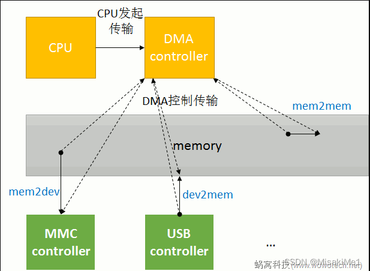
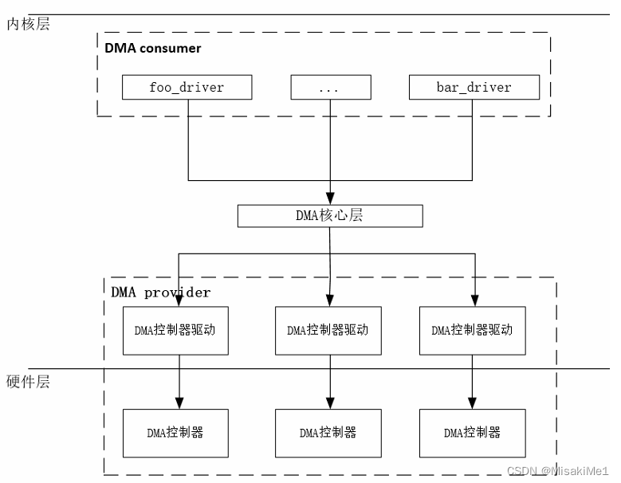

# DMA（direct memory access）

## DMA简介

DMA（direct memory access），即不经过CPU，直接访问内存。因为不管是memory和memory之间还是memory和设备之间进行数据搬运，对CPU来说都是枯燥乏味的，且非常浪费CPU的时间，造成CPU无法及时处理一些实时的事件。因此，为了解放CPU，可以让CPU在搬运数据的这段时间可以去做更有意义的事情，工程师们就设计出来一种专门用来搬运数据的器件，即DMA控制器，让它来协助CPU进行数据搬运工作，下图是DMA的硬件示意图。

* DMA 的原理：即CPU将需要迁移的数据的位置告诉给DMA，包括源地址，目的地址以及需要迁移的长度，然后启动DMA设备，DMA设备收到命令之后，就去完成相应的操作，最后通过中断反馈给CPU。

* DMA的实现：在实现DMA传输时，是DMA控制器掌控着总线，也就是说，这里会有一个控制权转让的问题，我们当然知道，计算机中权限最大的就是CPU，这个DMA暂时掌管的总线控制权当前也是CPU赋予的，在DMA完成传输之后，会通过中断通知CPU收回总线控制权。

### DMA传输过程
DMA传输的过程：一个完整的DMA传输过程必须经过DMA请求、DMA响应、DMA传输、DMA结束这四个阶段。

* DMA 请求：CPU对DMA控制器初始化，并向I/O接口发出操作命令，I/O接口提出DMA请求。
* DMA 响应：DMA控制器对DMA请求判别优先级以及屏蔽位，向总线裁决逻辑提出总线请求，当CPU执行完成当前的总线周期之后即可释放总线控制权。此时，总线裁决逻辑输出总线应答，表示DMA已经就绪，通过 DMA 控制器通知I/O接口开始DMA传输。
* DMA 传输：在DMA控制器的引导下，在存储器和外设之间进行数据传送，在传送过程中不需要CPU的参与。
* DMA 结束：当完成既定操作之后，DMA控制器释放总线控制权，并向I/O接口发出结束信号，当I/O接口收到结束信号之后，一方面停止I/O设备的工作，另一方面向CPU提出中断请求，使CPU从不介入状态解脱，并执行一段检查本次DMA传输操作正确性的代码。最后带着本次操作的结果以及状态继续执行原来的程序。

### DMA传输需要的参数
#### transfer size
在最简单的DMA传输中，只需要为DMA controller提供一个参数，即transfer size它就可以进行数据传输了：在每一个时钟周期，DMA controller将1byte的数据从一个buffer搬到另一个buffer，直到搬完transfer size个bytes即可停止。

#### transfer width
不过在实际应用场景中，只有一个transfer size参数是不够的，因为有些设备可能需要在一个时钟周期中，传输指定bit的数据，例如：

memory之间传输数据的时候，希望能以总线的最大宽度为单位（32-bit、64-bit等），以提升数据传输的效率。

而在音频设备中，需要每次写入精确的16-bit或者24-bit的数据；等等。

因此，为了满足这些多样的需求，我们需要为DMA controller提供一个额外的参数，即transfer width。

#### burst size
另外，当传输的源或者目的地是memory的时候，为了提高效率，DMA controller不愿意每一次传输都访问memory，而是在内部开一个buffer，将数据缓存在自己buffer中：

memory是源的时候，一次从memory读出一批数据，保存在自己的buffer中，然后再一点点（以时钟为节拍），传输到目的地；

memory是目的地的时候，先将源的数据传输到自己的buffer中，当累计一定量的数据之后，再一次性的写入memory。

这种场景下，DMA控制器内部可缓存的数据量的大小，称作burst size。

### DMA传输方式
DMA传输方式分为两种，即block DMA方式和scatter-gather DMA方式。

在DMA传输数据的过程中，要求源物理地址和目标物理地址必须是连续的。但是在某些计算机体系中，如IA架构，连续的存储器地址在物理上不一定是连续的，所以DMA传输要分成多次完成。

如果在传输完一块物理上连续的数据后引起一次中断，然后再由主机进行下一块物理上连续的数据传输，那么这种方式就为block DMA方式。

Scatter-gather DMA使用一个链表描述物理上不连续的存储空间，然后把链表首地址告诉DMA master。DMA master在传输完一块物理连续的数据后，不用发起中断，而是根据链表来传输下一块物理上连续的数据，直到传输完毕后再发起一次中断。

很显然，scatter-gather DMA方式比block DMA方式效率高

## Linux DMA子系统体系结构

Linux DMA体系结构主要分为三个部分：DMA provider、DMA consumer以及DMA核心层（DMA Engine）。

DMA provider：即DMA控制器驱动。

DMA consumer：主要是用于消费（申请）DMA请求，对于SPI、I2C等控制器驱动，会去申请DMA通道并使能DMA传输；

DMA核心层（DMA Engine）：提供公共接口函数。

## 参考（copy）
[Linux DMA子系统（1）：DMA Engine体系结构](https://blog.csdn.net/MisakiMe1/article/details/126974401)
[Linux DMA子系统（2）：DMA控制器驱动（provider）](https://blog.csdn.net/MisakiMe1/article/details/126988851?spm=1001.2014.3001.5502)
[Linux DMA子系统（3）：DMA设备驱动（consumer）](https://blog.csdn.net/MisakiMe1/article/details/126997339?spm=1001.2014.3001.5502)