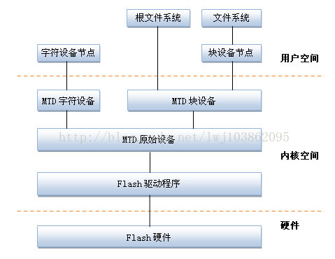

# mtd 子系统

MTD（memory technology device），即内存技术设备，是Linux针对flash设备（nor flash、nand flash等）设计的标准化硬件驱动框架，MTD为了使flash设备的驱动更加简单，因此在上层和硬件之间提供了一个抽象的接口，这样可以在是用不同的flash设备时可以使用相同的API；MTD所有源码位于/drivers/mtd目录下。

分层

MTD子系统的框架分层如上图所示，从上到下主要分为四层，分别为`设备节点层`、`MTD设备层`、`MTD原始设备层`以及`flash硬件驱动层`。

* 设备节点层：可以通过mknod命令在/dev目录下创建MTD设备节点，其中MTD字符设备节点的主设备号为90，MTD块设备节点的主设备号为31，这样就可以通过创建出来的设备节点来访问MTD字符设备和块设备。

* MTD设备层：基于MTD原始设备，linux系统可以定义出MTD的字符设备和块设备，其中，在mtdchar.c中实现了MTD字符设备相关接口，在mtdblock.c中实现了MTD块设备相关接口。

* MTD原始设备层：MTD原始设备层由两部分构成，一部分是MTD原始设备的通用代码，另一部分是各个特定Flash的数据，比如分区信息；用于描述MTD原始设备的数据结构是mtd_info，它定义了大量的关于MTD的数据和操作函数；原始设备层中重要的文件有两个：一个是mtdcore.c（MTD原始设备接口相关实现 ），另一个是mtdpart.c（MTD分区接口相关实现）。

* flash硬件驱动层：flash硬件驱动层的主要作用是初始化flash硬件、对flash设备进行擦除、读、写的具体操作，以及建立从具体的flash设备与MTD原始设备的映射关系；spi nor flash通用驱动位于drivers/mtd/spi-nor/目录下，CFI/jedec通用驱动位于rivers/mtd/chips/目录下，nand flash通用驱动位于drivers/mtd/nand/目录下，nor flash映射关系相关函数位于drivers/mtd/maps/目录下。

## 参考（copy）
[Linux MTD子系统（1）：系统层次分析](https://blog.csdn.net/MisakiMe1/article/details/126097241)
[Linux MTD系统剖析](https://blog.csdn.net/lwj103862095/article/details/21545791)