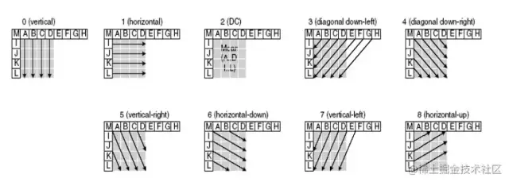

## H264

H.264，又称为MPEG-4第10部分，高级视频编码（AVC），也称为H.264或MPEG-4第10部分，高级视频编码（MPEG-4 AVC），是基于面向块，运动补偿的整数DCT编码的视频压缩标准。 截至2019年9月，它是视频内容的记录，压缩和分发的最常用格式，截止到2019年9月，已有91％的视频行业开发人员使用了该格式。它支持高达8K UHD的分辨率。
其实H264是VCEG和MPEG（第十部）的一部分开发的，所以常用于指代此标准的名称有H.264/AVC，AVC/H.264，H.264/MPEG-4 AVC，或MPEG-4/H.264 AVC。

__简单来说，H264就是对于视频原始数据尽可能去掉冗余数据。__

* 时间冗余
* 空间冗余
* 知识冗余
* 结构冗余
* 视觉冗余
* 信息熵冗余

## H264编码流程


### 相关概念

#### 序列

H264编码标准中所遵循的理论依据个人理解成：参照一段时间内相邻的图像中，像素、亮度与色温的差别很小。所以当面对一段时间内图像我们没必要去对每一幅图像进行完整一帧的编码，而是可以选取这段时间的第一帧图像作为完整编码，而下一幅图像可以记录与第一帧完整编码图像像素、亮度与色温等的差别即可，以此类推循环下去。

什么叫序列呢？上述的这段时间内图像变化不大的图像集我们就可以称之为一个序列。序列可以理解为有相同特点的一段数据。但是如果某个图像与之前的图像变换很大，很难参考之前的帧来生成新的帧，那么就结束上一个序列，开始下一段序列。重复上一序列的做法，生成新的一段序列。

#### 帧类型

H264协议内定义了三种帧，分别是I帧、B帧与P帧。

* I帧。关键帧，采用帧内压缩技术
* P帧。向前参考帧，压缩时只参考前一帧，属于帧间压缩技术
* B帧。双向参考帧，压缩时既参考前一帧，也参考后一帧，属于帧间压缩技术。

其中，帧内预测压缩：解决的是空域数据冗余问题，比如删除一副图里人眼不是很敏感的颜色光亮等。

帧间预测压缩：解决的是时域数据冗余问题，随着时间轴的推移，删除重复的数据。

整数离散余弦变换(DCT)：将空间上的相关性变为频域上无关的数据然后进行量化。

#### GOP

两个I帧之间是一个图像序列，在一个图像序列中只有一个I帧。（图像组）主要用作形容一个 i 帧 到下一个 i 帧之间的间隔了多少个帧，增大图片组能有效的减少编码后的视频体积，但是也会降低视频质量。

#### IDR帧(关键帧)

在编码解码中为了方便，将GOP中首个I帧要和其他I帧区别开，把第一个I帧叫IDR，这样方便控制编码和解码流程，所以IDR帧一定是I帧，但I帧不一定是IDR帧。
__IDR帧的作用是立刻刷新,使错误不致传播,从IDR帧开始算新的序列开始编码。I帧有被跨帧参考的可能，IDR不会。__

__作用：__
H.264引入 IDR 图像是为了解码的重同步，当解码器解码到 IDR图像时，立即将参考帧队列清空，将已解码的数据全部输出或抛弃，重新查找参数集，开始一个新的序列。
这样，如果前一个序列出现重大错误，在这里可以获得重新同步的机会。IDR图像之后的图像永远不会使用IDR之前的图像的数据来解码。

#### H.264编码分层

VLC（Video Coding Layer）层是对核心算法引擎、块、宏块及片的语法级别的定义，负责有效表示视频数据的内容，最终输出编码完的数据SODB。

NALU（Network Abstraction Layer Units）定义了片级以上的语法级别（如序列参数集参数集和图像参数集，针对网络传输，后面会描述到），负责以网络所要求的恰当方式去格式化数据并提供头信息，以保证数据适合各种信道和存储介质上的传输。


H264结构中，一个视频图像编码后的数据叫做一帧，一帧由一个片（slice）或多个片组成，一个片由一个或多个宏块（MB）组成，一个宏块由16x16的YUV数据组成。宏块作为H264编码的基本单位。

#### NALU type


在H.264中，量化参数分3个级别给出：图像参数集（pps）、片头（slice_header）、宏块（mb）。

参数使用指数哥伦布码方式保存。

#### Exp-Golomb指数哥伦布码

指数哥伦布码(Exponential-Golomb)属于熵编码，属于无损编码。

H.264中使用的是0阶指数哥伦布编码，编码方式如下：
以待编码码号code_num = 3为例：

* 第一步：将code_num +1, 即3+1 = 4
* 第二步：将4写为二进制的形式：100
* 第三步：计算100的比特个数为3，在100前面写（3-1）个0，得到编码码字：00100

0阶指数哥伦布码如下所示：

```
1 => 10 => 010  
2 => 11 => 011  
3 => 100 => 00100  
4 => 101 => 00101
5 => 110 => 00110
6 => 111 => 00111
7 => 1000 => 0001000
8 => 1001 => 0001001
```

#### NALU、RBSP、EBSP、SODB

H264裸流中，可以提取到一个个的NALU，并且解析出NALU Header，NALU Header是占一个字节。下面我们就从NALU Header的下一个字节开始，分析NALUE Placeholder部分。

NALU的Placeholder涉及到三个重要的名词，分别为EBSP、RBSP和SODB。

##### SODB

数据比特串，最原始的编码数据

##### RBSP

原始字节序列载荷，在SODB的后面填加了结尾比特（RBSP trailing bits 一个bit“1”）若干比特“0”,以便字节对齐。

##### EBSP

扩展字节序列载荷，在RBSP基础上填加了仿校验字节（0X03）。

它的原因是：NALU的起始码为0x000001或0x00000001，同时H264规定，当检测到0x000000时，也可以表示当前NALU的结束。

那这样就会产生一个问题，就是如果在NALU的内部，出现了0x000001或0x000000时，就需要使用“防止竞争”这样一种机制，当编码器编码完一个NAL时，应该检测NALU内部，是否出现0x000000、0x000001、0x000002、0x000003。

当检测到它们存在时，编码器就在最后一个字节前，插入一个新的字节：0x03。

比如：0x00000300、0x00000301、0x00000302、0x00000303。

这样一来，当我们拿到EBSP时，就需要检测EBSP内是否有序列：0x000003，如果有，则去掉其中的0x03。这样一来，我们就能得到原始字节序列载荷：RBSP。

公式可以这样看：

```
NALU = NALU Header（1 bytes） + EBSP
RBSP = SODB  + RBSP trailing bits
RBSP = EBSP - 0x03
```

其中RBSP trailing bits用于对齐字节数，因为SODB是最原始的编码数据，所以需要使用trailing bits来对齐字节数。

#### SPS/PPS

##### SPS

SPS：Sequence Parameter Set，序列参数集
NAL uint_type=7

包括了一个图像序列的所有信息（包含的是针对一连续编码视频序列的参数，如标识符seq_parameter_set_id、帧数及POC的约束、参考帧数目、解码图像尺寸和帧场编码模式选择标识等）

#### PPS

PPS：Picture Parameter Set，图像参数集
NAL uint_type=8

包括了一个图像所有片的信息（对应的是一个序列中某一副图像或者某几幅图像，参数如标识符pic_parameter_set_id、可选的seq_parameter_set_id、熵编码模式选择标识、片组数目、初始量化参数和去方块滤波系数调整标识等）

### 视频冗余

前面说到一些名词之后初步认识了H264大概的结构，现在我们这边探讨的是，对于各种冗余的剔除。

### 帧内压缩

#### 帧内预测

人眼对图象都有一个识别度，人的眼睛对图像的低频特性比如物体的总体亮度之类的信息很敏感，而对图像中的高频细节信息不敏感。所以基于一些研究，可以将一幅图像中人眼不敏感的数据去除掉。这样就提出了帧内预测技术。

帧内压缩类似于图片压缩，跟这一帧的前面（或后面）一帧（或几帧）无关，由当前帧中，已编码的部分来推测当前待编码的这一部分数据是什么。



一幅图像被划分好宏块后，对每个宏块可以进行 9 种模式的预测。找出与原图最接近的一种预测模式。然后，将原始图像与帧内预测后的图像相减得残差值。再将我们之前得到的预测模式信息一起保存起来，这样我们就可以在解码时恢复原图了。

#### DCT 变换和量化

这里不展开说，详细算法和过程可以google一下。

### 帧间压缩

#### 运动估计

基本思想是将图像序列的每一帧分成许多互不重叠的宏块，并认为宏块内所有象素的位移量都相同，然后对每个宏块到参考帧某一给定特定搜索范围内根据一定的匹配准则找出与当前块最相似的块，即匹配块，匹配块与当前块的相对位移即为运动矢量。视频压缩的时候，只需保存运动矢量和残差数据就可以完全恢复出当前块。得到运动矢量的过程被称为运动估计。

##### 运动估计算法

是视频压缩编码的核心算法之一。高质量的运动估计算法是高效视频编码的前提和基础。其中块匹配法（BMA, Block Match Algorithm）由于算法简单和易于硬件实现，被广泛应用于各视频编码标准中。

块匹配法的基本思想是先将图像划分为许多子块，然后对当前帧中的每一块根据一定的匹配准则在相邻帧中找出当前块的匹配块，由此得到两者的相对位移，即当前块的运动矢量。

在H.264标准的搜索算法中，图像序列的当前帧被划分成互不重叠16×16大小的子块，而每个子块又可划分成更小的子块，当前子块按一定的块匹配准则在参考帧中对应位置的一定搜索范围内寻找最佳匹配块，由此得到运动矢量和匹配误差。运动估计的估计精度和运算复杂度取决于搜索策略和块匹配准则。

这里使用H.264推荐算法UMHexagonS（Unsymmetrical-cross Multi-Hexagon-grid Search）作为DSP实现的算法参考，与FS算法比较，它在保证可靠搜索精度的前提下大幅降低搜索复杂度。

同时使用绝对差和（SAD, the Sum of Absolute Difference）标准作为匹配准则，它具有便于硬件实现的优点。

#### 运动补偿

运动补偿是通过先前的局部图像来预测、补偿当前的局部图像，它是减少帧序列冗余信息的有效方法。

运动补偿的基本原理是，当编码器对图像序列中地第N帧进行处理时，利用运动补偿中地核心技术－运动估值ME（Motion Estimation），得到第N帧得预测帧N´。

在实际编码传输时，并不总时传输第N帧，而是第N帧和其预测帧N´得差值△。如果运动估计十分有效，△中得概率基本上分布在零附近，从而导致△比原始图像第N帧得能量小得多，编码传输△所需得比特数也就少得多。

运动补偿的步骤如下：

1. 图像分割为静止得和运动的两部分，估计物体得位移向量（位移值）。
2. 按照估计得到的位移向量取得前一帧的图像数据。
3. 通过使用预测滤波器，得到前一帧图像数据的预测像素。

最后得到残差还需要DCT一下。

#### 环路滤波

##### 产生原因

各个块变换量化过程相对独立，因此引入的量化误差大小及其分布特性相互独立，导致相邻块边界的不连续；运动补偿中，相邻块的预测值可能来自不同图像的不同位置，导致预测残差信号在块边界产生数值不连续。

##### 使用原因

环路滤波处理后的重建像素更有利于参考，进一步减小后续编码像素的预测残差，有效地提高了视频的主客观质量。

详细需要自己在详细阅读，这里不展开解释了。

### 熵编码

当帧间压缩去掉了时间的冗余、视觉冗余（I-PCM模式），帧内压缩去掉了空间的冗余、视觉上冗余之后，得到的残差数据，这时候4x4的像素块经过变换和量化之后，低频信号集中在左上角，大量高频信号集中在右下角。

左边的低频信号相对数值较大，而右下角的大量高频信号都被量化成0、1和-1；变换量化后的残差信息有一定的统计特性和规律。

熵编码压缩是一种无损压缩，其实现原理是使用新的编码来表示输入的数据，从而达到压缩的效果。常用的熵编码有游程编码，哈夫曼编码和CAVLC编码等。

CAVLC 『Context-Based Adaptive Variable Length Coding』可变字长编码
详情的话需要google一下。

编码过程包括：

1. 非零系数数目(TotalCoeffs)和拖尾系数数目(TrailingOnes)的编码
2. 每一个拖尾系数的符号正负性编码（按照Z扫面结果的逆序编码）
3. 除拖尾系数外的每一个非零系数幅值(Level，包含正负号信息)编码（按照Z扫描结果的逆序编码）


### 结尾

其实整个流程是可以简化成:

1. 对空域和时域的冗余进行建模（帧内预测和帧间预测）
2. 对应的模型 转化为 句法元素
3. 句法元素--> 二进制流
4. 二进制-->熵编码
5. 最后得出码流。


## 来源与参考

来源：

[H264各种概念](1)

[1]: (https://juejin.cn/post/6983879143632928782)

参考：
https://www.cnblogs.com/Lxk0825/p/9925064.html
https://www.cnblogs.com/my_life/articles/6265265.html
https://www.jianshu.com/p/06a28206d8dc
https://zhuanlan.zhihu.com/p/98378872
https://www.jianshu.com/p/8edb448cf22e 
https://cloud.tencent.com/developer/article/1493226

