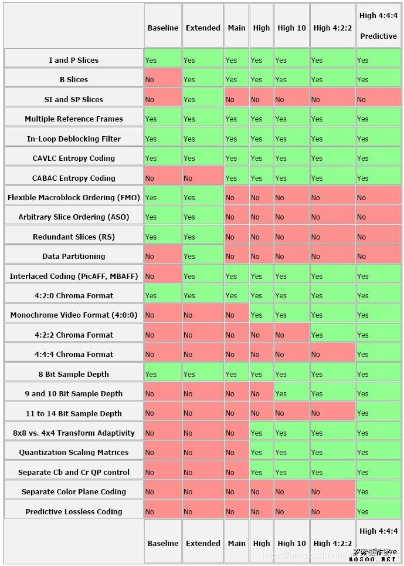
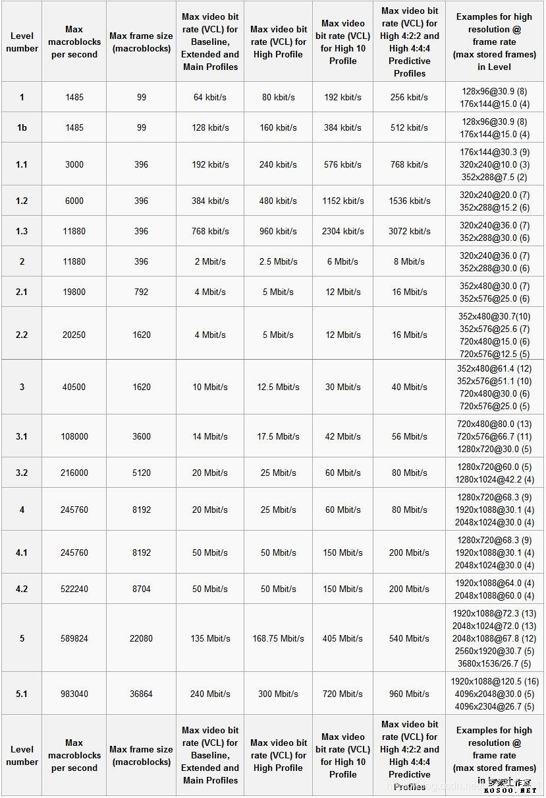
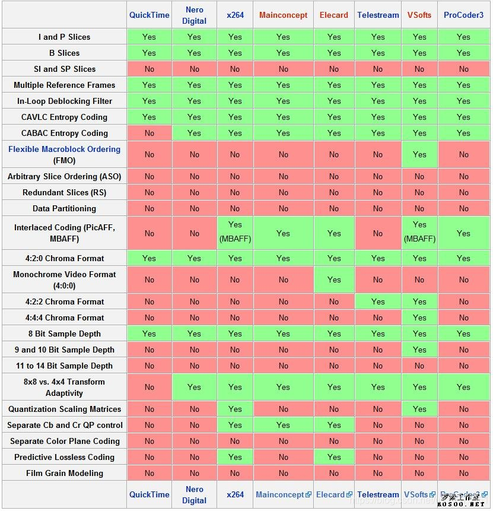

# H.264的四种画质（BP、EP、MP、HP）和 Profile、Level、Encoder

## 简介

首先要阐明所谓的AVC其实就是H.264标准，是由ITU-T和ISO/IEC组成的联合视频组（JVT，Joint Video Team）一起开发的，ITU-T给这个标准命名为H.264（以前叫做H.26L），而ISO/IEC称它为MPEG-4 高级视频编码（Advanced Video Coding，AVC）它定位于覆盖整个视频应用领域，包括：低码率的无线应用、标准清晰度和高清晰度的电视广播应用、Internet上的视频流应用，传输高清晰度的DVD视频以及应用于数码相机的高质量视频应用等等。

## AVC的三种规格

从低到高分别为：Baseline、Main、High。

* Baseline（最低Profile）级别支持I/P 帧，只支持无交错（Progressive）和CAVLC，一般用于低阶或需要额外容错的应用，比如视频通话、手机视频等；

* Main（主要Profile）级别提供I/P/B 帧，支持无交错（Progressive）和交错（Interlaced），同样提供对于CAVLC 和CABAC 的支持，用于主流消费类电子产品规格如低解码（相对而言）的mp4、便携的视频播放器、PSP和Ipod等；
* High（高端Profile，也叫FRExt）级别在Main的基础上增加了8x8 内部预测、自定义量化、无损视频编码和更多的YUV 格式（如4：4：4），用于广播及视频碟片存储（蓝光影片），高清电视的应用。

AVC 的规格主要是针对兼容性的，不同的规格能在相同级别上的平台应用。至于Baseline@L x.x、Main@L x.x、High@L x.x形式则是在不同级别下的码流级别，数值越大码流就越大，更耗费资源。所以就码流而言`High@L3.0<High@L4.0<High@L5.1`。

### BP、EP、MP、HP

H.264有四种画质级别,分别是BP、EP、MP、HP：

1. BP-Baseline Profile：基本画质。支持I/P 帧，只支持无交错（Progressive）和CAVLC；

2. EP-Extended profile：进阶画质。支持I/P/B/SP/SI 帧，只支持无交错（Progressive）和CAVLC；

3. MP-Main profile：主流画质。提供I/P/B 帧，支持无交错（Progressive）和交错（Interlaced），也支持CAVLC 和CABAC 的支持；

4. HP-High profile：高级画质。在main Profile 的基础上增加了8x8内部预测、自定义量化、 无损视频编码和更多的YUV 格式；

想要说明H.264 HP与H.264 MP的区别就要讲到H.264的技术发展了。

JVT于2003年完成H.264基本部分标准制定工作，包含`Baseline profile`、`Extended profile`和`Main profile`，分别包括不同的编码工具。

之后JVT又完成了H.264 FRExt（即：Fidelity Range Extensions）扩展部分（Amendment）的制定工作，包括`High profile（HP`）、`High 10 profile（Hi10P）`、`High 4:2:2 profile（Hi422P）`、`High 4:4:4 profile（Hi444P）`4个profile。

H.264 `Baseline profile`、`Extended profile`和`Main profile`都是针对8位样本数据、4:2:0格式的视频序列，FRExt将其扩展到8～12位样本数据，视频格式可以为4:2:0、4:2:2、4:4:4，设立了`High profile（HP）`、`High 10 profile（Hi10P）`、`High 4:2:2 profile（Hi422P）`、`High 4:4:4 profile（Hi444P）` 4个profile，这4个profile都以Main profile为基础。

在相同配置情况下，`High profile（HP）`可以比`Main profile（MP`）节省10%的码流量，比MPEG-2 MP节省60%的码流量，具有更好的编码性能。根据应用领域的不同，`Baseline profile`多应用于实时通信领域，`Main profile`多应用于流媒体领域，`High profile`则多应用于广电和存储领域。

`H.264 Baseline Profile`对应`MPEG-4 SP`
`H.264 Main Profile`对应`MPEG-4 ASP`
`H.264 Extended Profile`对应`MPEG-4 ARTS or FGS`
`H.264 Baseline Profile`对应`MPEG-4 Studio`

## CAVLC和CABAC简介

熵编码压缩是一种无损压缩，其实现原理是使用新的编码来表示输入的数据，从而达到压缩的效果。常用的熵编码有游程编码，哈夫曼编码和CAVLC编码等。

### CAVLC

CAVLC(Context Adaptive VariableLength Coding)是在H.264/MPEG-4AVC中使用的熵编码方式。

在H.264中，CAVLC以zig-zag顺序用于对变换后的残差块进行编码。

CAVLC是CABAC的替代品，虽然其压缩效率不如CABAC，但CAVLC实现简单，并且在所有的H.264profile中都支持。

### CABAC

CABAC(ContextAdaptive Binary Arithmatic Coding)也是 H.264/MPEG-4AVC中使用的熵编码算法。

CABAC在不同的上下文环境中使用不同的概率模型来编码。其编码过程大致是这样：首先，将欲编码的符号用二进制bit表示；然后对于每个bit，编码器选择一个合适的概率模型，并通过相邻元素的信息来优化这个概率模型；最后，使用算术编码压缩数据。

### H.264 Profile、Level、Encoder三张简图

#### h.264 profile

#### h.264 level

#### h.264 software encoder

## 参考

[H.264的四种画质（BP、EP、MP、HP）和 Profile、Level、Encoder](https://blog.csdn.net/u014470361/article/details/88713266)
[H.264 Profile、Level、Encoder三张简图](http://www.rosoo.net/a/201209/16262.html)