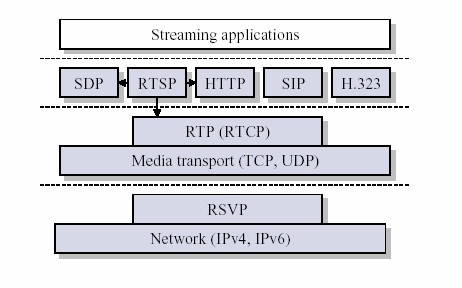

## RTP概述

###  RTP是什么
RTP全名是Real-time Transport Protocol（实时传输协议）。它是IETF提出的一个标准，对应的RFC文档为RFC3550（RFC1889为其过期版本）。RFC3550不仅定义了RTP，而且定义了配套的相关协议RTCP（Real-time Transport Control Protocol，即实时传输控制协议）。RTP用来为IP网上的语音、图像、传真等多种需要实时传输的多媒体数据提供端到端的实时传输服务。RTP为Internet上端到端的实时传输提供时间信息和流同步，但并不保证服务质量，服务质量由RTCP来提供。

### RTP的应用环境
RTP用于在单播或多播网络中传送实时数据。它们典型的应用场合有如下几个。
* 简单多播音频会议（Simple Multicast Audio Conference）
语音通信通过一个多播地址和一对端口来实现。一个用于音频数据（RTP），另一个用于控制包（RTCP）。

* 音频和视频会议（Audio and Video Conference）
如果在一次会议中同时使用了音频和视频会议，这两种媒体将分别在不同的RTP会话中传送，每一个会话使用不同的传输地址（IP地址＋端口）。如果一个用户同时使用了两个会话，则每个会话对应的RTCP包都使用规范化名字CNAME（Canonical Name）。与会者可以根据RTCP包中的CNAME来获取相关联的音频和视频，然后根据RTCP包中的计时信息(Network time protocol)来实现音频和视频的同步。

* 混频器和转换器（Mixers and Translators）
混频器和转换器都是RTP级的中继系统。转换器用在通过IP多播不能直接到达的用户区，例如发送者和接收者之间存在防火墙。当与会者能接收的音频编码格式不一样，比如有一个与会者通过一条低速链路接入到高速会议，这时就要使用转换器。在进入音频数据格式需要变化的网络前，转换器将来自一个源或多个源的音频包进行重构，并把重构后的多个音频合并，采用另一种音频编码进行编码后，再转发这个新的RTP包。从一个混频器出来的所有数据包要用混合器作为它们的同步源（SSRC，见RTP的封装）来识别，可以通过贡献源列表（CSRC表，见RTP的封装）可以确认谈话者。

* 分层编码（Layered Encodings）
为了匹配接收方的能力（容量）以及适应网络拥塞，多媒体应用程序应当能够调整其传输速率。许多应用实现把调适传输速率的责任放在源端。这种做法在多播传输中并不好，因为不同接收方对带宽存在着冲突性需求。这经常导致最小公分母的场景，网格中最小的管道支配了全部实况多媒体“广播”的质量和保真度。
相反地，可以把分层编码和分层传输系统组合起来，从而把调适速率的责任放在接收端。在IP多播之上的RTP上下文中，对一个横跨多个RTP会话（每个会话在独自多播组上开展）的分级表示信号(a hierarchically represented signal)，源能够把它的分层（layers)分割成条。 接收方仅需合并适当的多播组子集，就能适应异种网络和控制接收带宽。

### RTP相关概念

#### RTP负载（RTP payload）

通过RTP传输的包中的数据，例如，音频样本或压缩好的视频数据。负载格式与解释不在本文讨论范围。

#### RTP包（RTP packet）

一种数据包，其组成部分有：一个固定RTP报头，一个可能为空的作用源（contributing sources）列表（见下文），以及负载数据。一些下层协议可能要求对RTP包的封装进行定义。一般地，下层协议的一个包包含一个RTP包，但若封装方法允许，也可包含数个RTP包。

#### RTCP包（RTCP packet）

一种控制包，其组成部分有：一个类似RTP包的固定报头，后跟一个结构化的部分，该部分具体元素依不同RTCP包的类型而定。格式的定义见章节６。一般地，多个RTCP包将在一个下层协议的包中以合成RTCP包的形式传输；这依靠RTCP包的固定报头中的长度字段来实现。


#### RTP媒体类型（RTP media type）

一个RTP媒体类型是一个单独RTP会话所载有的负载类型的集合。RTP配置文件把RTP媒体类型指派给RTP负载类型。

#### 多媒体会话（Multimedia session）

多媒体会话在一个参与者公共组中，并发的RTP会话的集合。例如，一个视频会议（为多媒体会话）可能包含一个音频RTP会话和一个视频RTP会话。

#### RTP会话（RTP session）
RTP会话表示一群参与者通过RTP进行通信时所产生的关联。

一个参与者可能同时参与多个RTP会话。

在一个多媒体会话中，除非编码方式把多种媒体多路复用到一个单一数据流中，否则每种媒体都将使用各自的RTCP包，通过单独的RTP会话来传送。

通过使用不同的目的传输地址对（一个网络地址加上一对分别用于RTP和RTCP的端口，构成了一个传输地址对）来接收不同的会话，参与者能把多个RTP会话区隔开来。

单个RTP会话中的所有参与者，可能共享一个公用目的传输地址对，比如IP多播的情况；也可能各自使用不同的目的传输地址对，比如个体单播网络地址加上一个端口对。

对于单播的情况，参与者可能使用相同端口对来收听其他所有参与者，也可能对来其他每个参与者使用不同的端口对来收听。

RTP会话间相互区别的特征，在于每个RTP会话都维护一个用于SSRC标识符的独立完整的空间。

RTP会话所包含的参与者组，由能接收SSRC标识符的参与者组成，这些SSRC标识符由RTP（同步源或作用源）或RTCP中的任意参与者传递。

#### 同步源(SSRC，Synchronization source)

RTP包流的源，用RTP报头中32位数值的SSRC标识符进行标识，使其不依赖于网络地址。

一个同步源的所有包构成了相同计时和序列号空间的一部分，这样接收方就可以把一个同步源的包放在一起，来进行重放。

一个同步源可能随着时间变化而改变其数据格式，如音频编码。

SSRC标识符是一个随机选取的值，它在特定的RTP会话中是全局唯一（globally unique）的。

参与者并不需要在一个多媒体会议的所有RTP会话中，使用相同的SSRC标识符；SSRC标识符的绑定通过RTCP。

如果参与者在一个RTP会话中生成了多个流，例如来自多个摄影机，则每个摄影机都必须标识成单独的同步源。

#### 作用源（CSRC，Contributing source)

若一个RTP包流的源，对由RTP混频器生成的组合流起了作用，则它就是一个作用源。

对特定包的生成起作用的源，其SSRC标识符组成的列表，被混频器插入到包的RTP报头中，这个列表叫做CSRC表。

相关应用的例子如，在音频会议中，混频器向所有的说话人（talker)指出，谁的话语（speech)将被组合到即将发出的包中，即便所有的包都包含在同一个（混频器的）SSRC标识符中，也可让听者（接收者）可以清楚谁是当前说话人。

#### 终端系统（End system）

一种应用程序，它产生发送出的RTP包中内容，或者使用接收到的RTP包中内容。

在一个特定的RTP会话中，一个终端系统可以扮演一个或多个同步源角色，但通常是一个。

#### 混频器（Mixer)

一种中间系统，它从一个或多个源中接收RTP包，可能改变其数据格式，再按某种方式把这些包组合成一个新的包，然后转发出去。

由于多个输入源的计时一般不会同步，所以混频器会对各个流的计时作出调整，并为组合流生成一个新的计时。因此，混频器将被标识成它所产生所有数据包的同步源。

#### 转换器（Translator)

一种中间系统，它转发RTP包而不改变各包的同步源标识符。

转换器的例子如下：不作混频地转变编码的设备，把多播复制到单播的重复装置，以及防火墙里应用层次的过滤器。

#### 监视器(Monitor)

一种应用程序，它接收RTP会话参与者所发送的RTCP包，特别是接收报告（reception report)，而且对当前服务质量进行评估，评估结果用于分配监视任务，故障诊断和长期统计。

监视器常常被内建到参与会话的应用程序中，但也可以是一个的独立的应用程序，不参加会话、也不发送或接收RTP数据包（因为它们在不同的端口上）。这些被称作第三方监视器。还有一种情况也是可以接受的，第三方监视器只接收但不发送数据包，或者另外地算入到会话中。

#### 非RTP途径（Non-RTP means)

为提供一个可用的服务，可能还需要其他的协议和机制。

特别地，对多媒体会议来说，一个控制协议可以发布多播地址，发布加密密钥，协商所用的加密算法，以及为没有预定义负载类型值的格式，建立负载类型值和其所代表的负载格式之间的动态映射。

其他协议的例子如下：会话初始化协议（SIRFC3261），ITU推荐的H.323，还有使用SDP(RFC2327)的应用程序，如RTSP(RFC 2326).  对于简单的应用程序，电子邮件或者会议数据库也可能用到。

#### 流媒体

流媒体是指Internet上使用流式传输技术的连续时基媒体。当前在Internet上传输音频和视频等信息主要有两种方式：下载和流式传输两种方式。

下载情况下，用户需要先下载整个媒体文件到本地，然后才能播放媒体文件。在视频直播等应用场合，由于生成整个媒体文件要等直播结束，也就是用户至少要在直播结束后才能看到直播节目，所以用下载方式不能实现直播。

流式传输是实现流媒体的关键技术。使用流式传输可以边下载边观看流媒体节目。由于Internet是基于分组传输的，所以接收端收到的数据包往往有延迟和乱序（流式传输构建在UDP上）。要实现流式传输，就是要从降低延迟和恢复数据包时序入手。在发送端，为降低延迟，往往对传输数据进行预处理（降低质量和高效压缩）。在接收端为了恢复时序，采用了接收缓冲；而为了实现媒体的流畅播放，则采用了播放缓冲。

使用接收缓冲，可以将接收到的数据包缓存起来，然后根据数据包的封装信息（如包序号和时戳等），将乱序的包重新排序，最后将重新排序了的数据包放入播放缓冲播放。

为什么需要播放缓冲呢？容易想到，由于网络不可能很理想，并且对数据包排序需要处理时耗，我们得到排序好的数据包的时间间隔是不等的。如果不用播放缓冲，那么播放节目会很卡，这叫时延抖动。相反，使用播放缓冲，在开始播放时，花费几十秒钟先将播放缓冲填满（例如PPLIVE），可以有效地消除时延抖动，从而在不太损失实时性的前提下实现流媒体的顺畅播放。

到目前为止,Internet 上使用较多的流式视频格式主要有以下三种:RealNetworks 公司的RealMedia ,Apple 公司的QuickTime 以及Microsoft 公司的Advanced Streaming Format (ASF) 。

上面在谈接收缓冲时，说到了流媒体数据包的封装信息（包序号和时戳等），这在后面的RTP封装中会有体现。另外，RealMedia这些流式媒体格式只是编解码有不同，但对于RTP来说，它们都是待封装传输的流媒体数据而没有什么不同

## RTP详解

### RTP的协议层次



RTP被划分在传输层，它建立在UDP上。同UDP协议一样，为了实现其实时传输功能，RTP也有固定的封装形式。RTP用来为端到端的实时传输提供时间信息和流同步，但并不保证服务质量。服务质量由RTCP来提供。

RTP也可以归为应用层的一部分，这是从应用开发者的角度来说的。操作系统中的TCP/IP等协议栈所提供的是我们最常用的服务，而RTP的实现还是要靠开发者自己。因此从开发的角度来说，RTP的实现和应用层协议的实现没不同，所以可将RTP看成应用层协议。

RTP实现者在发送RTP数据时，需先将数据封装成RTP包，而在接收到RTP数据包，需要将数据从RTP包中提取出来。

### RTP封装格式

<table>
    <tr>
        <th align=left colspan=8 width="120">0</th>
        <th align=left colspan=8 width="120">8</th>
        <th align=left colspan=8 width="120">16</th>
        <th align=left colspan=8 width="120">24</th>
    </tr>
    <tr>
        <th align=center colspan=2>V=2</th>
        <th align=center colspan=1>p</th>
        <th align=center colspan=1>X</th>
        <th align=center colspan=4>CC</th>
        <th align=center colspan=1>M</th>
        <th align=center colspan=7>PT</th>
        <th align=center colspan=16>Sequence Number</th>
    </tr>
    <tr>
         <th align=center colspan=32>TimeStamp</th>
    </tr>
    <tr>
        <th align=center colspan=32>Synchronization Source(SSRC) indentifier</th>
    </tr>
    <tr>
        <th align=center colspan=32>Contributing Source(CSRC) identifier</th>
    </tr>
    <tr>
        <th align=center colspan=32>...</th>
    </tr>
</table>

* 版本号（V）：2比特，用来标志使用的RTP版本。

* 填充位（P）：1比特，如果该位置位，则该RTP包的尾部就包含附加的填充字节。

* 扩展位（X）：1比特，如果该位置位的话，RTP固定头部后面就跟有一个扩展头部。

* CSRC计数器（CC）：4比特，含有固定头部后面跟着的CSRC的数目。

* 标记位（M）：1比特,该位的解释由配置文档（Profile）来承担.

* 载荷类型（PT）：7比特，标识了RTP载荷的类型。

* 序列号（SN）：16比特，发送方在每发送完一个RTP包后就将该域的值增加1，接收方可以由该域检测包的丢失及恢复包序列。序列号的初始值是随机的。

* 时间戳：32比特，记录了该包中数据的第一个字节的采样时刻。在一次会话开始时，时间戳初始化成一个初始值。即使在没有信号发送时，时间戳的数值也要随时间而不断地增加（时间在流逝嘛）。时间戳是去除抖动和实现同步不可缺少的。

* 同步源标识符(SSRC)：32比特，同步源就是指RTP包流的来源。在同一个RTP会话中不能有两个相同的SSRC值。该标识符是随机选取的 RFC1889推荐了MD5随机算法。

* 贡献源列表（CSRC List）：0～15项，每项32比特，用来标志对一个RTP混合器产生的新包有贡献的所有RTP包的源。由混合器将这些有贡献的SSRC标识符插入表中。SSRC标识符都被列出来，以便接收端能正确指出交谈双方的身份。

### RTP头扩展 
RTP头字段扩展是为了使用新的独立的有效载茶在RTP数据报文头中携带附带信息。

<table>
    <tr>
        <th align=left colspan=8 width="120">0</th>
        <th align=left colspan=8 width="120">8</th>
        <th align=left colspan=8 width="120">16</th>
        <th align=left colspan=8 width="120">24</th>
    </tr>
    <tr>
        <th align=center colspan=16>defined by profile</th>
        <th align=center colspan=16>length</th>
    </tr>
    <tr>
         <th align=center colspan=32>header extension</th>
    </tr>
    <tr>
        <th align=center colspan=32>Contributing Source(CSRC) identifier</th>
    </tr>
    <tr>
        <th align=center colspan=32>...</th>
    </tr>
</table>

当RTP头中的X bit为1时，就表示RTP头在CSRC list后有扩展数据。

RTP头扩展中的前16位用来鉴别 identifier 或是参数的。格式由其 profile 来定义的。RTP 不定义任何的头扩展。
后16位是用来表示扩展数据长度的（不包含前面固定的32bit数据）。

RTP数据头中只能添加一个扩展。

## RTCP （RTP 控制协议）

RTP 控制协议(RTCP)是基于在会话中的对所有参与者周期传输的控制报文的，与数据报文使用相同的分发机制。

协议必须提供对数据报文和控制报文的复用，例如用 UDP 的不同端口号。

RTCP的主要功能是：服务质量的监视与反馈、媒体间的同步，以及多播组中成员的标识。另外其还可以传达最小的会话控制信息。

在RTP会话期 间，各参与者周期性地传送RTCP包。RTCP包中含有已发送的数据包的数量、丢失的数据包的数量等统计资料，因此，各参与者可以利用这些信息动态地改变传输速率，甚至改变有效载荷类型。RTP和RTCP配合使用，它们能以有效的反馈和最小的开销使传输效率最佳化，因而特别适合传送网上的实时数据。

RTCP也是用UDP来传送的，但RTCP封装的仅仅是一些控制信息，因而分组很短，所以可以将多个RTCP分组封装在一个UDP包中。

### RTCP报文分类

|类型|缩写|用途|
|-|-|-|
|200|SR(Sender Report)|发送端报告|
|201|RR（Receiver Report）|接收端报告|
|202|SDES（Source Description Items）|源点描述|
|203|BYE|结束传输|
|204|APP|特定应用|

每个RTCP包的开始部分是与RTP数据包相类似的固定部分，随后是一块结构化单元，它随负载类型不同长度发生变化，但是总以32比特终止。对齐要求和长度域使RTCP包可"堆栈"，即可以将多个RTCP包形成一个复合RTCP包，在底层协议(如UDP)中，通常都是将复合包作为一个包传输的。    

复合包中的每个RTCP单包可以单独处理，而无需考虑包复合的顺序。

### RTCP报文格式

RTP 接收者利用 RTCP 报文来提供接收质量反馈，RTCP中的数据包格式定义如下。

#### RTCP 固定头
<table>
    <tr>
        <th align=left colspan=8 width="120">0</th>
        <th align=left colspan=8 width="120">8</th>
        <th align=left colspan=8 width="120">16</th>
        <th align=left colspan=8 width="120">24</th>
    </tr>
    <tr>
        <th align=center colspan=2>V=2</th>
        <th align=center colspan=1>P</th>
        <th align=center colspan=5>RC</th>
        <th align=center colspan=8>PT</th>
        <th align=center colspan=16>length</th>
    </tr>
    <tr>
        <th align=center colspan=32>...</th>
    </tr>
</table>

* V(version): 2bits， 识别 RTP 版本，RTCP 报文也一样。现在定义的是 2。

* P(padding): 1bits， 如果设定了 padding 位，这个个别的 RTCP 报文在尾部包含一些附加的padding 字段，不是控制信息但却包含在长度域中。padding 的最后一个字段是应该忽略的字段的计数，包括自己（四的倍数）。

* RC(reception report count): 5bits， 本报文中包含的接收报告块的数量，零有效。

* PT(packet type): 8bits，RTCP报文格式。

* lenght: 16bits，本 RTCP 报文长度（以 32-bit 形式）减一，包括头和 padding（减一是为了零长度有效和避免无限循环来寻找混合的 RTCP 报文，而 32-bit 字是避免对四的倍数的有效检查）。

#### SR 报文格式
<table>
    <tr>
        <th align=left colspan=8 width="120">0</th>
        <th align=left colspan=8 width="120">8</th>
        <th align=left colspan=8 width="120">16</th>
        <th align=left colspan=8 width="120">24</th>
    </tr>
    <tr>
        <th align=center colspan=2>V=2</th>
        <th align=center colspan=1>P</th>
        <th align=center colspan=5>RC</th>
        <th align=center colspan=8>PT=SR=200</th>
        <th align=center colspan=16>length</th>
    </tr>
    <tr>
         <th align=center colspan=32>SSRC</th>
    </tr>
    <tr>
        <th align=center colspan=32>NTP timestamp,most significant word</th>
    </tr>
    <tr>
        <th align=center colspan=32>NTP timestamp,least significant word</th>
    </tr>
    <tr>
        <th align=center colspan=32>RTP timestamp</th>
    </tr>
    <tr>
        <th align=center colspan=32>sender's packet count</th>
    </tr>
    <tr>
        <th align=center colspan=32>sender's octet count</th>
    </tr>
    <tr>
        <th align=center colspan=32>SSRC_1 (SSRC of first source) </th>
    </tr>
    <tr>
        <th align=center colspan=8>fraction lost</th>
        <th align=center colspan=24>cumulative number of packets lost</th>
    </tr>
    <tr>
        <th align=center colspan=32>extended highest sequence number received</th>
    </tr>
    <tr>
        <th align=center colspan=32>interarrival jitter</th>
    </tr>
    <tr>
        <th align=center colspan=32>last SR (LSR)</th>
    </tr>
    <tr>
        <th align=center colspan=32>delay since last SR (DLSR)</th>
    </tr>
    <tr>
        <th align=center colspan=32>SSRC_2 (SSRC of second source) </th>
    </tr>
    <tr>
        <th align=center colspan=32>...</th>
    </tr>
    <tr>
        <th align=center colspan=32>...</th>
    </tr>
    <tr>
        <th align=center colspan=32>profile-specific extensions</th>
    </tr>
</table>

* RTCP header: 同上描述，header占32bit, 在SR中 PT值为200
    * SSRC：32 bits，对本 SR 报文的同步源标识。

* send info: 发送者信息

    * NTP timestamp：64 bits，当本报告发送时，标识 wallclock time。

    * RTP timestamp：32 bits，与 NTP timestamp 保持一致(上)，在数据报文中与 RTP timestamp 有相同的单元和相同的随机偏移。

    * sender's packet count：32 bits，发送者传输的 RTP 数据报文的总数，从传输开始到本 SR 产生。如果发送者改变了 SSRC identifier，计数值重置位。

    * sender's octet count：32 bits，payload 字段的数量（即，不包括头或是填充）。如果发送者改变了 SSRCidentifier，计数值重置位。这个域可用来估计平均 payload 数据速率。

* report info: 接收报告块，可能存在多个接收报告，每一个接收报告块都含有从单个同步源的关于接收 RTP 报文的统计。当源因为冲突而改变了 SSRC identifier 时，接收者不携带统计。

    *  SSRC_n (source identifier)：32 bits，源的 SSRC identifier，本报告块的信息所属。
    * fraction lost：8 bits，上次 SR 或 RR 发送之后，从 SSRC_n 源的 RTP 报文丢失的部分，以定点数来表达，二进制的点在左边沿（相当于 loss 部分乘 256 之后取整）。
    * cumulative number of packets lost：24 bits，从接收开始，SSRC_n 源的 RTP 报文丢失的数量。
    * extended highest sequence number received：32 bits，低 16 位包含从源 SSRC_n 接收到的 RTP 数据报文中最高的序列值和 16 位的扩展序列值。注意到如果开始时间差距很大，同一会话中的不同接收者会生成不同的序列值扩展。
    * interarrival jitter：32 bits，RTP 数据报文 interarrival 时间的统计方差的估值，以 timestamp 单元来估值，表现为无符号整数。
    * last SR timestamp (LSR)：32 bits，NTP timestamp的中间 32 位作为从源 SSRC_n 来的最近的 RTCP SR。如果尚未接收到 SR，域设置为零。
    * delay since last SR (DLSR)：32 bits，延迟定义为从接收到从源 SSRC_n 来的上一个 SR 到发送本接收报告块的间隔，表示为 1/65536 秒一个单元。如果尚未收到 SR，DLSR 域设置为零。

#### RR 报文格式

<table>
    <tr>
        <th align=left colspan=8 width="120">0</th>
        <th align=left colspan=8 width="120">8</th>
        <th align=left colspan=8 width="120">16</th>
        <th align=left colspan=8 width="120">24</th>
    </tr>
    <tr>
        <th align=center colspan=2>V=2</th>
        <th align=center colspan=1>P</th>
        <th align=center colspan=5>RC</th>
        <th align=center colspan=8>PT=RR=201</th>
        <th align=center colspan=16>length</th>
    </tr>
    <tr>
         <th align=center colspan=32>SSRC</th>
    </tr>
    <tr>
        <th align=center colspan=32>SSRC_1 (SSRC of first source) </th>
    </tr>
    <tr>
        <th align=center colspan=8>fraction lost</th>
        <th align=center colspan=24>cumulative number of packets lost</th>
    </tr>
    <tr>
        <th align=center colspan=32>extended highest sequence number received</th>
    </tr>
    <tr>
        <th align=center colspan=32>interarrival jitter</th>
    </tr>
    <tr>
        <th align=center colspan=32>last SR (LSR)</th>
    </tr>
    <tr>
        <th align=center colspan=32>delay since last SR (DLSR)</th>
    </tr>
    <tr>
        <th align=center colspan=32>SSRC_2 (SSRC of second source) </th>
    </tr>
    <tr>
        <th align=center colspan=32>...</th>
    </tr>
    <tr>
        <th align=center colspan=32>...</th>
    </tr>
    <tr>
        <th align=center colspan=32>profile-specific extensions</th>
    </tr>
</table>

RR报文格式与SR的区别在于header中PT值为201，并且其没有第二部分，发送报告，其它都是一致的。

如果没有数据传输或是接收报告，必须将空 RR 报文(RC = 0) 放在混合RTCP报文头部。

#### SDES 报文格式

<table>
    <tr>
        <th align=left colspan=8 width="120">0</th>
        <th align=left colspan=8 width="120">8</th>
        <th align=left colspan=8 width="120">16</th>
        <th align=left colspan=8 width="120">24</th>
    </tr>
    <tr>
        <th align=center colspan=2>V=2</th>
        <th align=center colspan=1>P</th>
        <th align=center colspan=5>SC</th>
        <th align=center colspan=8>PT=SDES=202</th>
        <th align=center colspan=16>length</th>
    </tr>
    <tr>
         <th align=center colspan=32>SSRC/CSRC_1</th>
    </tr>
    <tr>
        <th align=center colspan=32>SDES items</th>
    </tr>
    <tr>
        <th align=center colspan=32>...</th>
    </tr>
    <tr>
        <th align=center colspan=32>...</th>
    </tr>
    <tr>
         <th align=center colspan=32>SSRC/CSRC_2</th>
    </tr>
    <tr>
        <th align=center colspan=32>SDES items</th>
    </tr>
    <tr>
        <th align=center colspan=32>...</th>
    </tr>
    <tr>
        <th align=center colspan=32>...</th>
    </tr>
</table>

SDES 报文是三级结构，由头，零个或多个 chunk 组成，每个 chunk 是由描
述本 chunk 的源标识 item 组成。item 是独立的在子序列段中表示。

* RTCP header：32bits，PT为202，SC表示本 SDES 中含有的 SSRC/CSRC chunks 的数量。零是有效的但没用。

* chunk 是由一个 SSRC/CSRC identifier 及零个或更多的 item 组成，item携带关于SSRC/CSRC的信息。chunk是由32-bit的边界开始的。item有一个8-bit的类型域，一个 8-bit 描述内容(text)的长度（不包括这两个字节的头）的字段计数。text 不能超过 255 字节，这与需要限制 RTCP 带宽消耗是一致的。

* Item 是连续的，即，并不是给 item 单个的填充 32-bit 边界。Text 也不是以空(null)来结束的，因为某些 multi-octet 编码包含空字段。chunk 中的 Item表必须以一个或是多个空字节来结束，第一个空字节被译码为零类型的 item 来表示表尾。空类型字节之后没有长度字节，但是如果填充到下一个 32-bit 的边界，那就得附加空字节。这个填充是与 RTCP 头中由 P 位标识的填充是分离的(separate)。零 item 的 chunk 是有效的但无用。

##### SDES items

SDES items 格式为TLV格式，其表示形式如下：
<table>
    <tr>
        <th align=left colspan=8 width="120">0</th>
        <th align=left colspan=8 width="120">8</th>
        <th align=left colspan=8 width="120">16</th>
        <th align=left colspan=8 width="120">24</th>
    </tr>
    <tr>
        <th align=center colspan=8>SDES items type</th>
        <th align=center colspan=8>length</th>
        <th align=center colspan=16>value</th>
    </tr>
    <tr>
        <th align=center colspan=32>...</th>
    </tr>
</table>

* END: end of SEDS list，type = 0

* CNAME：规范的终点标识, type = 1，CNAME 标识有以下特性：
    * 因为如果发现冲突或者程序重起，随机分配的 SSRC 标识就会改变，CNAME item 必须提供从 SSRC 标识到源标识(sender 或 receiver)的绑定。
    * 同 SSRC 标识一样，CNAME 标识应该在一个 RTP 会话中的所有参与者中是唯一的。
    * 对那些在一系列相关 RTP 会话的同一参与者使用多媒体工具提供绑定，应与那个参与者固定。
    * 为了方便第三方监测，CNAME 应该与程序或个人向配合定位源

* NAME：用户名 type = 2
    这是用来描述源的真实名字，用户可以用任何形式的名字。

* EMAIL：电子邮地址，type = 3
    Email 地址定义的格式见 RFC 2822 [9]，例如"John。Doe@example。com"。EMAIL 值在会话期内是恒定的。

* PHONE：电话号码，type=4
    电话号码被编成格式为“+”取代国际码。例如，"+1 908 555 1212"是美国
的号码。

* LOC：用户地理定位，type=5
    不同应用对应信息的详略程度。详略程度是由 implementation 和/或用户来定的，但是格式和内容可能是由 profile 来描述的。除了移动主机，LOC 值应该在会话期内是恒定的。

* TOOL：应用或工具名，type=6
    一个字符串，提供名字和可能的生成流的应用的版本。

* NOTE：通知状态，type=7
    NOTE item 用来描述源的当前状态消息。应该仅仅用它来携带例外的信息，不能被所有参与者循规蹈矩的利用，因为这样会降低发送接收报告和 CNAME的速率，削弱协议的性能。特别是，不应在用户确认中作为 item 或是在quote-of-the-day 中自动生成。

* PRIV：私人扩展，type=8
    本 item 用来定义实验的或是 application-specific SDES 扩展。
    其value格式如下：
    <table>
    <tr>
        <th align=left colspan=8 width="120">0</th>
        <th align=left colspan=8 width="120">8</th>
        <th align=left colspan=8 width="120">16</th>
        <th align=left colspan=8 width="120">24</th>
    </tr>
    <tr>
        <th align=center colspan=8>prefix lenngth</th>
        <th align=center colspan=8>prefix string</th>
    </tr>
    <tr>
        <th align=center colspan=32>... value ...</th>
    </tr>
    </table>
    Item 包含一个由 length-string 对组成的前缀，然后是值串填充剩余的部分和携带需要的信息。前缀的长度是 8 比特。前缀字符串是由定义 PRIV item 来选的，一定要与本应用接收的其它的 PRIV item 不同。应用创建者可以选择使用应用名，如果需要，加上一个附加的子类型标识。建议根据它们代表的实体来选择，在实体内调整名字的使用。


只有 CNAME item 是强制性的，这所述的某些 item 可能仅对特定的profile 有用，但是所有的 item 类型都是从通用空间指派来提高共享或是简化profile-independent应用。

附加的item可以通过向IANA注册来在特定profile
中定义

#### Bye packet
<table>
    <tr>
        <th align=left colspan=8 width="120">0</th>
        <th align=left colspan=8 width="120">8</th>
        <th align=left colspan=8 width="120">16</th>
        <th align=left colspan=8 width="120">24</th>
    </tr>
    <tr>
        <th align=center colspan=2>V=2</th>
        <th align=center colspan=1>P</th>
        <th align=center colspan=5>SC</th>
        <th align=center colspan=8>PT=BYPE=203</th>
        <th align=center colspan=16>length</th>
    </tr>
    <tr>
         <th align=center colspan=32>SSRC/CSRC</th>
    </tr>
    <tr>
        <th align=center colspan=32>...</th>
    </tr>
    <tr>
        <th align=center colspan=8>lenth</th>
        <th align=center colspan=24>reason for leaving</th>
    </tr>
    <tr>
        <th align=center colspan=32>...</th>
    </tr>
</table>

BYE 报文表示一个或多个源不再活跃。header中PT为203。SC表示本 BYE 报文中包含的 SSRC/CSRC identifier 的数量。零时有效的但没用。

lenth和reason for leaving为可选字段。其表示结束原因。


#### APP: 应用定义的RTCP报文
<table>
    <tr>
        <th align=left colspan=8 width="120">0</th>
        <th align=left colspan=8 width="120">8</th>
        <th align=left colspan=8 width="120">16</th>
        <th align=left colspan=8 width="120">24</th>
    </tr>
    <tr>
        <th align=center colspan=2>V=2</th>
        <th align=center colspan=1>P</th>
        <th align=center colspan=5>ST</th>
        <th align=center colspan=8>PT=APP=204</th>
        <th align=center colspan=16>length</th>
    </tr>
    <tr>
         <th align=center colspan=32>SSRC/CSRC</th>
    </tr>
    <tr>
        <th align=center colspan=32>name</th>
    </tr>
    <tr>
        <th align=center colspan=32>application-dependent data </th>
    </tr>
</table>

APP 报文是给新应用或开发的新特性做试验用，不需要报文类型注册。忽略那些不识别的 APP 报文名字。测试之后如果证实可以打更宽的应用，建议从新定义 APP 报文，不要子类型和名字域，并且用 RTCP 报文类型向 IANA 注册。

其header中PT为204，SC变为了ST，表示任何的 application-dependent 数据。
name：32bits，应用的创建者可以选择使用应用名字，名字是解释成一个四个 ASCII 字符的序列，区分大写字母和小写字母。

application-dependent data：variable length，Application-dependent 数据可以也可以不出现在 APP 报文中。它是由应用解释而不是 RTP 本身，必须是 32 比特的倍数。

#### RTCP 复合包

每个 RTCP 包的开始部分是与 RTP 数据包相类似的固定部分，随后是一块结构化单元，它随负载类型不同长度发生变化，但是总以 32 比特终止。

对齐要求和长度域使 RTCP 包可"堆栈"，即可以将多个 RTCP 包形成一个复合 RTCP 包，在底层协议(如 UDP)中，通常都是将复合包作为一个包传输的。

复合包中的每个 RTCP 单包可以单独处理，而无需考虑包复合的顺序。

然而，为了实现某些协议功能，添加以下限制：

* 接收数据的统计信息(在 SR 或 RR 中)。只要带宽允许应尽可能经常的发送，以达到统计数字的最大分辨率。因此每个周期发送的 RTCP 包必须包含一个报告包。

* 新的参与者需要尽快接收一个源的规范名以识别数据源并与媒体建立会话。因此，每个包中必须包含源描述项中的规范名。除非复合包进行了分割以进行部分加密。

* 必须限制首次在复合包中出现的包类型的数目，以增加在第一个字中常数比特的数目，这样可以增加RTCP包的有效性，以区分误传的 RTP包和其他无关的包。因此，所有RTCP包必须以复合包的形式发送。复合包中至少有两个单个的 RTCP 包。具有以下格式：
    * 加密前缀：当且仅当复合包被加密时，对每个 RTCP 复合包加 32 比特的前缀。
    * SR 或 RR：复合包中的第一个 RTCP 包必须是一个报告包。即使没有数据发送和接收，此时发送空的 RR 包，或者复合包中其他的唯一包是 BYE 包，也必须发送报告包。
    * 附加的 RR：若被报告的接收统计源数目超过 SR/RR 包中最大允许的 31 个，附加的 RR必须跟在最初的报告包后面。
    * 源描述 SDES
    * BYE 或 APP 包

每个 RTP 参与者在一个报告间隔内应只发送一个 RTCP 复合包，以便正确估计每个参与者的 RTCP 带宽。

如果数据源的个数太多，以至于不能把所有的 RR 包都放到同一个 RTCP 包中而不超过网络路径的最大传输单元（maximum transport unit MTU），那么可在每个间隔中发送其中的一部分包。

在多个发送间隔中，所有的包应该被等概率的选中。这样就可以报告所有数据源的接收数据的情况。

如果一个 RTCP 复合包的长度超过了网络路径的 MTU，则它应当被分割为多个更短的 RTCP 包来传输。这不会影响对 RTCP 带宽的估计，因为每一个复合包至少代表了一个参与者。


### RTCP传输间隔

RTP被设计为允许应用自动适应不同的规模的会话――从几个参与者到几千个参与者的会话。

当调用一个媒体应用时，会话带宽参数期望是由会话管理应用来提供的。但是媒体应用会根据单发送者数据带宽发送一个默认值以便于会话的编码。应用也可以根据多播范围规则或是其它的标准来强迫带宽限定。所有的参与者必须使用同样的会话带宽值以便于计算相同的 RTCP 间隔。

建议 RTCP 控制传输带宽为 RTCP 会话带宽的 5%。其中的 1/4 分配给发送者；当发送者的比例超过所有参与者的 1/4 时，其 RTCP控制带宽相应增加。所有的会话参与者必须使用相同的常数（以上提到的百分比），以便计算出相同的发送时间间隔。

在应用启动时，应该在第一个混合 RTCP 报文之前先加一段延迟来接收其它参与者的 RTCP 报文，这样报告间隔就会更快的收敛到正确值。这个延迟设定为最小间隔的一半，这样能对新加入者做出更快的反应。建议的固定的最小间隔是 5 秒。

#### RTCP 包的发送和接收规则

##### RTCP会话维持变量

* tp：上次传输 RTCP 报文的时间；
* tc：当前时间；
* tn：下一个 RTCP 报文预定的传输时间；
* pmembers：上次重计算的会话成员的估计数量；
* members：最大的(most)当前估计的会话成员数量；
* senders：最大的当前会话中的发送者的数量；
* rtcp_bw：目标 RTCP 带宽，即所有会话中的成员用的带宽（B/s)。在应用启动时提供的"session bandwidth"参数的一部分。
* we_sent：如果应用前两个(the 2nd previous)RTCP 报告发送了，设定标志为true。
* avg_rtcp_size：混合 RTCP 报文的平均长度(B)，单个参与者所有的收发 RTCP报文。长度包括低层传输和网络协议头。
* initial：如果应用尚未发送 RTCP 报文，就设定标志为 true。


##### RTCP 传输时间间隔计算

一个会话参与者包的平均发送时间间隔应当和所在会话组中人数成正比。这个间隔称为计算时间间隔。

它由上面提到的各个状态参量结合起来计算得出。计算时间间隔 T 的计算如下：

* 如果发送者的数量小于等于成员的 25%，间隔是根据参与者是否是发送者来定(基于 we_sent)。

* 如果参与者是发送者(we_sent true)，常量`C`被定为平均的RTCP报文长度(avg_rtcp_size)除以RTCP带宽的 5%(rtcp_bw)，常量`n`定为发送者的数量。

* 如果 we_sent 不是 true，`C`定为平均RTCP报文长度除以RTCP带宽的 75%。`n` 定为接收者的数量(members-senders) 。

* 如果发送者的值大于 25%，发送者和接收者一起处理。`C` 定为平均 RTCP 报文长度除以整个 RTCP 带宽，`n `为成员的总数。

* RTP profile 可以说明RTCP带宽明确的由两个独立参数(称作`S`和`R`)定义。这种情况下，25%的部分变成了`S/(S+R)`和 75%部分变成了`R/(S+R)`。如果`R`是零，发送者的百分比不会超过`S/(S+R)`，必须避免分母为零的情况。

* 如果参与者还没有发送 RTCP packet( initial变量为 true)，常量 Tmin 定为2.5 秒，否则为 5 秒。

* 计算的间隔 Td 在 Tmin 和 `n*C`之间取最大值，决定性的计算时间间隔（deterministic calculated interval）`Td=max(Tmin ,n*c)`。

* 计算的间隔 T 取值为：按在 0.5 和 1.5 之间的平均分布的值乘以 Td，即`T=Td*λ`。其中 `λ~U(0.5,1.5)`。即 λ 服从 0.5 到 1.5 之间的均匀分布。

*  补偿时间重估算法（`T=T/(e-0.5)≈T/1.21828`），使之收敛到比计算出的平均 RTCP 带宽小的一个值。

##### 初始化 

加入会话，参与者的各状态参量初始化为：
```txt
tp=0；
tc=0； 
senders=0； 
pmembers=1；
members=1； 
vw_sent=false； 
rtcp_bw:由会话带宽参数的相应部分得到；
initial=true；
avg_rtcp_size: 初始化为应用程序稍后将发送的 RTCP 包的可能大小；
T：T=Td*λ；
tn=T
参与者把它自己的 SSRC 加到成员列表中。
```

tn=T（这意味着，一个计时器将经 T 时间后被唤醒）；应用程序可以用任何它需要的方式实现计时器。

##### 接收到的 RTP 包或一个非 BYE 的 RTCP 包

当收到一个参与者的 RTP 或 RTCP 包时，若其 SSRC 不在成员列表中，将其 SSRC 加入列表；若此参与者被确认有效，就把列表中成员的值更新。

对每个有效的RTP 包中的 CSRC 执行相同的过程。

当收到一个参与者的 RTP 包时，若其 SSRC 不在发送者列表中，则将其 SSRC 加入发送者列表，更新相应的值。

每收到一个 RTCP 复合包，avg_rtcp_size 更新为 `avg_rtcp_size = 1/16 *packet_size + 15/16 * avg_rtcp_size`；其中 packet_size 是刚收到的 RTCP 复合包的大小。

##### 接收 RTCP BYE 包
如果收到一个 RTCP BYE 包，则检测成员列表。若 SSRC 存在；先移除之，并更新成员的值。

另外，为使 RTCP 包的发送速率与组中人数变化更加协调，当收到一个 BYE 包使得members 的值 pmembers 时，下面的逆向重估算法应当执行：

1. tn 的更新：`tn = tc + ( members / pmembers ) * ( tn –tc )`；
2. tp 的更新：`tp = tc – ( members / pmembers ) * ( tc – tp )`；下一个 RTCP 包将在时刻 tn 被发送，比更新前更早一些。
3. pmembers 的更新：`pmembers=members`；

这个算法并没有防止组的大小被错误的在短时间内估计为 0 的情况。如：在一个较多人数的会话中，多数参与者几乎同时离开而少数几个参与者没有离开的情况。

这个算法并没有使估计迅速返回正确的值。因为这种情况较罕见，且影响不大。

#####  SSRC 超时

在随机的时间间隔中，一个参与者必须检测其他参与者是否已经超时。

为此，对接收者（we_sent 为 false），要计算决定性时间间隔 Td，如果从时刻 `Tc-M*Td`(M 为超时因子，默认为 5 秒)开始，未发送过 RTP 或 RTCP 包，则超时。
其 SSRC 将被从列表中移除，成员被更新。在发送者列表中也要进行类似的检测。

发送者列表中，任何从时间`tc-2T`(在最后两个 RTCP 报告时间间隔内)未发送 RTP 包的发送者，其 SSRC 从发送者列表中移除，列表更新。

如果有成员超时，应该执行“接收 RTCP BYE 包”章节的逆向检测算法。每个参与者在一个 RTCP 包发送时间间隔内至少要进行一次这样的检测。


##### 发送时钟到时了

当包传输的发送时钟到时，参与者执行下列操作：
1. 计算`T`值。
2. 更新发送时钟的定时时间，判断是否发送 RTCP 包，更新 pmembers。
``` txt
if tp+T<=tc
    发送 RTCP 包
    tp=tc; 
    tn=tc+T; 
    initial=false;
    avg_rtcp_size=1/16 * packet_size + 15/16 * avg_rtcp_size
    tn=tp+T
    Pmemvers=members
else
    不发送 RTCP 包
```

##### 发送一个 BTE 包
当一个参与者离开会话时，应发送 BYE 包，通知其他参与者。为避免大量参与者同时离开系统时，大量 BYE 包的发送，若会话人数超过 50，则参与者在要离开会话时，应执行下面的算法（这个算法实际上“篡夺”了一般可变成员的角色来统计 BYE 包）：

1. tp=tc ； members=1； pmembers=1； sinitial=1； we_sent=false；senders=0； rtcp_size:设置为将要发送的 RTCP 包大小；计算―计算时间间隔‖T；tn=tc+T；(BYE 包预计在时刻 tn 被发送)。

2. 每当从另外一个参与者接收到 BYE 包时，成员人数加 1。不管此成员是否存在于成员列表中，也不管 SSRC 采样何时使用及 BYE 包的 SSRC 是否包含在采样之中。如果收到 RTP 包或甚的 RTCP 包（除 BYE 包之外的 RTCP 包），成员人数不增加。类似，只有在收到 BYE 包时，avg_rtcp_size 才更新。当 RTP 包到达时，发送者人数 senders 不更新，保持为 0。

3. 在此基础上，BYE 包的传输服从上面规定的一般的 RTCP 包的传输。（BYE 包的传输，是专注于统计会话中发送 BYE 包的人数的。）

这允许 BYE 包被立即发送，并控制总的带宽使用。在最坏情况下上，这可能会使 RTCP 控制包使用两倍于正常水平的带宽，达到 10%――其中 5%给 BYE 包的 RTCP 包，其余 5%给BYE 包。

一个参与者若不想用上面的机制进行 RTCP 包的发送，可以直接离开会话，而根本不发送BYE 包。他会被其他参与者因超时而删除。

一个参与者想离开会话时，如果组中的人数会计数目小于 50，则参与者可以直接发送 BYE包。

另外，一个从未发送过 RTP 或 RTCP 包的参与者，在离开会话时，不能发送 BYE 包。

##### 更新 we_sent 变量
如果一个参与者最近发过 RTP 包，则变量 we_sent 值为 true,否则为 false。相同的机制可以管理发送者中的其他参与者。

如果参与者发送了 TPT 包而此时，其对应的 we_sent 变量值为
false,则就把它自己加到发送者列表中，并设置其 we_sent 变量为 true。

逆向重估算法（reverse reconsideration algorithm）应当被执行。以可能减少发送 SR 包前的延迟。每次发送一个 RTP 包，其相应的传输时间都会记录在表中。一般发送者的超时算法应用到参与者自身：从 tc-2T 时开始，一直没有发送 RTP 包，则此参与者就从发送者列表中将其自身移除，减少发送者总数，并设置 we_sent 变量值为 false。

##### 源描述带宽的分配
这里定义了几种源描述项，强制性的规范名（CNAME）除外。例如，个人姓名（NAME）和电子邮件地址（EMAIL）。

它也提供了方法定义新的 RTCP 包的类型。应用程序在给这些额外信息分配带宽时应额外小心。

因为这会降低接收报告及 CNAME 的发送速率，可能破坏协议发挥作用。建议分配给一个参与者用于传输这些额外信息的带宽不超过总的 RTCP带宽的20%。

另外，并非所有的源描述项都将包含进每一个应用程序中。包含进应用程序的源描述项应根据其用途分配给相应的带宽百分比。建议不要动态会计这些百分比，而应根据一个源描述项的典型长度将所占带宽的百分比的转化为报告间隔。

当多个会话考虑使用一个通用的规范名为每个参与者进行绑定时，如在一个 RTP 会话组成的多媒体会议中，额外的 SDES 信息可能只在一次 RTP 会话中被发送。其余的会话将只发送CNAME。特别，这个办法也应该用在分层编码的多个会话中。


## 参考
[RFC3550 RTP 中文版（转载）](https://www.jianshu.com/p/d85a6a7b3189)
[RTP协议分析](https://blog.csdn.net/u011006622/article/details/80675054)
[RTP协议全解析（H264码流和PS流）](https://blog.csdn.net/chen495810242/article/details/39207305)
[RFC7587  RTP Payload Format for the Opus Speech and Audio Codec](http://www.muonics.com/rfc/rfc7587.php)


RFC2198
RFC5109