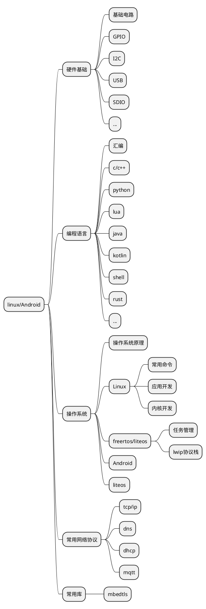

## 参考

https://blog.csdn.net/weixin_44409075/article/details/118975534
https://blog.csdn.net/weixin_41826018/article/details/100538170
https://blog.csdn.net/xyz_lmn/article/details/41411355
https://www.jianshu.com/p/6e1ae6e763cf
https://www.jianshu.com/p/39c63eff3c36